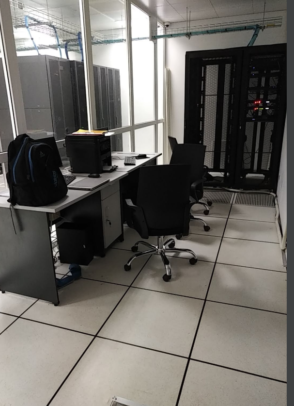
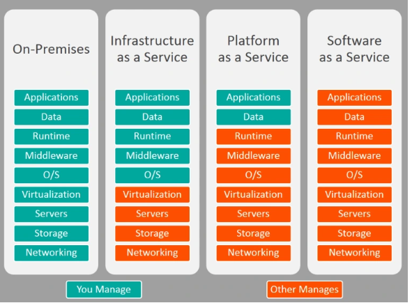

# Tìm hiểu về điện toán đám mây
### 1-Định nghĩa 
- Thuật ngữ điện toán đám mây đề cập đến dữ liệu và ứng dụng được lưu trữ chạy trên đám mây thay vì được lưu trữ và chạy trên máy tính cục bộ của bạn hoặc trên bất kỳ thiết bị nào mà bạn sở hữu. Sau đó dữ liệu này và các ứng dụng trên đám mây được truy cập thông qua internet. Chính vì vậy khối lượng công việc không còn trên máy tính của bạn hoặc trên bất kỳ thiết bị nào bạn sở hữu mà toàn bộ sẽ được xử lý trên đám mây( Cloud).

Hay nói 1 cách đơn giản : 
- Cloud chỉ là 1 tòa nhà lớn chứa đầy các máy chủ cung cấp dịch vụ cho khách hàng, bên trong đó là 1 trung tâm dữ liệu khổng lồ .Các máy chủ này thực hiện nhiều tác vụ chả hạn như chạy ứng dụng lưu trữ dữ liệu, xử lý dữ liệu lưu trữ web...Và tất cả các máy chủ này có thể kết nối với nhau và chúng có thể truy cập internet.

### 2-Cloud để làm gì

- Các công ty sở hữu cloud gọi là cloud provider .Các công ty này bán các sercice ( dịch vụ) cho bạn, và bạn sẽ trả tiền cho họ để họ thực hiện mọi công việc cho bạn.

Ví dụ: Ngày xưa khi chưa có cloud ,1 công ty muốn có 1 hệ thống mail riêng thì họ sẽ cần phải có 1 máy chủ vật lý ,1 hệ điều hành và 1 phần mềm chạy dịch vụ mail, đi kèm theo là quá trình cấu hình phức tạp từ network và máy chủ.Trong quá trình vận hành nếu có bất kỳ sự cố nào xảy ra với máy chủ chả hạn : lỗi phần cứng, sự cố phần mềm ,sự cố hệ điều hành, cháy nổ, virus... thì bạn( công ty đó )sẽ phải là người chịu trách nhiệm khắc phục sự cố, chưa kể đến bạn phải bảo trì, giám sát nó để nó hoạt động liên tục và ổn định. Đây chính là lúc Cloud xuất hiện và bạn chỉ cần trả tiền cho Cloud Provider để họ làm những công việc trên , hoặc 1 phần công việc trên cho bạn.

Và email cũng chỉ là 1 service trong nhiều service mà Cloud provider cung cấp cho bạn (Phần mềm, web, database,lưu trữ...)

- Tại sao tổ chức , công ty lại dùng cloud computing? 
  - Nguyên nhân đầu tiên : đó là do chi phí 
Việc  sử dụng cloud computing sẽ giảm rất nhiều chi phí so với việc bạn làm tất cả các công việc từ khâu mua phần cứng đến việc triển khai phần mềm kể ở ví dụ bên trên.
  - Nguyên nhân thứ 2 là : độ tin cậy
  Nhà cung cấp sẽ có trách nhiệm sao lưu , khôi phục, bảo trì... máy chủ bạn thuê khi gặp ra sự cố , và kể cả server bị hỏng thì vẫn có thể có server khác sẵn sàng thay thế để dịch vụ của bạn không bị gián đoạn
  - Một khả năng nữa là do tính năng mở rộng 

Các nhà dịch vụ đám mây  sẽ cung cấp cho bạn các gói dịch vụ khác nhau dù bạn thuê nhiều hay ít

  Một số nhà cung cấp Cloud lớn trên thế giới như Amazone Web Service, Microsoft azuze, Google cloud platform,Alibaba, IBM

  Ở việt nam có các nhà cung cấp dịch vụ lớn như FPT telecom ,Viettel IDC, CMC cloud,Mắt Bão,Long Vân,Nhân Hòa,...

  ### 3-Các gói cloud cơ bản

  Có 3 loại gói cơ bản về khả năng kiểm soát và tính linh hoạt , phụ thuộc vào nhu cầu của người dùng.

- IAAS : Infrastruc as a service

  Công ty Cloud sẽ cho bạn thuê cơ sở hạ tầng (infrastucture) bao gồm server, ổ cứng, mạng. Bạn muốn cài gì cũng được

- PAAS : Platform as a service

  Nhà cung cấp sẽ lo cho bạn từ OS (Windows hoặc  Linux) cho tới Runtime

- SAAS : Software as a service

   Phần mềm được cung cấp dưới dạng dịch vụ, người sử dụng sẽ trả tiền thuê hàng tháng như Gmail, Dropbox, Salesforce 

                             Bảng tổng quát dịch vụ

Bảng trên xuất hiện khái niệm On-premise nó chính là làm tất cả từ A-Z ,từ network >phần cứng máy chủ >hệ điều hành> bổ trợ>phần mềm>...đến user sử dụng dịch vụ .( Hoặc nói 1 cách khác chính là việc bạn không thuê cloud hoặc có thuê mà chỉ thuê chỗ đặt cloud để đảm bảo có điện dự phòng và liên tục)     .               