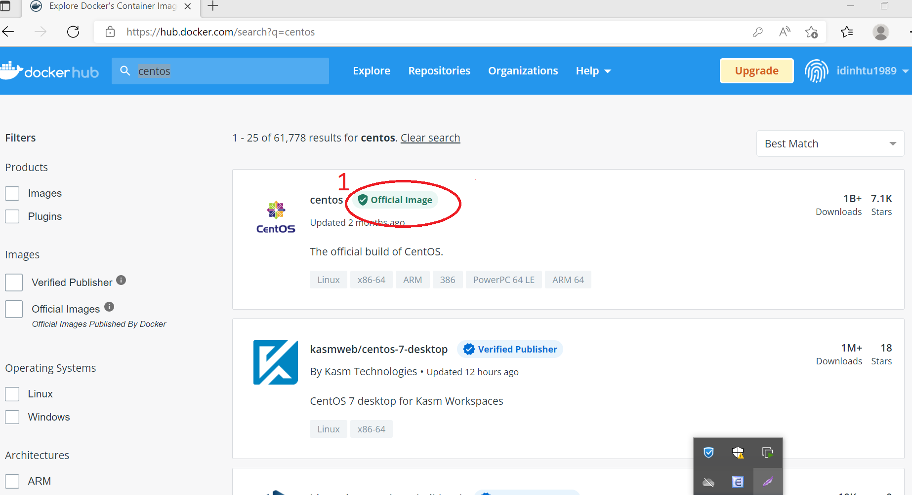
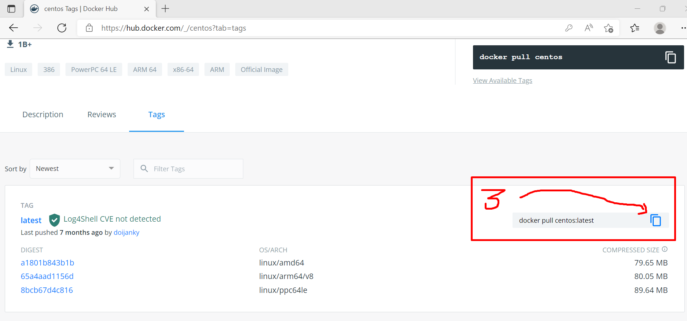
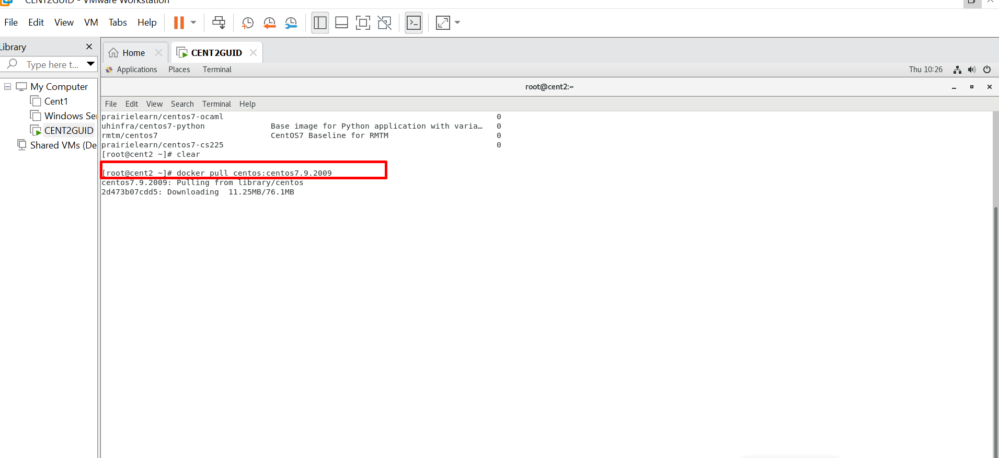
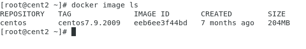

1- yum install - y yum-utils

2- yum-config-manager \

            --add-repo \

                          https://download.docker.com/linux/centos/docker-ce.repo

3- yum install docker-ce docker-ce-cli containerd.io -y

4- service docker restart

docker version  // kiem tra phien ban docker

docker --help   //xem cac lenh docker

dang nhap docker.com tao tai khoan dockerhub(nhu github)

toi da tao tai khoan idinhtu1989 voi gmail idinhtu1989@gmail.com passs Pp0967898808

7- tren centos go lenh: docker login va nhap tai khoan pass vua tao tai dockerhub

8- tim kiem 1 image bat ky tren dockerhub  : go truc tiep tren thanh search cua dockerhub

tren centos7 go lenh: 
- docker search + ten image muon tim

thong thuong ta tim truc tiep tren dockerhub

search va click vao official image

## pull image 

click tag

copy dong lenh va paste  dong lenh vao centos lab

doi no tai ve

Ta thấy image tải về có 76MB , nó ko phải file iso của centos7 ~ 4.4 GB
mà là 1 phiên bản container được đóng gói thành image trong đó có chứa các thư viện tập lệnh có giá trị rất nhỏ, khi sử dụng nó sẽ sử dụng nhân của hdh bên ngoài máy centos đang chạy thông qua 1 teminal là công cụ đứng giữa, có những image rất nhỏ ~ vài MB nhưng chứa rất nhiều tập tin thư viện bên trong .

Sau khi đã load thành công gõ:
- docker image --help

ta dùng lệnh **docker image ls** để ktra image vừa tải về

gõ **docker run --help** để trợ giúp xem ý nghĩa lệnh

