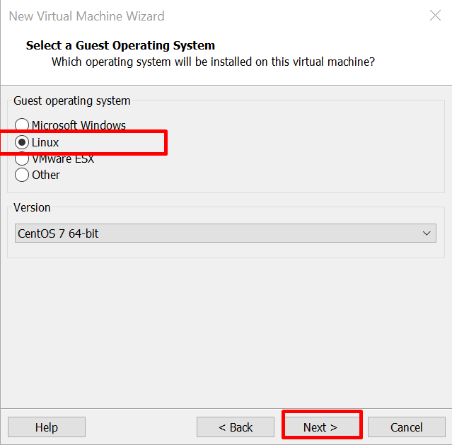

# Cài đặt centos 7 trên VMware workstation

Em thực hiện cách cài 1 phiên bản linux là centos7 sử dụng VMware

Các thao tác được khoanh tròn đỏ

Open VMware

Chọn create new virtual machine

Bản minimal không paste được lệnh nên phải cài ssh thao tác cho nhanh.

