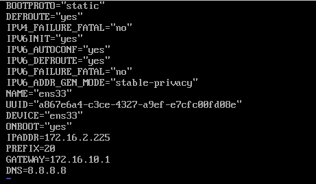

# Thực hành cài centos 7 trên vmw 

Mở phần mềm ảo hóa Phầnvmw workstation 16 pro 

- Click Create a New Vitual machine

- Typical là cài đặt tự động do app vmw tự đề xuất cho mình về các thông số...
- Custom - cài đặt tùy chọn theo ý muốn,tạo 1 máy ảo tùy chọn option, như là trình điều khiển SCSI,loại dữ liệu trên đĩa,tương thích với các sản phầm vmw cũ hơn.

- Phần cứng máy ảo tương thích cho phiên bản vmw 16         và cũng tương thích esx server ( vmw sphere), cột Limitation thế hiện phần cứng hỗ trợ tối đa của 1 máy ảo như 128 GB ram, 32 CPU,10 card mạng...

Tùy chọn cài hệ điều hành cuối cùng

Chọn loại hệ điều hành và phiên bản muốn cài, ở đây mình cài centos nên chọn Linux và chọn Centos7 64bit

Tiếp theo ta chọn đường dẫn lưu các file của hệ điều hành

Chọn số lượng cpu cài lên và số core trên cpu cài lên

vì thực tế có những bo mạch chủ chạy nhiều cpu, trên mỗi cpu lại có nhiều nhân.

Tùy chọn ram theo gợi ý: hỗ trợ max 128GB ram, phiên bản centos7 test 1 gb ram là đủ

Tùy chọn card mạng. 
  - Bridge là biến máy ảo như 1 máy thật với môi trường bên ngoài( giống như 1 máy vật lý thường)
  - NAT : Giao tiếp với host và đi ra được internet
  - Host Only : chỉ giao tiếp với host và ko ra internet
  - Custom cũng có tùy chọn VM switch khi ta có nhiều máy ảo muốn connect với nhau và ko giao tiếp bên ngoài ta sẽ chọn các sw ảo.
  - Tùy chọn cuối cùng : ko kết nối với cái j hết

Next

Next

Chọn loại đĩa mà bạn muốn tạo chọn theo khuyến nghị:

- Chọn tạo 1 đĩa ảo mới,
  Đĩa ảo bao gồm một hoặc nhiều tệp trên hệ thống tệp máy chủ. Đĩa ảo xuất hiện như 1 đĩa cứng trên hdh host.Bạn có thể sao chép hoặc di chuyển các đĩa ảo trên cùng một máy chủ hoặc giữa các máy chủ.
- Chọn đĩa ảo hiện có( đã đc cấu hình trước)
- Sử dụng đĩa vật lý

Chọn dung lượng đĩa ảo, trong đó
  - Tùy chọn 1 là fix cứng dung lượng lấy từ host (allocate...), nếu ko tích thì đĩa ảo sẽ lấy dần dung lượng trong số 20GB ấy
  - Tùy chọn 2 là để đĩa ảo đó là 1 file .
  - Tùy chọn 3 là chia đĩa ảo thành nhiều file để tiện copy, di chuyển sang máy pc khác

Next

Finish

Bấm tùy chọn tìm file iso của ubuntu
và finish

Sau khi hoàn tất các chọn lựa ta power on máy ảo

Giao diện khởi động

Chọn ngôn ngữ hệ thống và bàn phím loại US

Ta chọn múi giờ , thời gian

Tùy vào mục đích sử dụng, ở đây mình cài bản không có giao diện

Đến tùy chọn phân vùng ổ cứng tự động hoặc thủ công, mình chọn thủ công

Chọn phân vùng tiêu chuẩn

Định dạng ổ đĩa dạng xfs, 
- Phần vùng boot chứa các file boot loader để khởi động

- Phân vùng swap là phân vùng Ram ảo, lấy ổ cứng làm ram ảo tránh trường hợp bị treo máy khi ram bị đầy.hiệu suất của nó rất thấp ,chỉ mục đích dự phòng

- Phân vùng / là toàn bộ phần dữ liệu theo cây thư mục /

Accept

On /off card mạng , đổi tên máy hoặc chọn IP tĩnh

Begin

Đặt mật khẩu cho root và tạo 1 tài khoản user

Quá trình hoàn tất , login root và mật khẩu

Cài đặt ssh

chỉnh sửa ssh tại

/etc/ssh/sshd_config

Tùy chọn root login

Disabled selinux tại

/etc/sysconfig/selinux

Cho SSH khởi động cùng hệ thống mỗi khi reboot

Cấu hình IP tĩnh

/etc/sysconfig/network-scrip/ifcfg-enss33

CÀi bind

