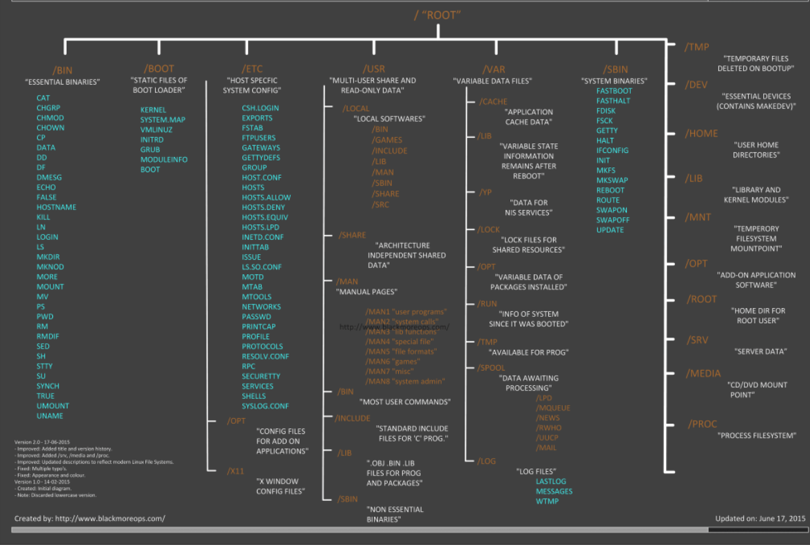
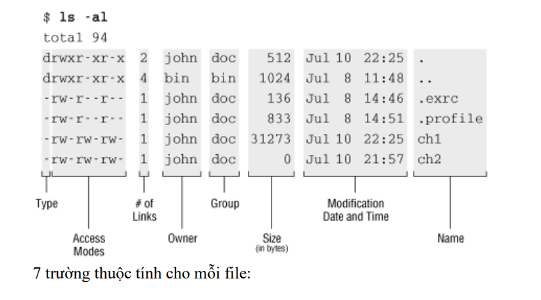

# Cấu trúc cây thư mục

Linux được thiết kế theo dạng cây (tree) khởi nguồn là ký tự / , mỗi thư mục đều có chức năng riêng của nó và được biểu diễn theo hình ảnh sau:

/ : thư mục gốc gốc của cấu trúc cây thư mục Linux, trong đó các file là các nút lá

/bin : thư mục chứa các lệnh thực thi cơ bản ((binary applications)

/sbin: thư mục chứa các lệnh quản trị hệ thống (system binaries)

/boot : thư mục chứa kernel và boot loader

/etc : thư mục chứa các tập tin cấu hình hệ thống

/sys : thư mục lưu các tập tin của hệ thống (system files)

/dev : thư mục các file thiết bị (device files), các thiết bị 
phần cứng được xem là các file

/root : thư mục home của người quản trị hệ thống root

/home : mỗi thư mục con trong thư mục này là Home Directory của các users

/lib : thư mục thư viện chia sẻ của hệ thống (system libraries) ~ như C:\Windows\System32

/usr : thư mục chứa những tập tin của các ứng dụng chính đã được cài đặt cho mọi người
dùng (all users), thư mục /usr/local ~ như C:\Program Files\ chứa các chương trình của 
người dùng được cài từ mã nguồn

/var : thư mục lưu tập tin ghi dữ liệu biến đổi (variable files) như các tập ghi nhật ký (log file)

/tmp : thư mục chứa các file tạm thời trong lúc chạy chương trình (temporary files). Một điểm 
lưu ý là các users đều có quyền write trên /tmp. Một user hoàn toàn có khả năng tạo ra hàng 
loạt các file có kích thước lớn trong /tmp để làm đầy partition /

/mnt : thư mục này được dùng để gắn các hệ thống tập tin tạm thời (mounted filesystems

/media : thư mục này được dùng để tạo ra các tập tin gắn (loaded) tạm thời được hệ thống tạo 
ra khi một thiết bị lưu động (removable media) được cắm vào như đĩa CDs, máy ảnh kỹ thuật 
số…

/opt : thư mục chứa các phần mềm ứng dụng (optional applications) được cài đặt thêm.

/lost+found : thư mục lưu các tập tin không có thư mục cha mà được tìm thấy dưới thư mục 
gốc / sau khi thực hiện lệnh kiểm tra hệ thống tập tin (fsck)

/proc : thư mục đặc biệt để lưu các thông số của kernel.
Thư mục /proc là một thư mục quan trọng, đóng vai trò sống còn đối với hệ thống Linux. 
Thông tin chứa trong /proc được tạo ra một cách tự động dựa trên các quá trình startup và 
shutdown của hệ thống hay thay đổi theo thời gian thực của file system. Thông tin của hệ 
thống, các tiến trình , các tham số của hệ thống đều thể hiện trong thư mục này.

### Mô tả 1 file hoặc thư mục

- File    : ký tự - ở đầu

- Thư mục : ký tự d (directory)

Các quyền  được ký hiệu như sau:

- Read: ký hiệu là r hoặc số 4

- Write: ký hiệu là w hoặc số 2

- Excute: ký hiệu là x hoặc số 1 

Mỗi 1 đối tượng gắn với 3 loại quyền: read (đọc), write (sửa đổi) và execute (thực thi). Và mỗi quyền này lại được chỉ định cho 3 loại user:

+ owner: chủ sở hữu của đối tượng – mặc định ban đầu là user tạo ra đối tượng đó.

+ group: 1 nhóm các user có các quyền hạn giống nhau đối với đối tượng – mặc định ban đầu là group mà owner ở trên thuộc về.

+ other: tất cả các user không thuộc 2 nhóm trên

Ý nghĩa của 3 loại quyền trên là:

+ Đối với thư mục:

  - Read: chỉ cho phép sử dụng lệnh ls để xem tên các đối tượng có trong thư mục, nếu muốn xem thêm các thông tin như: kích thước, quyền hạn truy cập, chủ sở hữu, ngày khởi tạo… bạn cần cấp thêm cho thư mục quyền execute.

  - Write: cho phép tạo và xóa các đối tượng trong thư mục.

  - Execute: chỉ cho phép chuyển vào thư mục sử dụng lệnh cd.

+ Đối với file:

  - Read: cho phép xem nội dung của file.

  - Write: cho phép chỉnh sửa nội dung, xóa file.

  - Excute: cho phép chạy file, quyền này thường được gán các file nhị phân thực thi (tương tự như file .exe trong Windows).

User root có đủ cả 3 quyền đối với mọi đối tượng trên hệ thống. Ngoài ra, root có thể thay đổi (cấp hoặc tước) quyền hạn truy cập đối tượng cho bất kỳ user nào và còn có thể chuyển quyền sở hữu đối tượng qua lại giữa các user.

