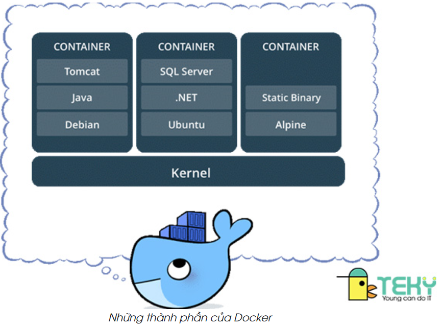
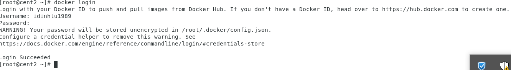
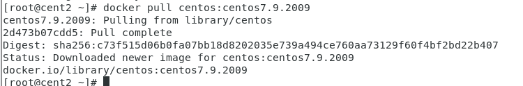
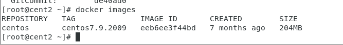
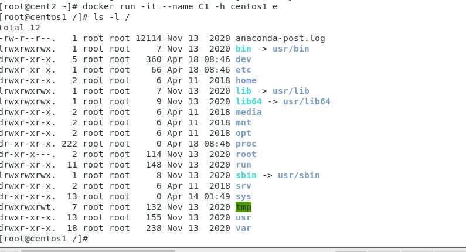
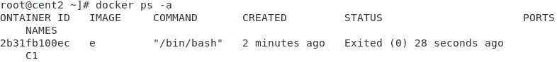
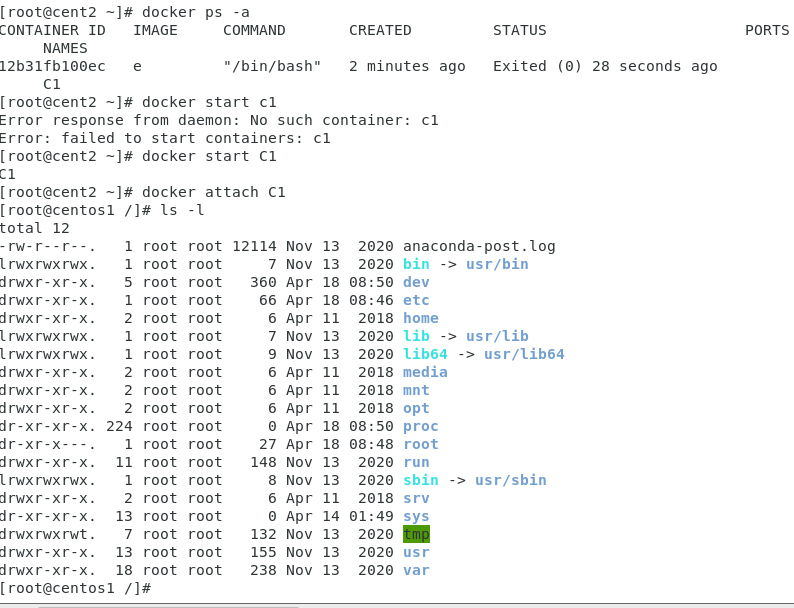
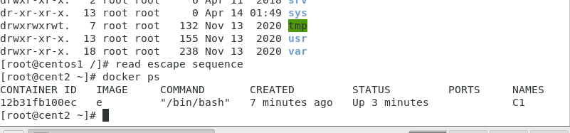
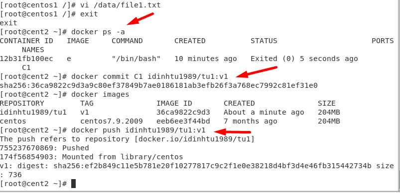
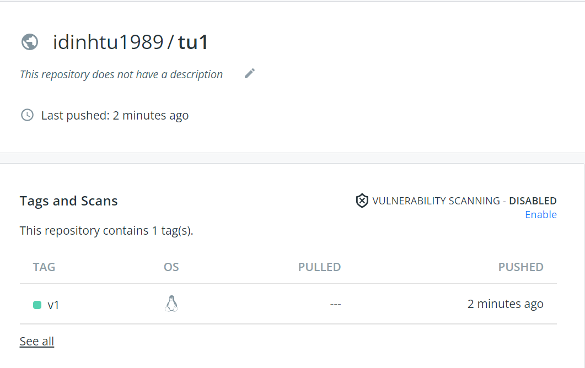

# Tìm hiểu về docker và container

## Giới thiệu

Ứng dụng rất quan trọng đối với các doanh nghiệp. Hầu như tất cả ứng dụng đều chạy trên các server. Các hệ điều hành chỉ dùng để chạy một ứng dụng. Khi cần triển khai bất kì ứng dụng nào đêu cần mua một server mới mà không biết chính xác phần cứng yêu cầu cho ứng dụng. Vì vậy dẫn đến sự lãng phí lớn về tài nguyên phần cứng, điện năng,...cho các công ty.

VMware giới thiệu công nghệ ảo hóa virtual machine(VM)công nghệ giúp chạy đa ứng dụng một cách an toàn và bảo mật trên một server vật lý IT không cần mua một server mới khi công ty yêu cầu một ứng dụng mới nữa. Họ hoàn toàn có thể triển khai chúng trên server sẵn có với một máy ảo mới Điều này giúp giảm sự lãng phí về tài nguyên.

Tuy nhiên, VM vẫn không hoàn hảo:

- Cần một hệ điều hành riêng cho mỗi VM, dẫn đến sự tốn kém về tài nguyên, license, bảo hành, theo dõi cho mỗi VM đó.
- Vm boot chậm và không có tính di động - sao lưu hay di chuyển VM giữa các đều rất khó khăn.

**Docker**

là một nền tảng để cung cấp cách để building, deploying và running ứng dụng dễ dàng hơn bằng cách sử dụng các containers (trên nền tảng ảo hóa).

Các containers cho phép lập trình viên đóng gói một ứng dụng với tất cả các phần cần thiết, chẳng hạn như thư viện và các phụ thuộc khác, và gói tất cả ra dưới dạng một package.

Bằng cách đó, nhờ vào container, ứng dụng sẽ chạy trên mọi máy Linux khác bất kể mọi cài đặt tùy chỉnh mà máy có thể có khác với máy được sử dụng để viết code.

Theo một cách nào đó, Docker khá giống virtual machine. Nhưng tại sao Docker lại phát triển, phổ biến nhanh chóng? Đây là những nguyên nhân
- Tính dễ ứng dụng: Docker rất dễ cho mọi người sử dụng từ lập trình viên, sys admin… nó tận dụng lợi thế của container để build, test nhanh chóng. Có thể đóng gói ứng dụng trên laptop của họ và chạy trên public cloud, private cloud… Câu thần chú là “Build once, run anywhere”.

- Tốc độ: Docker container rất nhẹ và nhanh, bạn có thể tạo và chạy docker container trong vài giây.

- Môi trường chạy và khả năng mở rộng: Bạn có thể chia nhỏ những chức năng của ứng dụng thành các container riêng lẻ. Ví dụng Database chạy trên một container và Redis cache có thể chạy trên một container khác trong khi ứng dụng Node.js lại chạy trên một cái khác nữa. Với Docker, rất dễ để liên kết các container với nhau để tạo thành một ứng dụng, làm cho nó dễ dàng scale, update các thành phần độc lập với nhau.

### Một số khái niệm cơ bản

- Docker Client: là cách mà bạn tương tác với docker thông qua command trong terminal. Docker Client sẽ sử dụng API gửi lệnh tới Docker   Daemon.

- Docker Daemon: là server Docker cho yêu cầu từ Docker API. Nó quản lý images, containers, networks và volume.

- Docker Volumes: là cách tốt nhất để lưu trữ dữ liệu liên tục cho việc sử dụng và tạo apps.

- Docker Registry: là nơi lưu trữ riêng của Docker Images. Images được push vào registry và client sẽ pull images từ registry. Có thể sử dụng registry của riêng bạn hoặc registry của nhà cung cấp như : AWS, Google Cloud, Microsoft Azure.

- Docker Hub: là Registry lớn nhất của Docker Images ( mặc định). Có thể tìm thấy images và lưu trữ images của riêng bạn trên Docker Hub ( miễn phí).
- Docker Repository: là tập hợp các Docker Images cùng tên nhưng khác tags. VD: golang:1.11-alpine.

- Docker Networking: cho phép kết nối các container lại với nhau. Kết nối này có thể trên 1 host hoặc nhiều host.

- Docker Compose: là công cụ cho phép run app với nhiều Docker containers 1 cách dễ dàng hơn. Docker Compose cho phép bạn config các command trong file docker-compose.yml để sử dụng lại. Có sẵn khi cài Docker.

- Docker Swarm: để phối hợp triển khai container.

- Docker Services: là các containers trong production. 1 service chỉ run 1 image nhưng nó mã hoá cách thức để run image — sử dụng port nào, bao nhiêu bản sao container run để service có hiệu năng cần thiết và ngay lập tức.

**Container**

Theo nghĩa đen nó là thùng hàng , nghĩa bóng container cũng có nghĩa là kết quả của quá trình đóng gói nhiều thứ vào bên trong như thư viện, dịch vụ...Điều này rất tiện lợi vì có thể 1 dịch vụ nào đó muốn chạy trên nhiều môi trường hệ điều hành khác nhau mà không cần phải tốn công sức và tài nguyên để tạo ra các máy ảo.Container rất tốt trong các môi trường là các công ty cung cấp các dịch vụ về phần mềm.

Trong một khoảng thời gian dài, các công ty lớn sử dụng công nghệ container để khắc phục những thiếu sót của VM. Container không cần hệ điều hành riêng như VM mà các container chia sẻ hệ điều hành với HostOS. Dẫn đến giảm tiêu tốn tài nguyên cũng như chi phí cho công ty. Container có tính di động cao - việc di chuyển container giữa laptop, cloud, hay VM là một việc đơn giản

Container hiện đại thì bắt đầu trên LInux. Được phát triển và đóng góp rất nhiều từ rất nhiều người, công ty lớn để có được công nghệ container ngày nay. Một số công nghệ giúp containter pát triển mạnh bao gồm: Kernel namespaces, cgroup, union filesystem, và đương nhiên Docker. Tuy vậy, container vẫ khá phức tạp và khó tiếp cận với hầu hết các công ty cho đến khi Docker xuất hiện.

# Sự khác biệt giữa Docker và Container

Định nghĩa

Docker là một nền tảng phần mềm để tạo, triển khai và quản lý các thùng chứa ứng dụng ảo hóa trên một hệ điều hành chung với hệ sinh thái gồm các công cụ đồng minh. Ngược lại, Container là một giải pháp thay thế nhẹ cho ảo hóa toàn bộ máy liên quan đến việc đóng gói một ứng dụng với môi trường hoạt động của chính nó.

Nền tảng

Docker có chức năng như một dịch vụ quản lý container. Tuy nhiên, Container là một phần mềm đóng gói mã và tất cả các phụ thuộc của nó để các ứng dụng có thể chạy nhanh và độ tin cậy từ môi trường điện toán này sang môi trường điện toán khác. Đây là sự khác biệt cơ bản giữa Docker và Container.

Sử dụng

Docker cải thiện khả năng mở rộng, cải thiện bảo mật và làm cho quá trình phát triển dễ dàng hơn. Container, mặt khác, cải thiện hiệu quả hoạt động, năng suất, cung cấp kiểm soát phiên bản, vv Đây là một sự khác biệt khác giữa Docker và Container.

Kết luận

Tóm lại, điểm khác biệt cơ bản giữa Docker và Container là Docker là một nền tảng để xây dựng, chạy và quản lý các thùng chứa phần mềm trong khi container là một phần mềm nhẹ cung cấp ảo hóa hệ điều hành để chạy các ứng dụng và phụ thuộc vào các quy trình cách ly tài nguyên.

# Thực hành tạo container từ bằng docker engine

## Cài đặt docker

1- yum install - y yum-utils

2- yum-config-manager \ 
--add-repo \ 
https://download.docker.com/linux/centos/docker-ce.repo

3- yum install docker-ce docker-ce-cli containerd.io -y

4- service docker restart

systemctl enable docker.service

docker version  // kiem tra phien ban docker

docker --help   //xem cac lenh docker

dang nhap docker.com tao tai khoan dockerhub

5- trên centos gõ lệnh: docker login và nhập tài khoản và pass vừa tạo ở docker hub

6- tim kiem 1 image bat ky tren dockerhub  : go truc tiep tren thanh search cua dockerhub

Trên  centos7 gõ lệnh: 
- docker search + ten image muốn tìm

## pull image 

Ta thấy image tải về có 204 MB , nó ko phải file iso của centos7 ~ 4.4 GB
mà là 1 phiên bản container được đóng gói thành image trong đó có chứa các thư viện tập lệnh có giá trị rất nhỏ, khi sử dụng nó sẽ sử dụng nhân của hdh bên ngoài máy centos đang chạy thông qua 1 teminal là công cụ đứng giữa, có những image rất nhỏ ~ vài MB nhưng chứa rất nhiều tập tin thư viện bên trong .

Sau khi đã load thành công gõ:
- docker image --help

ta dùng lệnh **docker image ls** để ktra image vừa tải về

gõ **docker run --help** để trợ giúp xem ý nghĩa lệnh

Chạy image

trong đó tham số interactive là tạo đường dẫn sử dụng teminal của host kết nối vào trong máy ảo container

-it là tùy chọn, --name C1 : tùy chọn --name tên C1, e là viết tắt của ID Image mới tải về

Exit ra xem tiến trình( nếu exit thì tiến trình chạy docker sẽ bị dừng) 

và bật lại : docker start C1

Giờ ta thoát khỏi container mà tiến trình chạy ko bị dừng ta bấm tổ hợp phím ctrl+ P +Q

exit ra container

ktra tiến trình

docker ps -a ta thấy tiến trình bị dừng

Tiếp theo ta commit container,tag v1 và push lên dockerhub vừa có sự sửa đổi( thêm file txt)

Refresh lại giao diện

