# iSCSI là gì ?
iSCSI là Internet SCSI (Small Computer System Interface), được xem như một tiêu chuẩn giao thức phát triển nhằm mục đích truyền tải các lệnh SCSI qua mạng IP bằng giao thức TCP/IP. Từ đó iSCSI cho phép truy cập các khối dữ liệu trên hệ thống lưu trữ SAN qua các lệnh SCSI và truyền tải dữ liệu qua hệ thống mạng Network (LAN/WAN).

SCSI lệnh sẽ được đóng gói trong lớp TCP/IP và truyền qua mạng nội bộ (LAN) hoặc cả mạng Internet Public (WAN Internet) mà không cần quan tâm bất kì thiết bị chuyên biệt nào như Fibre Channel, chỉ cần cấu hình hệ thống phần cứng Gigabit Ethernet và iSCSI đúng là được.

iSCSI sử dụng không gian lưu trữ ảo như VHD’s trong Windows Server Storage hay LUN trên Linux , giảm chi phí khi tận dụng hạ tầng LAN sẵn có ( các thiết bị mạng, Swich ,… trên nền IP ). iSCSI chủ yếu cạnh tranh với Fibre Channel, nhưng khác với Fibre Channel truyền thống, thường đòi hỏi cáp chuyên dụng, iSCSI có thể chạy trên các khoảng cách xa bằng cách sử dụng hạ tầng mạng hiện có.

# Các thành phần của iSCSI

Một giao tiếp kết nối iSCSI sẽ bao gồm 2 thành phần chính sau:

- iSCSI Initator (client)
- iSCSI Target   (server)

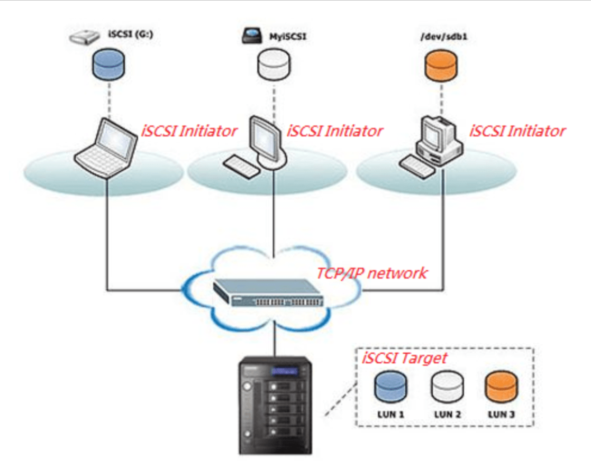

## iSCSI Initiator
iSCSI Initiator (iSCSI Initiator Node) là thiết bị client trong kiến trúc hệ thống lưu trữ qua mạng. iSCSI Initiator sẽ kết nối đến máy chủ iSCSI Target và truyền tải các lệnh SCSI thông qua đường truyền mạng TCP/IP . iSCSI Initiator có thể được khởi chạy từ chương trình phần mềm trên OS hoặc phần cứng thiết bị hỗ trợ iSCSI.

## iSCSI Target
Server iSCSI Target thường sẽ là một máy chủ lưu trữ (storage) có thể là hệ thống NAS chẳng hạn. Từ máy chủ iSCSI Target sẽ tiếp nhận các request gửi từ iSCSI Initiator gửi đến và gửi trả dữ liệu trở về. Trên iSCSI Target sẽ quản lý các ổ đĩa iSCSI với các tên gọi LUN (Logical Unit Number) được dùng để chia sẻ ổ đĩa lưu trữ iSCSI với phía iSCSI Client

## iSCSI hoạt động như thế nào?

Kết nối iscsi

- Máy tính client sẽ khởi tạo request yêu cầu truy xuất dữ liệu trong hệ thống lưu trữ (storage) ở máy chủ iSCSI Target.

- Lúc này hệ thống iSCSI Initiator sẽ tạo ra một số lệnh SCSI tương ứng với yêu cầu của client.

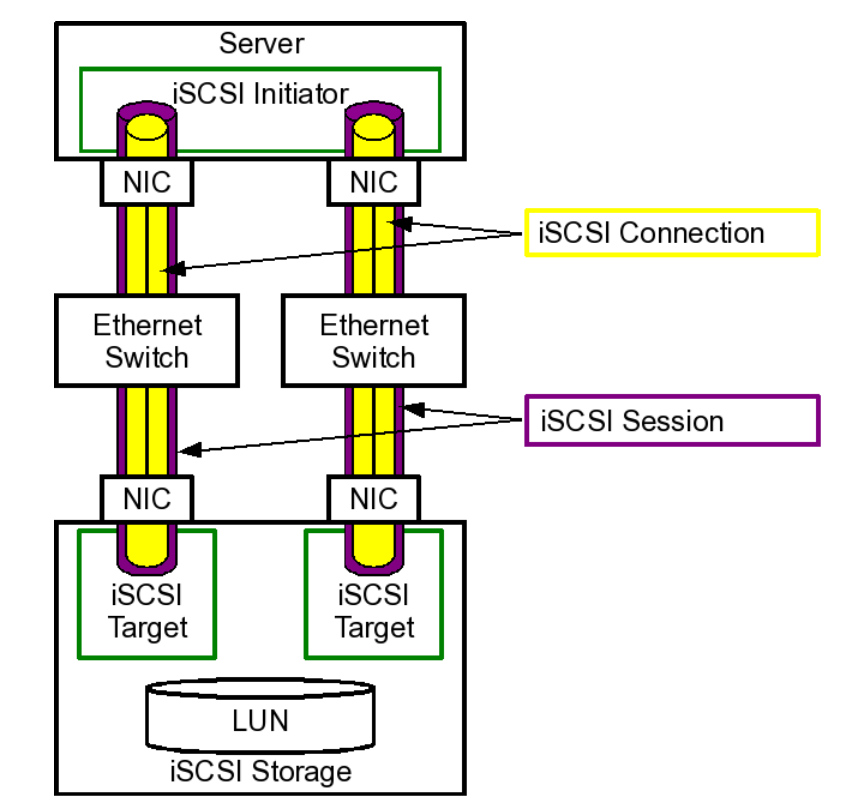

## Lợi ích của iSCSI với hệ thống lưu trữ SAN

Chi phí rẻ hơn so với việc đầu tư hệ thống lưu trữ Fibre Channel.

Không tốn nhiều thời gian và chi phí đầu tư đào tạo Quản trị viên quản lý hệ thống lưu trữ iSCSI SAN.

Với việc sử dụng hệ thống mạng đơn giản với thành phần Gigabit Ethernet chuẩn, các công ty tổ chức có thể đơn giản hoá việc tạo dựng một môi trường lưu trữ qua mạng của họ.

Các sản phẩm tương thích với iSCSI, môi trường iSCSI SAN có thể dễ dàng triển khai bằng cách tận dụng phần cứng mạng hiện có và các thành phần khác.

Là một giao thức dựa trên IP, iSCSI tận dụng lợi ích của TCP/IP và Ethernet.

Đặc biệt hiệu quả khi sử dụng với card mạng Ethernet 10G phổ biến.

**Nếu không có SAN cứng ta có thể triển khai giao thức này dùng tăng tính chịu lỗi**

# Thực hành

- 2 máy cent1 cent2 
 ip lần lượt 192.168.1.222/24 192.168.1.223/24 192.168.1.224/24,máy 1 làm server, máy còn lại sẽ lấy storage scsi của máy 192.168.1.222 

- Trên cent1 gắn thêm 1 sdc 10G

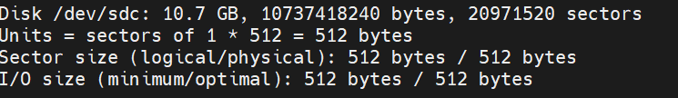

- kiểm tra packet lvm2 nếu chưa có tiến hành cài đặt

- yum install lvm2 -y

Sau đó tạo lvm trên sdc1 =10G

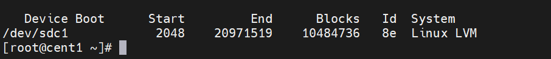

- pvcreate /dev/sdc1

- Tạo một Volume  group có tên là VG
 
- Tạo 1 logical volum tên LV dựa trên VG vừa tạo

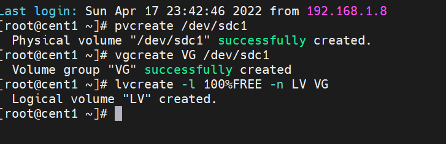

show lv vừa tạo

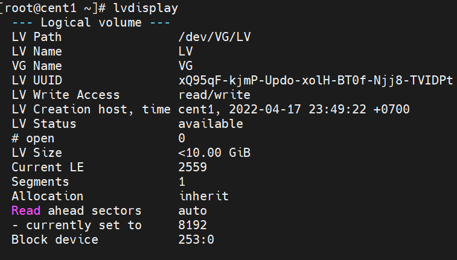

- Login vào targetcli đã cài ở trên và di chuyển đến khối block để khởi tạo ISCSI

  - gõ targetcli

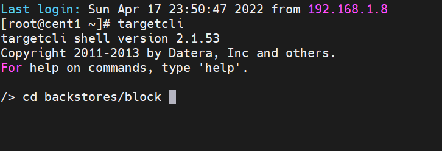
- Cài iscsi trên máy chủ 

- Tạo đĩa tên disk1 từ phân vùng LVM

create disk1 /dev/VG/LV

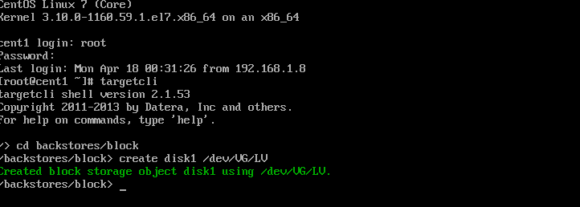

Trở lại  targetcli

cd /iscsi tạo iqn

create iqn.2022-4.dinhtu.local.target:cent1
   - 2022-4 là mốc thời gian
   - dinhtu.local là tên miền cty
   - target chỉ máy chủ
   - cent1 tên máy chủ

TPG1 dùng port 3260 để chuyển storage xuống

cd tiếp vào /iscsi/iqn..:cent1/tpg1/acls

acls: accesslist, kiểu điều kiện kết nối
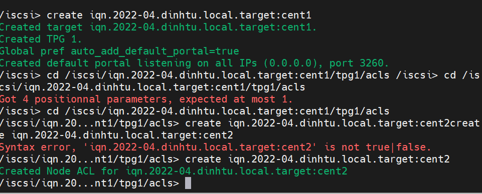

Khai báo kết nối cho cả 2 máy vào 1 disk

create iqn.2022-4.dinhtu.local.target:cent2

create iqn.2022-4.dinhtu.local.target:cent3

cd vao create iqn.2022-4.dinhtu.local.target:cent1/tpg1/luns

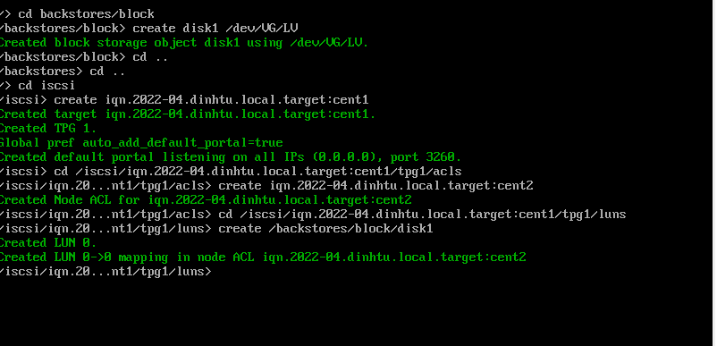

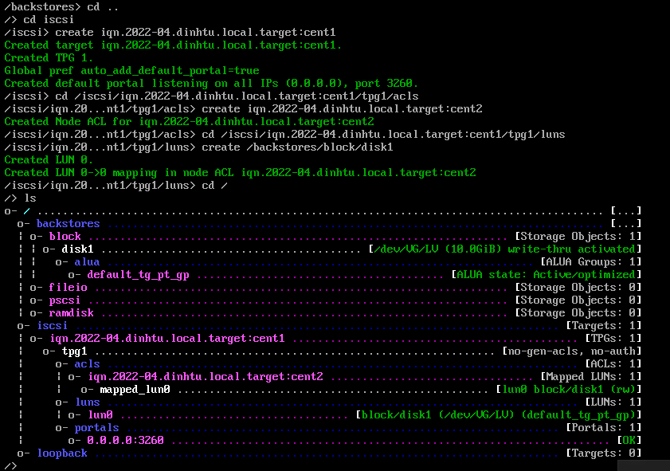

exit và khởi động lại dv , khởi động cùng hệ thống

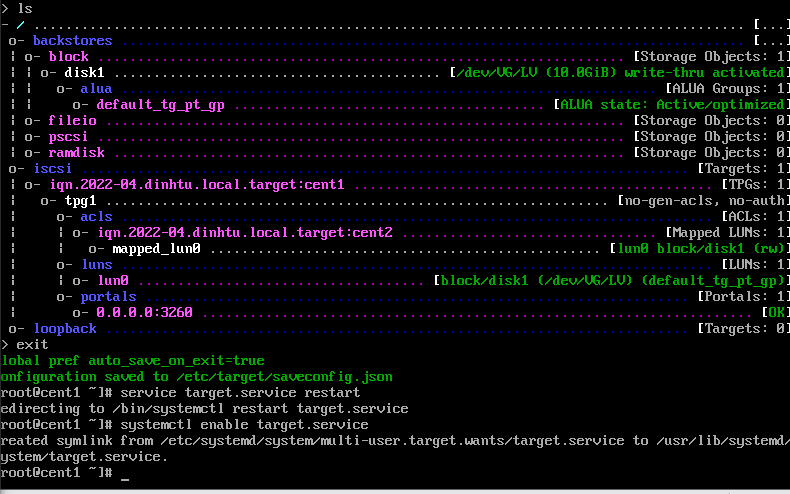

Sang cent2 ktra gói iscsi initiator

vào vi /etc/iscsi/initiatorname.iscsi 

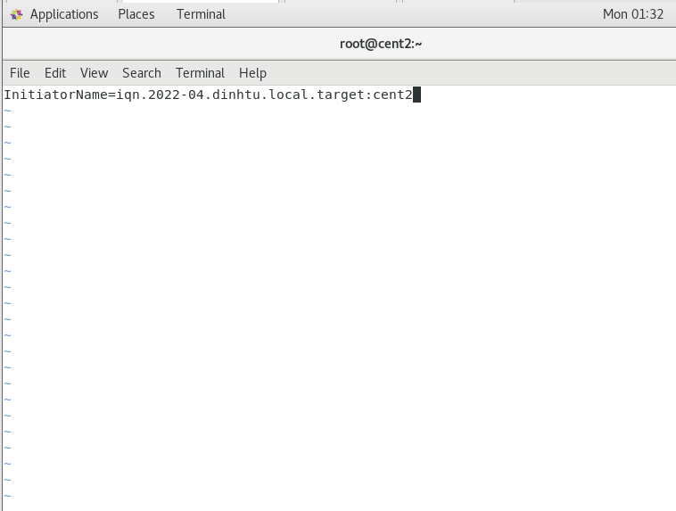

#service iscsi restart

#systemctl restart iscsi.service

#systemctl enable iscsi.service

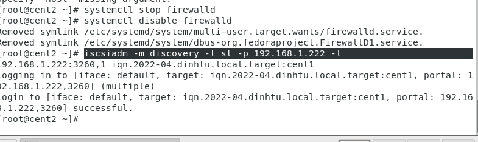

Lấy thành công /dev/sdb 

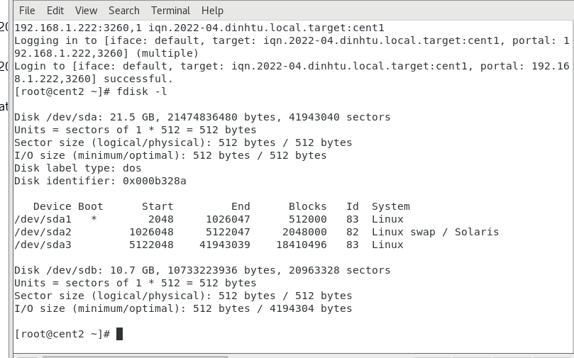

VÀ cuối cùng format và mount, ghi vào fstab để sử dụng

