# 1. Lệnh cơ bản trên hệ thống
- `# exit` hoặc `# logout` : thoát ra khỏi trạng thái đăng nhập
- `# reboot`: Khởi động lại hệ thống
- `# ps`: Liệt kê các tiến trình đang hiện hành và PID (Process ID) của tiến trình đó.
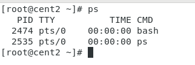

- `# sleep <thoi_gian>`: Cho phép hệ thống ngừng hoạt động trong một thời gian (thoi_gian tính bằng giây). Ví dụ `# sleep 6`, thì máy chủ sẽ tạm thời ngưng hoạt động trong 6 giây
- `# useradd <ten_user>`: Thêm 1 user vào hệ thống


- `# passwd <ten_user>`: Cập nhật mật khẩu cho user đã tạo. Ví dụ
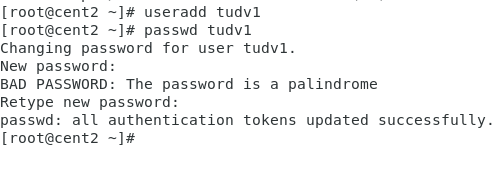

- `# who`: Cho biết user nào đang sử dụng hệ thống
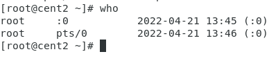

- `# whoami`: Cho biết user nào đang đăng nhập


- `# top`: Hiển thị các tiến trình đang chạy trên hệ thống. Tương tự nhu task manager của window
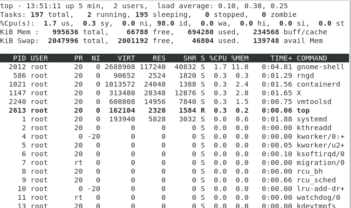

- `# usermod -aG wheel <username>`: Cho phép user sử dụng quyền sudo


- `#su - <username>`: Đăng nhập bằng user khác
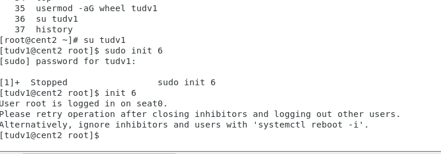

- Nhấn tổ hợp "ctrl + L" hoặc `# clear` đề làm sạch commandline
- `# ifconfig` : Xem địa chỉ IP của máy


- `# history`: Để xem lịch sử các lệnh đã được thực thi bởi user hiện tại
- `# pwd`: Hiển thị đường dẫn tại nơi hiện hành
- `# date`: Kiểm tra ngày giờ trên máy
- `#free`: Kiểm tra RAM của máy
	+ -b: Hiển thị dưới dạng byte
	+ -k: Hiển thị dưới dạng Kb
	+ -m: Hiển thị dưới dạng Mb
	+ -g: Hiển thị dưới dạng Gb
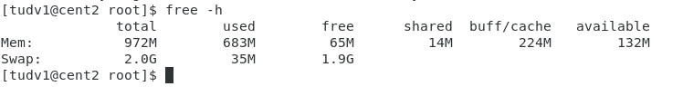

- `# hostnamectl`: Xem thông tin hostname hiện tại của máy
- `# uname`: Kiểm tra hệ điều hành đang sử dụng
- `# yum update`: Cập nhật hệ thống
- `# init 0`: Tắt máy
- `# init 6`: Khởi động lại 
- `# w`: Kiểm tra các phiên SSH
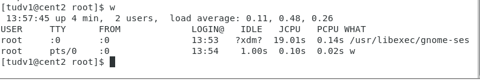
- `# df -h`: Hiển thị dung lượng ổ cứng của máy (dung lượng sẵn sàng và được sử dụng...)
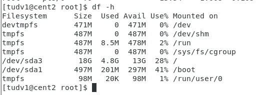
- `# df -i`: Hiển thị thông tin Inodes của máy (tổng số file đã tạo ra, số file còn có thể tạo, số file đã tạo...)
# 2. Thao tác với tập tin
- `# ls`: Xem danh sách các file và thư mục hiện hành
- `# ll`: Xem danh sách các file và thư mục hiện hành chi tiết
- Chuyển thư mục (change directory): `# cd`
	+ cd /etc/selinux: Chuyển tới thư mục /selinux/
	+ cd: Chuyển về thư mục chính của người dùng
	+ cd A && ls: Chuyển tới thư mục A và hiển thị danh sách file và các thư mục của nó
	+ cd ..: Chuyển về thư mục cha của thư mục hiện tại
- Tạo 1 thư mục mới: `# mkdir <ten_thu_muc>`
- Tạo 1 tập tin: `# touch <ten_tap_tin>`
- Tạo 1 tập tin dạng text: `# echo "" >> ~/<ten_tap_tin>`
- Xóa tập tin: `# rm`
	+ `# rm <ten_tap_tin>`: Xóa 1 tập tin
	+ `# rm <tap_tin_1> <tap_tin_2>`: Xóa nhiều tập tin
	+ `# rm /a/b/c/<tap_tin>`: Xóa tập tin theo đường dẫn
	+ `# rm -i`: Xóa có xác nhận lại
	+ `# rm -f`: Xóa không xác nhận
	+ `# rm -I <ten_thu_muc>/file*`: Xóa hàng loạt file có cấu trúc file[...]
- Xóa thư mục: `# rmdir`
	+ `# rmdir <ten_thu_muc>`: hoặc `# rm -d`: Xóa 1 thư mục rỗng
	+ `# rm -r <ten_thu_muc>`: Xóa thư mục chứa các thư mục con và tập tin (có xác nhận cho từng đối tượng)
	+ `# rm -rf <ten_thu_muc>`: Xóa thư mục chứa các thư mục con và tập tin (không xác nhận)
- Mở tập tin: `# cat <tap_tin>`hoặc `# tail <tap_tin>` hoặc `head <tap_tin>`
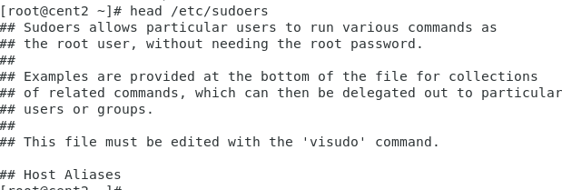
- Khởi động trình soạn thảo VI:
	+ Câu lệnh `# vi <ten_file>`
	+ Nếu file chưa tồn tại thì hệ thống sẽ tạo ra file đó
	+ Nhấn phía "i" (Insert): Để chỉnh sửa văn bản
	+ Nhấn phím "ESC" để thoát khoải trạng thái nhập
	+ Nhập `:wq` (Để lưu lại file sửa đổi) hoặc `:q!` (Để thoát mà không lưu)
	+ Nhập `: <so_dong>`: Để chuyển đến dòng muốn tới
	+ Nhập `/ <tu_muon_tim_kiem>`: Để tìm kiếm trong file file đó
- Copy file: `# cp`
	+ Copy file A thành file B tại thư mục hiện hành
	```sh
	cp A.txt B.txt 
	```
	+ Copy nhiều file vào 1 thư mục khác. Ví dụ: Copy file A.txt, B.txt, C.txt, D.exe, E.exe vào thư mục tu vừa tạo
	```sh
	mkdir tu
	touch ./{A,B,C}.txt
	touch ./{D,E}.exe
	cp A.txt B.txt C.txt D.exe E.exe tu/
	```
	+ Copy file từ thư mục này sang thư mục khác. Ví dụ: Copy file A.txt từ thư mục tu sang thư mục B
	```sh
	mkdir B
	cp /tu/A.txt B
	```
	+ Để xem thông tin copy ta thêm `-v`. Ví dụ
	```sh
	cp -v A.txt B.txt C.txt D.exe E.exe tu/
	"A.txt" -> "tu/A.txt"
	"B.txt" -> "tu/B.txt"
	"C.txt" -> "tu/C.txt"
	"D.exe" -> "tu/D.exe"
	"E.exe" -> "tu/E.exe"
	```
	+ Để giữ nguyên thuộc tính file khi copy ta thêm `-p`. Các thuộc tính giữ nguyên là: access time, modification date, user ID, group ID, file flag, file mode, access control lists
	```sh
	cp -p /tu/A.txt B
	```
- Copy thư mục: tương tự file. Ta thêm `-a` hoặc `-r` 
	+ `-r`: Copy toàn bộ thư mục hoặc file con của thư mục được copy
	+ `-a`: Bao gồm option `-r` và thực hiện duy trì các thuộc tính của file hoặc folder như file mode, ownership, timestamps...
- Copy không cho ghi đè: thêm `-n`
- Copy cho ghi đè không cần xác định `-f`
- So sánh 2 tệp tin hoặc 2 thư mục `diff`
```sh
diff -c a.txt b.txt
```
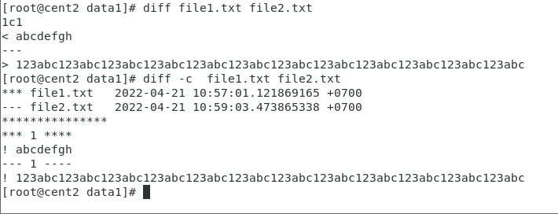


- Xác định kiểu file: `# file <duong_dan_toi_file>`
# 3. Lệnh nén và giải nén
- Các option dùng với lệnh `tar`
	+ `-c`: Tạo file nén.tar
	+ `-x`: Giải file nén .tar
	+ `-v`: Hiển thị quá trình nén và giải nén dữ liệu ra màn hình
	+ `-f`: Chỉ định nén thành file
	+ `-t`: Xem dữ liệu trong file nén
	+ `-j`: Tạo file nén với bzip2 có định dạng file.tar.bz2
	+ `-z`: Tạo file nén với gzip có định dạng file.tar.gz
	+ `-r`: Thêm một file và thư mục và file nén đã tồn tại
	+ `--wildcards`: Tìm và xuất file bất kỳ trong file nén
## 3.1 Các lệnh nén
- Nén file/thư mục sang định dạng "tar": `# tar -cvf`
	+ `# tar -cvf filenenA.tar /mnt/A` : Nén thư mục `A` thành `filenenA.tar` và show quá trình nén
- Nén file/thư mục sang định dạng "tar.gz": `# tar -cvzf`
	+ `# tar -cvfz filenenA.tar.gz /mnt/A`: Nén thư mục `A` thành `filenenA.tar.gz` và show quá trình nén
## 3.2 Các lệnh giải nén
- `tar -xvf filenenA.tar /mnt/A`
- `tar -xvfz filenenA.tar.gz /mnt/A`
- `tar -xvfj filenenA.tar.bz2 /mnt/A`


## 3.3. Thêm file và folder vào file nén
- Thêm file `abc.txt` vào `filenenA.tar`
	+ `# tar -rvf filenenA.tar abc.txt`
- Thêm thư mục `A` vào `filenenA.tar`
	+ `# tar -rvf filenenA.tar A`
# 4. File hệ thống
- Hệ thống tập tin của Linux được tổ chức theo 1 hệ thống phân bậc tương tự cấu trúc của 1 cây phân cấp. Bậc cao nhất là thư mục gốc, ký hiệu là "/" (root directory)
- Kiến trúc phân cấp của hệ thống file trong Linux

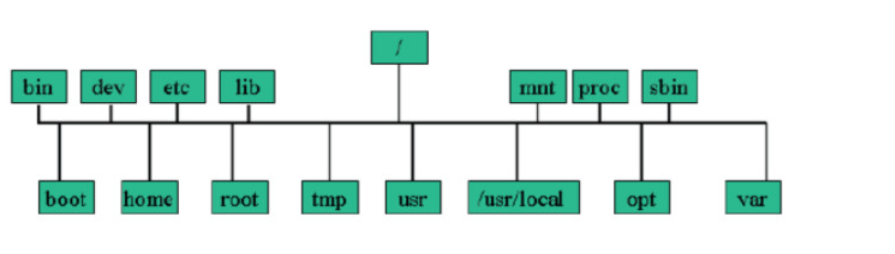

- `/bin` - User binaries và `sbin` - System binaries
	+ Chứa những file cần thiết cho quá trình khởi động và những lệnh thiết yếu để duy trì hệ thống
- `/dev` - Files device
	+ Chứa các định danh ánh xạ của thiết bị hoặc những file đặc biệt 
- `/etc` - Configuration Files
	+ Chứa các file cấu hình của hệ thống và nhiều chương trình tiện ích
- `/lib` - System Libraries
	+ Chứa các thư viện dùng chung cho các lệnh nằm trong `/bin` và `/sbin`. Và thư mục này cũng chứa các module của nhân.
- `/mnt` - Mount Directory
	+ Mount point mặc định cho những hệ thống file kết nối ra ngoài
- `/proc` - Mount Directory
	+ Chứa các thông tin về tiến trình hệ thống
- `/boot` - Boot Loader Files
	+ Chứa tập tin cấu hình cho quá trình khởi động của hệ thống
- `/home` - Thư mục Home
	+ Thư mục mặc dành cho người dùng khác root. Lưu trữ các tập tin cá nhân của tất cả user
- `/root` - Thư mục Root
	+ Thư mục mặc định của người dùng root
- `/tmp` - Temporary Files
	+ Thư mục chứa các file tạm thời
- `/usr` - User Programs
	+ Thư mục chứa những file cố định hoặc quan trọng để phục vụ tất cả người dùng
	+ Chứa các ứng dụng, thư viện, tài liệu và mã nguồn các chương trình thứ cấp
- `/var`
	+ Thư mục chứa các tập tin ghi các số liệu biến đổi
	+ Bao gồm: Hệ thống tập tin log `/var/log`, các gói và các file dữ liệu `/var/lib`, email `/var/mail`, print queues `/var/spool`, lock files `/var/lock`, các file tạm thời cần khi reboot `/var/tmp`
- `/media` - Removable Media Devices
	+ Gắn kết các thư mục tạm thời được hệ thống tạo ra khi một thiết bị lưu động (removable media)
- `/srv` - Service Data
	+ Chứa các service của máy chủ cụ thể liên quan đến dữ liệu
## 4.1 Hệ thống tập tin
Hệ thống linux gốc 'ext3', 'ext4', 'btrfs', 'xfs'. Trước khi sử dụng 1 hệ thống tập tin, phải gắn nó vào cây hệ thống tại `mountpoint`. Nên gắn vào thư mục trống.
- `mount`: Sử dụng để gắn vào cây tập tin
```sh
mount /dev/sdx /mnt
```

> Đính kèm hệ thống tập tin có trong phân vùng đĩa được liên kết với dev/sd5a trên thiết bị vào cây tệp tin tại /mnt

- `unmount`: Tác các hệ thống tập tin từ điểm gắn
```sh
unmount /mnt
```
# 5. File Permissions
- Trong Linux mọi tệp đều liên kết với người dùng là chủ sở hũu. Mỗi tệp cũng được liên kết với 1 nhóm có liên quan đến tệp và các quyền hoặc quyền nhất định: đọc, viết, thực thi...
- Các tệp có 3 loại quyền: đọc(r), ghi(w), thực thi(x). 3 quyền này được đại diện theo thứ tự: Người dùng (User), nhóm (group), người dùng khác (other user).

 |rwx: |rwx: |rwx:|
 |---|---|---|
 |u: |g:|o:|
- Ví dụ:

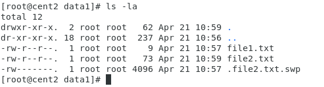

-> Tại dòng 
- `d`: Nghĩa là `data1` là 1 folder
- `rwx`: Là quyền của User. Ở đây User có đầy đủ 3 quyền là read (đọc), write (ghi) và excute (thực thi) 
- `r-x`: Là quyền của Group. Ở đây Group có 2 quyền là read (đọc) và excute (thực thi)
- `r-x`: Là quyền của các User khác. Ở đây các User khác có 2 quyền là read (đọc) và excute (thực thi)
- `root root`: Các quyền ở trên là quyền của User root và Group root
-> Tại dòng `file1.txt`
- `-`: Nghĩa là `file1` là 1 file
- `rw-`: Là quyền của User. Ở đây User có 2 quyền là read (đọc) và write (ghi)
- `r--`: Là quyền của Group. Ở đây Group có 1 quyền là read (đọc)
- `r--`: Là quyền của User khác. Ở đây các User khác có 1 quyền là read (đọc)
- `root root`: Các quyền ở trên là quyền của User root và Group root

- `ls -lah`: Kiểm tra đầy đủ thông tin của một file (bao gồm quyền)
- `chmod`: Thay đổi quyền truy cập của người dùng tới file/folder
## 5.1 Cấu trúc lệnh
### Thay đổi quyền của file và folder
```sh
chmod [options] [mode] file1 file2 file3 ...
```
- Các options: 
	+ `-R`: Recursive, áp dụng cho tất cả các file và folder bên trong
	+ `-f`: force, thay đổi quyền trong cả trường hợp xảy ra lỗi
	+ `-v`: verbose, hiển thị đối tượng đã xử lý
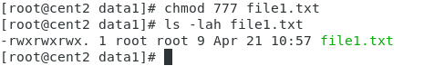    
- Các mode:
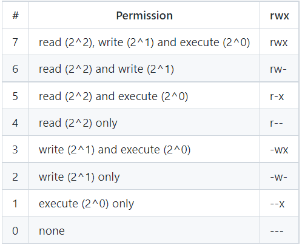


Đối với thư mục:

  - Read: chỉ cho phép sử dụng lệnh ls để xem tên các đối tượng có trong thư mục, nếu muốn xem thêm các thông tin như: kích thước, quyền hạn truy cập, chủ sở hữu, ngày khởi tạo… bạn cần cấp thêm cho thư mục quyền execute.

  - Write: cho phép tạo và xóa các đối tượng trong thư mục.

  - Execute: chỉ cho phép chuyển vào thư mục sử dụng lệnh cd.

Đối với file:

  - Read: cho phép xem nội dung của file.

  - Write: cho phép chỉnh sửa nội dung, xóa file.

  - Excute: cho phép chạy file, quyền này thường được gán các file nhị phân thực thi (tương tự như file .exe trong Windows).

Các trường hợp

- X=1: cd đc vào trong thư mục, chạy đc các file thực thi.

- W = 2: Không làm được gì  = 0. 

- W+X = 3: đc cd,Tạo đối tượng trong Folder, ko được phép ghi nội dung vào file, chỉ được ghi đè, không liệt kê đc thông tin trong thư mục (ls), được quyền xóa cả file và thư mục.

- R = 4: Người dùng chỉ được liệt kê trong folder có những file hoặc thư mục  gì (Không liệt kê đc thông tin của file hoặc thư mục ), không đọc được nội dung trong file. ko cd đc vào trong thư mục.

- R+X =5: CD vào trong thư mục  và biết thông tin file,Người  dùng được phép đọc nội dung file (cat), không thay đổi đc nội dung file.

- W+R =6 : chỉ liệt kê tên file, còn lại ko làm đc gì.

- R+W+X =7: Full quyền .


