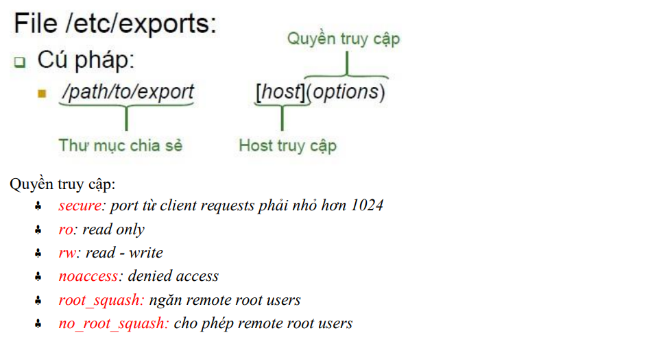
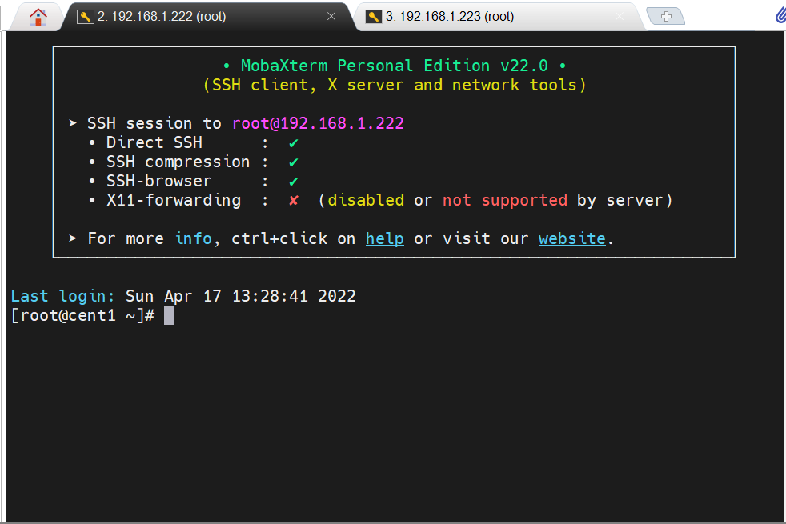
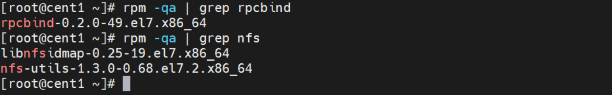
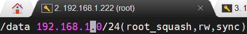
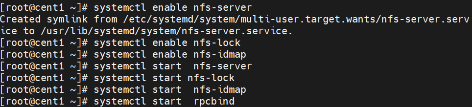
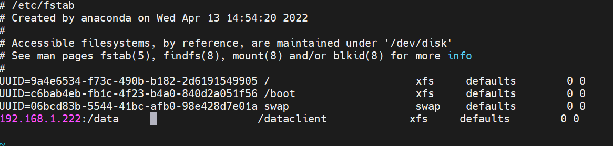
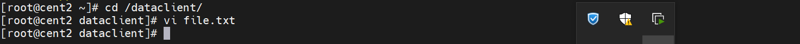
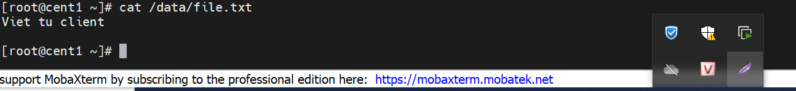

# Network File System - NFS

Dịch vụ chia sẻ file NFS
- NFS (Network File System) là hệ thống cung cấp dịch vụ chia sẻ file phổ biến hiện nay trong 
hệ thống mạng Linux. Hiê n nay tồn tại các phiên bản: NFSv2, NFSv3 và NFSv4

NFS sử dụng mô hình client/server. Trên server có các ổ đĩa cứng vật lý chứa các file system 
được chia sẻ và 1 số dịch vụ chạy ngầm trên hệ thống phục vụ cho việc chia sẻ cho các client
(goị là quá trình export). Ngoài ra các dịch vụ chạy trên Server cũng cung cấp chức năng bảo mật 
file và quản lý lưu lượng dùng file system quota

- NFS cho phép NFS client mount một phân vùng của NFS server như phân vùng cục bộ.

- Dịch vụ NFS không được security nhiều, vì vậy cần thiết phải tin tưởng các client được cho 
phép mount các phân vùng của NFS server.

### Cấu trúc khai báo chia sẻ file với NFS

NFS Server mặc định không cho user có quyền root trên NFS Client có quyền tương tự trên NFS 
Server. Với tuỳ choṇ no_root_squash cho phép root tại máy client cũng là root tại server, 
root_squash cho phép máy chủ chạy NFS server coi root trên client như một người dùng ngoài 
hệ thống (nfsnobody).

### Các tiến trình NFS

- portmap quản lý các kết nối, sử dụng cơ chế RPC (Remote Procedure Call), tiến trình 
chạy ở cả server và client

-  rpc.nfsd tiến trình NFS server

-  rpc.statd và rpc.lockd xử lý file locking

-  rpc.mountd kiểm soát quyền được mount patition của NFS users

- rpc.rquotad kiểm soát quota mà NFS users có thể sử dụng

#  Cài đặt và cấu hình dịch vụ NFS 

Yêu cầu

- Bài lab cần 2 máy Linux: 1 máy làm NFS Server, 1 máy làm NFS Client(Cent2 guid và cent1)

- Chia sẻ thư mục trên máy NFS Server qua mạng cho máy NFS Client

Máy server IP 192.168.1.222

Máy client IP 192.168.1.223

1 -Kiểm tra package rpcbind và nfs-utils đã được cài đặt trên NFS Server hay chưa

Yum để cài đặt nfs-utils và rpcbind

2 -Tạo thư mục chia sẻ /data

- mkdir /data

- chown -R nfsnobody:nfsnobody /data
- chmod 755 /data

Chỉnh sửa trong exports

vi /etc/exports

- /data: Thư mục chỉ định share trên server
- 192.168.1.0/24: Lớp mạng được phép sử dụng thông tin share từ server (tùy chọn chỉ chia sẻ cho 1 ip cụ thể thì gõ thẳng ip đó)
- (root_squash,rw,sync): Thiết lập quyền thư mục share với quyền read-write, root_squash - truy 
cập nfs bằng user nfsnobody.

  -// Các tùy chọn :

  - ro: quyền chỉ đọc

  - rw: quyền đọc và viết

  - root_squash: ngăn chặn người dùng root remote NFS

  - no_root_squash: cho phép người dùng root remote NFS

  - subtree_check: tuỳ chọn kiểm tra tệp và thư mục trên server lưu trữ.

  - no_subtree_check: không kiểm tra tệp và thư mục đang được lưu trữ.

  - sync: đồng bộ thư mục dùng chung.

  - async: bỏ qua kiểm tra đồng bộ hóa để tăng tốc độ.

- Chưa dùng firewall thì tắt và khởi động lại dịch vụ nfs server

Khởi động lại các dịch vụ

### Trên client 
- tắt firewalld ,selinux

- và cài đặt nfs-utils

- tạo thư mục chứa storage (mkdir /dataclient)

- tiến hành mount và ghi nhớ  vào  /etc/fstab

Tạo thử 1 text có chữ " Viet tu client""

Và sang server kiểm tra

 

