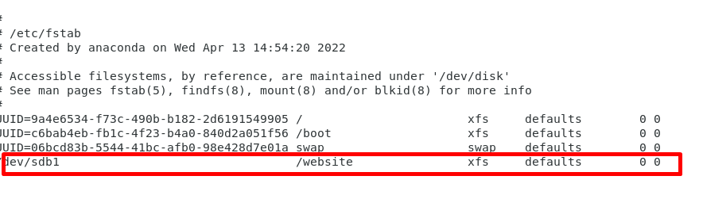

# Phân vùng ổ cứng
## 1 - Ổ Physical
Một file system xác định cách lưu trữ dữ liệu hoặc thông tin và truy xuất từ ​​đĩa lưu trữ. Đối với hệ điều hành Windows thì các file systems phổ biến là FAT32 và NTFS. Trên hệ điều hành Linux, các file system phổ biến là ext2, ext3, ext4, xfs, vfat, swap, ZFS và GlusterFS.Hiện trên centos7 sử dụng chuẩn mới là xfs.
Trên window đc xác định bằng các ký tự A B C D...Trên Linux là các mountpoint

- fdisk chỉ tạo phân vùng trên ổ đĩa mbr tạo tối đa 4 phân vùng chính

- ổ cứng GPT tạo đc 128 phân vùng chính ( sử dụng công cụ parted để phân vùng)

Tùy vào bios có hỗ trợ khởi động ổ loại nào ta có thể lựa chọn phù hợp.

Sử dụng công cụ fdisk (hoặc parted)

Các bước thực hiện:
- Lệnh fdisk -l để kiểm tra thông tin các ổ cứng hiện tại có trên hệ thống
- Lệnh fdisk /dev/sdX để phân chia partition của ổ cứng /dev/sdX
- Lệnh mkfs.xfs /dev/sdXn để format phân vùng /dev/sdXn định dạng xfs
- Lệnh mount /dev/sdX /dataX để gắn kết partition đã format vào thư mục /dataX
- Sửa file /etc/fstab để tự động mount partition lúc khởi động
- Lệnh mount -a để reload file cấu hình /etc/fstab

Kiểm tra thông tin thiết bị lưu trữ:

ta sẽ tiến hành phân vùng ổ cứng sdb vừa mới gắn vào

/dev/sdb1 = 10GiB dung lượng là phân vùng chính có thể cài hdh lên đây

còn nếu chỉ lưu dữ liệu thì chọn e

Định dạng dữ liệu xfs và tạo thư mục /website rồi mount

Test thử tạo file1.txt trong /website và in ra

Để Linux tự động mount /dev/sdb1, khi hệ thống khởi động cần phải thêm vào cuối 
file /etc/fstab

Khởi động lại  test thử.

Khi xóa 1 phân vùng ta phải bỏ lưu trữ thông tin ở fstab rồi tiến hành câu lệnh umount

Rồi fdisk vào /dev/sdb1 xóa patittion có số là 1 ( d ) và lưu lại (w)

# 2- Ổ cứng dạng LVM

Logical Volume Management (LVM) đã có sẵn trên hầu hết trên các bản phân phối Linux, có nhiều lợi thế so với quản lý phân vùng truyền thống. Logical Volume Management được sử dụng để tạo nhiều ổ đĩa logic. Nó cho phép các bộ phận logic được thay đổi kích thước (giảm hoặc tăng) theo ý muốn của người quản trị.

Cấu trúc của LVM bao gồm:

Một hoặc nhiều đĩa cứng hoặc phân vùng được định cấu hình là physical volume(PV).
Một volume group(VG) được tạo bằng cách sử dụng một hoặc nhiều khối vật lý.
Nhiều logical volume có thể được tạo trong một volume group.

Ktra packet lvm2 đã được cài đặt chưa

Lấy 2 ổ cứng mỗi ổ 20 GB gắn vào máy và phân vùng mỗi vùng 10Gb trên sdb1 và sdc1 dạng lvm 

Tạo các physical volum, volum group và logical volum

Sau đó ta định dạng xfs và mount , ghi vào fstab và test thử khởi động lại

