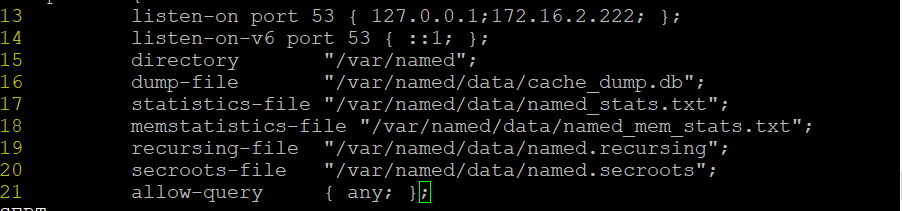

# 1

Trên web

   - yum install httpd -y

   - vi /etc/httpd/httpd.conf
   
      - sửa dòng 95  ServerName www.dinhtu.com:80
      - dòng  151     AllowOverride All
      - dòng 196  
      

      - đổi đường dẫn 119 và 131 thành /web

        - service firewalld stop
        - systemctl disable firewalld.service
        - tắt selinux
# Trên máy proxy + làm cả dns

Mở rộng thư viện

    rpm -Uvh https://dl.fedoraproject.org/pub/epel/epel-release-latest-7.noarch.rpm

    rpm -Uvh http://li.nux.ro/download/nux/dextop/el7/x86_64/nux-dextop-release-0-1.el7.nux.noarch.rpm

    yum --enablerepo=epel -y install nginx

    yum  install bind* -y

    đặt dn1 là chính nó

     - vào vi /etc/named.conf
     
       - dòng 13

       

