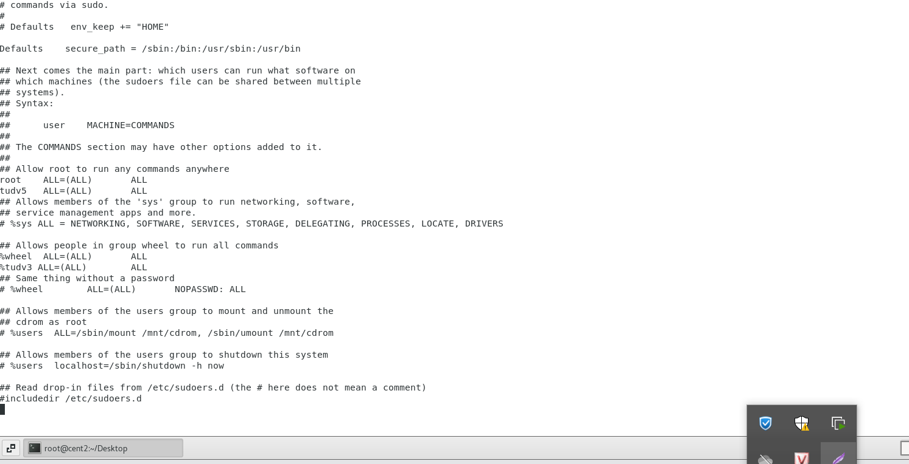

# Quản trị người dùng Linux

Có hai loại tài khoản:

- Tài khoản quản trị root: có quyền quản trị cao nhất trong hệ thống, được phép làm mọi việc mà 
không bị kiểm soát

- Các tài khoản thông thường được tạo ra cho các mục đích:

  - Cung cấp tài khoản truy nhập cho người sử dụng hệ thống

  - Cung cấp tài khoản dùng bởi các dịch vụ hệ thống như http, samba, mysql,…

Chú ý: tránh làm việc dưới tài khoản của root cho các công việc thông thường hàng ngày

Với Linux, mỗi user có một định danh duy nhất, gọi là UID (User ID).

- 0 – 99: user có quyền quản trị

- >99: user khác. >= 500: không phải user hệ thống

-  UID có khả năng sử dụng lại

Mỗi user thuộc ít nhất một group. Mỗi group cũng có một định danh duy nhất là GID 

Mỗi users cần có những thông tin: tên user, UID, tên group, GID, home directory… 

Windows quản lý thông tin bằng LDAP, Kerberos. Linux quản lý thông tin bằng file text. 

Có thể chỉnh sửa thông tin của users bằng công cụ, hoặc sửa trực tiếp bằng text file.

Quản lý người dùng hệ thống bằng lệnh

- useradd: tạo user mới

- usermod: chỉnh sửa thông tin user.

- userdel -r: xóa user khỏi hệ thống

- passwd: đổi mật khẩu, chính sách thay đổi mật khẩu

- groupadd: tạo group mới

- groupdel: xóa group khỏi hệ thống

- groupmod: chỉnh sửa thông tin group.

# 2. Nhóm sudoers

/etc/sudoers

•	Chỉ thị ” root ALL=(ALL) ALL” tuân theo đúng cú pháp thường gặp, có nghĩa là người dùng root, trên tất cả các máy, có thể mượn quyền tất cả các người dùng, để thực thi tất cả các lệnh.

•	Chỉ thị “%admin ALL=(ALL) ALL” cũng tuân theo cú pháp đó, có nghĩa là nhóm người dùng admin, trên tất cả các máy, có thể mượn quyền tất cả các người dùng, để thực thi tất cả các lệnh

Một số ví dụ thực tế khác

a) Cho phép user subadmin được thực thi nhiều lệnh với quyền root

subadmin ALL=(root) /sbin/shutdown, /bin/kill, /etc/init.d/httpd

b) Cho phép user subadmin được tắt máy mà không cần phải xác nhận bằng mật khẩu

subadmin localhost= NOPASSWD: /sbin/shutdown

c) Cho phép user subadmin được thực hiện bất kỳ lệnh nào trong /usr/bin ở máy linux01

subadmin linux01 = /usr/bin/*

/usr/bin/passwd, /usr/sbin/useradd, /sbin/reboot

### Cấp 1 vài quyền cho tudv

%tudv       ALL=(root)      /etc/init.d/sshd, /sbin/shutdown, /usr/sbin/useradd, /sbin/service, /usr/bin/passwd, /sbin/reboot 

Cấp cho tudv được thực thi tất cả nhưng ngoại trừ reboot máy
%tudv    ALL=(root)      ALL, !/sbin/reboot

Cấp cho tudv được thực thi tất cả trong sbin 

%tudv  ALL=(root)    /sbin/*
