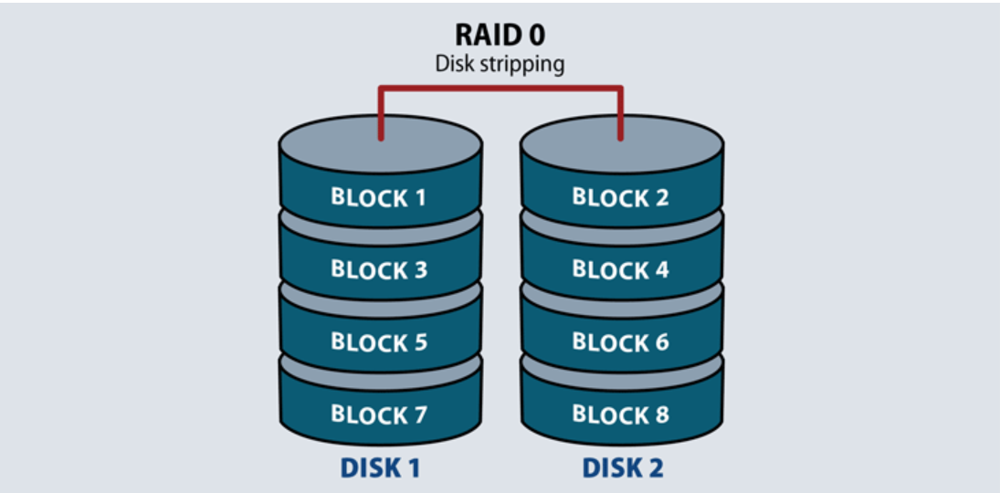

# RAID

## Khái niệm 

RAID là viết tắt của cụm từ Refundant Arrays of Inexpensive Disks, lần đầu tiên được phát triển vào năm 1987 tại trường Đại học California tại Berkeley (Hoa Kỳ). Đây là một trong những hình thức ghép các ổ vật lý lại với nhau thành cả một hệ thống lưu trữ với chức năng có thể gia tăng tốc độ đọc/ghi dữ liệu, giảm nguy cơ mất, hỏng dữ liệu do lỗi đĩa phần cứng gây ra, hỗ trợ hiệu quả cao và an toàn đáng tin cậy hơn so với các giải pháp trước đây.

RAID có thể được sử dụng cho các ổ đĩa SATA, SAS và SSD.

Lợi ích RAID mang lại:

- Độ tin cậy của dữ liệu (Data Reliability) đảm bảo cho dữ liệu không có lỗi.

- Tính sẵn sàng của dữ liệu (Data Availability) đảm bảo cho dữ liệu khả dụng ngay cả trong trường hợp lỗi phần cứng.

- Hiệu suất dữ liệu (Data Performance) đảm bảo truy cập dữ liệu nhanh chóng cho cả hoạt động đọc và ghi.

- Dung lượng dữ liệu (Data Capacity) đảm bảo khả năng lưu trữ lượng dữ liệu lớn.

Sự dự phòng là nhân tố quan trọng nhất trong quá trình phát triển RAID cho môi trường máy chủ. Dự phòng cho phép sao lưu dữ liệu bộ nhớ khi gặp sự cố. Nếu một ổ cứng trong dãy bị trục trặc thì nó có thể hoán đổi sang ổ cứng khác mà không cần tắt cả hệ thống hoặc có thể sử dụng ổ cứng dự phòng. Phương pháp dự phòng phụ thuộc vào phiên bản RAID được sử dụng.

# Các kiểu RAID phổ biến

Hiện nay các thể loại raid phổ biến  là raid 0 1 5 6 và 10 là các loại được sử dụng nhiều nhất.

## 1-RAID 0

Đây là loại RAID khá phổ biến và được nhiều người dùng do có khả năng nâng cao hiệu suất trao đổi dữ liệu của đĩa cứng.

RAID 0 thì cần ít nhất 2 ổ đĩa, RAID 0 cho phép máy tính ghi dữ liệu theo phương thức đặc biệt được gọi là Striping. Có thể dễ hiểu là nếu bạn có với n đĩa cứng thì mỗi đĩa chỉ cần phải đọc, ghi 1/n lượng dữ liệu được yêu cầu, tốc độ sẽ tăng lên tương ứng với n lần.

Mặc dù vậy nhưng RAID 0 lại có bất lợi đó là nguy cơ mất dữ liệu cao, vì Raid 0 được đưa ra không thể cung cấp cấp độ dự phòng cho các dữ liệu được lưu trữ. Nên khi một ổ cứng bị lỗi thì sẽ gây nguy hiểm đến cho dữ liệu.

RAID 0 thực sự thích hợp cho những người dùng cần truy cập nhanh số lượng dữ liệu lớn, 

## 2- RAID 1

Cũng như RAID 0, RAID 1 cũng cần ít nhất hai đĩa cứng để có thể làm việc. Dữ liệu được ghi vào hai ổ giống hệt nhau (Mirroring). Trong trường hợp một trong hai ổ gặp trục trặc thì ổ còn lại sẽ vẫn tiếp tục hoạt động bình thường.

Nếu RAID 0 tập trung ưu tiên cho tốc độ thì RAID 1 lại hoàn toàn trái ngược, nó nghiêng về an toàn dữ liệu là nhiều hơn. Và nhược điểm của RAID 1 đó chính là làm giảm một nửa dung lượng có thể sử dụng, có nghĩa là sẽ chia đôi dung lượng ra làm hai và điều này khiến cho tăng chi phí cho mỗi GB.

## 3 - RAID 1+0

Đây là loại RAID kết hợp giữa RAID 0 và RAID 1 nhưng là hai cơ chế hoàn toàn khác.

Hạn chế của RAID 10 đó là khả năng sử dụng thấp và tốn kém chi phí do cần tới 4 ổ cứng và dữ liệu sẽ được lưu theo 2 dạng đó là hai ổ dạng Striping (RAID 0) và hai ổ dạng Mirroring (RAID 1). Raid 10 thích hợp với tất cả các đối tượng sử dụng.

Khả năng mở rộng cũng bị hạn chế so với các cấp RAID khác. Do vậy RAID 10 được sử dụng nhiều trong các máy chủ cơ sở dữ liệu thực hiện nhiều thao tác ghi.

## 4 - RAID 5 

- Raid 5 là một bản Raid được nâng cấp từ Raid 0

- RAID 5 không giới hạn về số ổ đĩa, nhưng cần tối thiểu ít nhất là 3 ổ đĩa.

- Giả sử  Raid 5 với 4 ổ đĩa (được đánh số theo thứ tự 1,2, 3, 4), và các dữ liệu A, B, C, D (được phân đoạn thành A1, A2, A3/ B1, B2, B3/ C1, C2, C3/ D1, D2, D3) (như hình)

  - Dữ liệu A: dữ liệu này sẽ được phân ra làm những đoạn dữ liệu A1, A2, A3, các đoạn dữ liệu này được lưu lần lượt và các ổ đĩa theo thứ tự 1, 2, 3 và ổ số 4 sẽ là ổ để sao lưu lại toàn bộ dữ liệu A.
  - Tương tự dữ liệu B1, B2, B3 sẽ được ghi vào ổ đĩa theo thứ tự các ổ 1, 2, 4, và ổ số 3 sẽ là ổ backup dữ liệu phòng của dữ liệu B.
  - Các dữ liệu C1, C2, C3 sẽ được ghi vào các ổ đĩa theo thứ tự 1, 3, 4 và ổ số 2 sẽ là ổ để backup dữ liệu dự phòng của dữ liệu C.
  - Các dữ liệu D1, D2, D3 sẽ được ghi vào các ổ đĩa theo thứ tự 2, 3, 4 và ổ đĩa số 1 sẽ là ổ để backup dữ liệu dự phòng của dữ liệu D.
  - Và chu kỳ lặp lại.

- Raid 5 được đánh giá là an toàn cho người dùng ,cơ chế hoạt động của nó cần ít nhất 3 ổ cứng, dữ liệu và dữ liệu backup được ghi đều trên các ổ.

Vì vậy khi một trong những chiếc ổ cứng trong hệ thống máy chủ chạy Raid 5  bị hỏng, dữ liệu sẽ không bị mất đi vì trên mỗi ổ cứng đều có các đoạn dữ liệu dự phòng. Như vậy trong thệ thống server báo lỗi 1 ổ cứng ta chỉ việc rút ổ cứng hỏng ra và thay thế vào đó 1 ổ cứng mới có thông số tương tự  nó sẽ tự động chuyển dữ liệu dự phòng sang mà không phải cài đặt hay rebuild lại Raid.  Bằng cách đó các dữ liệu sẽ hoàn toàn được bảo toàn. Dung lượng ổ cứng mà người dùng có thể sử dụng (dung lượng cuối) chính là dung lượng toàn bộ ổ cứng cộng lại trừ đi dung lượng 1 ổ. Chính vì vậy Raid 5 tối ưu hơn Raid 10 về mặt dung lượng. Raid 10 độ an toàn cũng khá cao nhưng không được sử dụng phổ biến như Raid 5.

## 5 -RAID 6

RAID 6 là sự phát triển hơn của RAID 5. Về cơ bản thì RAID 6 phần tương tự như RAID 5 nhưng trong RAID 6 sử dụng lặp lại nhiều hơn số lần sự phân tách dữ liệu để ghi vào các đĩa cứng khác nhau. Ví dụ như ở RAID 5 thì mỗi một dữ liệu được tách thành hai vị trí lưu trữ trên hai đĩa cứng khác nhau, nhưng ở RAID 6 thì mỗi dữ liệu lại được lưu trữ ở ít nhất ba vị trí, mục đích của việc này chỉ để nhằmg nâng cao an toàn dữ liệu hơn.

RAID 6 yêu cầu tối thiểu 4 ổ cứng. Khi sử dụng đến 4 ổ ứng đó là nó chỉ cho phép bị hỏng đồng thời nhiều nhất là 2 ổ cứng thì vẫn đảm bảo được quá trình hoạt động, khả năng này nhỏ nên việc bảo mật cũng được tăng lên nhưng khả năng chịu rủi ro được cải thiện rất nhiều. Vì vậy, RAID 6 rất được tin tưởng để sử dụng cho các hệ thống máy chứa các thông tin vô cùng quan trọng.

# Cài đặt RAID
Việc cài đặt RAID  chủ yếu dựa vào BIOS của mainboard, RAID Controller .

Sau khi đã cắm ổ cứng vào đúng vị trí RAID trên bo mạch , bạn vào BIOS  để bật bộ điều khiển RAID ...

Sau thao tác này, bạn sẽ lưu thông số rồi khởi động lại máy tính. Trên  màn hình thông báo và nhấn đúng tổ hợp phím khi máy tính yêu cầu (có thể là Ctrl+F hoặc F4 hoặc F11 ..tùy bộ điều khiển RAID) để vào BIOS RAID.

Đối với BIOS RAID, mặc dù mỗi loại có một giao diện khác nhau (tham khảo tài liệu đi kèm) nhưng về cơ bản bạn phải thực hiện những thao tác sau:

+ Chỉ định những ổ cứng sẽ tham gia RAID.

+ Chọn kiểu RAID (0/1/0+1/5).

+ Chỉ định Block Size: Đây là chìa khóa ảnh hưởng rất lớn tới hiệu năng của giàn ổ cứng chạy RAID. Đối với RAID dạng Striping, Block size cũng có nghĩa là Stripe Size. Nếu thông số này thiết lập không phù hợp với nhu cầu sử dụng thì sẽ gây lãng phí bộ nhớ và giảm hiệu năng. Ví dụ nếu Block Size có giá trị là 64KB thì tối thiểu sẽ có 64KB được ghi vào ổ đĩa trong mọi trường hợp, ngay cả khi đó là một file text có dung lượng 2KB. Vì thế giá trị này nên xấp xỉ tương ứng với kích thước trung bình của các file bạn dùng. Nếu ổ cứng chứa nhiều file nhỏ ví dụ tài liệu Word, bạn nên để block size bé, nếu chứa nhiều phim ảnh hoặc nhạc, block size lớn sẽ cho hiệu năng cao hơn (nhất là với hệ thống RAID 0).

Bên cạnh đó, Block size còn có một chức năng khác quyết định việc file sẽ được ghi vào đâu. Quay về với ví dụ Block Size 64KB, nếu như file có kích thước nhỏ hơn 64KB, nó sẽ chỉ được ghi vào một ổ cứng trong hệ thống RAID và như vậy sẽ không có bất cứ sự cải thiện hiệu năng nào. Trong một trường hợp khác, một file có kích thước 150KB sẽ được ghi vào 3 ổ đĩa với các đoạn 64KB + 64KB + 22KB và bộ điều khiển có thể đọc thông tin từ ba ổ cùng lúc cho phép tăng tốc đáng kể. Nếu bạn chọn block size là 128KB thì file đó chỉ được ghi vào 2 ổ 128KB + 22KB mà thôi. Thực tế bạn nên chọn Block Size là 128KB cho các máy tính để bàn trừ khi có nhu cầu riêng.

Sau khi bộ điều khiển đã nhận biết hoàn hảo hệ đĩa cứng mới, bạn tiến hành cài đặt hệ điều hành cũng như format ổ RAID

