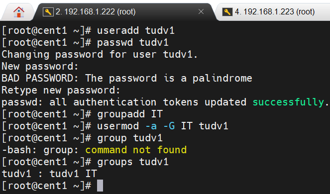
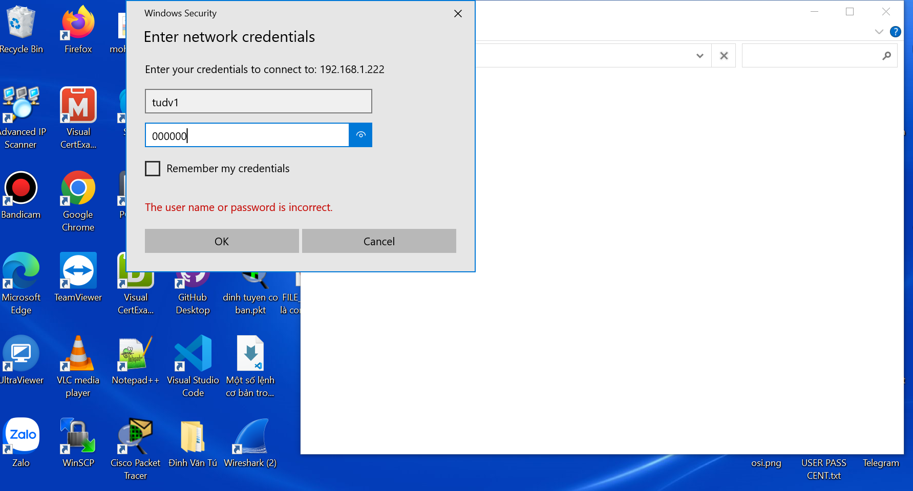

# DỊCH VỤ CHIA SẺ FILE SAMBA

### 1-Giới thiệu dịch vụ

Samba là dịch vụ chia sẻ file và printer trong môi trường mạng giữa các máy Linux và Windows. 

Samba hỗ trợ các máy Linux join vào Workgroup hoặc Domain trên Windows. Samba chạy trên 
nền giao thức SMB (Server Message Block) để chia sẻ tài nguyên.

Windows sử dụng các giao thức chia sẻ file là SMB hay CIFS (Common Internet File Sharing). 
Giao thức mạng mức cao, cung cấp cấu trúc và ngôn ngữ yêu cầu chia sẻ file giữa client và 
server. Giao thức này cung cấp các lệnh để mở, đọc, ghi và đóng file qua môi trường mạng và 
cũng có thể cung cấp truy cập vào các dịch vụ Directory.
SMB được sử dụng cho mục đích chia sẻ file. Trên các hệ thống Windows NT cũ nó vận hành 
với NetBT (NetBIOS over TCP/IP), sử dụng các port thông dụng như 137, 138 (UDP) và 139 
(TCP). Trên các hệ thống Windows 2000/XP/2003, Microsoft hỗ trợ khả năng vận hành trực tiếp 
SMB qua port 445 (TCP), không cần qua NetBT

### 2-Cơ chế phân quyền và chia sẻ trên Windows

Cơ chế kiểm soát truy nhập cơ bản trên Windows là kết hợp giữa hai cơ chế phân quyền: phân 
quyền trên hệ thống file system NTFS và phân quyền share trên giao thức chia sẻ file CIFS 
Phân quyền CIFS

- Read (đọc)

- Change (sửa)

- Full Control (toàn quyền

Ba quyền này không độc lập với nhau. Full Control bao hàm Change, và Change lại bao hàm
Read.

Phân quyền NTFS
- Full Control (toàn quyền)
-  Modify (sửa)
- Read & Execute (đọc tệp và chạy chương trình)
- List folder contents (hiện nội dung thư mục)
- Read (đọc)
- Write (viết)
Sáu quyền này không độc lập với nhau. Full Control bao hàm tất cả các quyền còn lại.

# Thực hành
Sử dụng 2 máy Sambaserver 192.168.1.222 
và sambaclient là win 10 là máy host đang chạy máy ảo vmware chứa Samba server

Tạm thời tắt hết firewall selinux

**Trên SERVER**

Trên Samba server cần cài 2 package sau:
- samba: package chính dịch vụ Samba
- samba-common: thư viện dùng chung dịch vụ Samba

Kiểm tra package Samba được cài đặt hay chưa,nếu chưa tiến hành cài đặt

- yum install samba -y

- Tạo user tudv1 pass 000

- Tạo nhóm IT và add tudv1 vào IT

Tạo thư mục /samba

- chuyển chủ sở hữu /samba cho IT và để giấy phép  755

Cấu hình dịch vụ

- Copy file cấu hình của samba để lần sau có thể dùng lại( giữ nguyên trạng thái)

- Chỉnh sửa file /etc/samba/smb.conf

thêm vào 1 đoạn ở cuối cùng file đó

[IT]

        comment = chia se cho IT
        path = /samba
        browsable = yes
        writeable = yes
        reaonly = no
        valid user = @IT

- Tiếp theo thêm người dùng vào dịch vụ samba

 - smbpasswd -a tudv1
 - pass smb là 000000

Khởi động lại dịch vụ smb

Tiến hành test trên Host win 10

Vào run gõ //192.168.1.222

Win 10 viết dữ liệu vào tudv1

