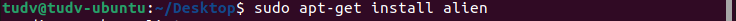

## **HĐH UBUNTU**

- Ubuntu là phản phân phối theo nhánh Debian

- Packetmanager là ***apt-get***

- Hoặc cài đặt bằng file ***.deb*** theo cấu trúc

  - apt-get install soft.deb cài phần mềm soft đồng thời giải quyết
    các gói phần mềm phụ thuộc
  - apt-get remove soft.deb loại bỏ phần mềm soft cũng như tất cả
    các gói phần mềm trực thuộc

- Cài đặt file .rpm**

  - Chuyển file ***.rpm*** thành file ***.deb*** :

  - Mở Terminal

  - Cài đặt gói alien với câu lệnh: ***sudo apt-get install alien***

  - Convert file từ ***.rpm*** thành ***.deb*** với câu lệnh: ***sudo alien -k filename.rpm***

  - Sau bước trên bạn đã có một tệp tin là filename.deb, tiếp tục click vào để cài đặt.

- Firewall trên ubuntu là dịch vụ ufw được lưu tại   ***/etc/default/ufw***

  - Đặt lại các giá trị mặc định cho firewall ,UFW được đặt để từ chối tất cả các kết nối đến và cho phép tất cả các kết nối đi

   - sudo ufw default deny incoming 
   - sudo ufw default allow outgoing 
   - Cho phép kết nối SSH  ( giả sử ở giá trị mặc định port 22)
     - sudo ufw allow ssh 
     - sudo ufw allow 22 
   - sudo ufw enable
   - sudo ufw disable
   - systemctl enable ufw

   ....

## CÀI ĐẶT UBUNTU TRÊN VMWARE

- Mở phần mềm vmw và chọn create new vt 
- Typical là cài đặt tự động do app vmw tự đề xuất cho mình về các thông số...
- Custom - cài đặt tùy chọn theo ý muốn,tạo 1 máy ảo tùy chọn option, như là trình điều khiển SCSI,loại dữ liệu trên đĩa,tương thích với các sản phầm vmw cũ hơn.
                        

- Phần cứng máy ảo tương thích cho phiên bản vmw 16         và cũng tương thích esx server ( vmw sphere), cột Limitation thế hiện phần cứng hỗ trợ tối đa của 1 máy ảo như 128 GB ram, 32 CPU,10 card mạng...

- Tùy chọn cài hệ điều hành cuối cùng 

- Chọn loại hệ điều hành và phiên bản muốn cài, ở đây mình cài ubuntu nên chọn Linux và chọn ubuntu 64bit 

- Tiếp theo ta chọn đường dẫn lưu các file của hệ điều hành sẽ tạo ra khi cài máy vmw tạo ra các file .vmdk 

- Chọn số lượng cpu cài lên và số core trên cpu cài lên
vì thực tế có những bo mạch chủ chạy nhiều cpu, trên mỗi cpu lại có nhiều nhân.

- Tùy chọn ram theo gợi ý: hỗ trợ max 128GB ram, phiên bản ubuntu thường chỉ cần 2gb ram là đủ, phiên bản minimum cần tối thiểu 1gb 

- Tùy chọn card mạng. 
  - Bridge là biến máy ảo như 1 máy thật với môi trường bên ngoài( giống như 1 máy vật lý thường)
  - NAT : Giao tiếp với host và đi ra được internet
  - Host Only : chỉ giao tiếp với host và ko ra internet
  - Custom cũng có tùy chọn VM switch khi ta có nhiều máy ảo muốn connect với nhau và ko giao tiếp bên ngoài ta sẽ chọn các sw ảo.
  - Tùy chọn cuối cùng : ko cần internet và môi trường LAN ngoài, chỉ kết nối internet.
 

- Chọn SCSI controller (BusLogic Parallel, LSI Logic Parallel, LSI Logic SAS và VMware Paravirtual

Chọn theo gợi ý . 

- Chọn loại đĩa mà bạn muốn tạo chọn theo khuyến nghị:

- Chọn tạo 1 đĩa ảo mới,
  - Đĩa ảo bao gồm một hoặc nhiều tệp trên hệ thống tệp máy chủ. Đĩa ảo xuất hiện như 1 đĩa cứng trên hdh host.Bạn có thể sao chép hoặc di chuyển các đĩa ảo trên cùng một máy chủ hoặc giữa các máy chủ.
  - Chọn đĩa ảo hiện có( đã đc cấu hình trước)
  - Sử dụng đĩa vật lý

- Chọn dung lượng đĩa ảo, trong đó
  - Tùy chọn 1 là fix cứng dung lượng lấy từ host (allocate...), nếu ko tích thì đĩa ảo sẽ lấy dần dung lượng trong số 20GB ấy
  - Tùy chọn 2 là để đĩa ảo đó là 1 file 

- Chọn tên file của disk

 

- Bấm tùy chọn tìm file iso của ubuntu
và finish

- Sau khi hoàn tất các chọn lựa ta power on máy ảo

- Giao diện boot lên đầu tiên
sẽ là các gợi ý cài phiên bản phù hợp
mình chọn cái OEM cho nhẹ và đơn giản, cái đầu tiên là phiên bản cho ng dùng phổ thông 

- Chọn ngôn ngữ máy 

- Chọn ngôn ngữ bàn phím 

- Tùy chọn:
 - cài đặt bình thường( cài thêm các phần mềm, các utinities..)
 - mini chỉ cài trình duyệt firefox và các utinities cơ bản
 - Other opt
   - download các cập nhật khi cài đặt,các cập nhật sẽ chạy sau khi cài xong...
   - cài đặt phần mềm bên thứ 3 cho card đồ họa ,wifi...

   

- Tùy chọn : 
  - xóa và cài mới hệ điều hành (erase)
  - Tạo lại phân vùng trong số 20gb trên đã chọn bên trên... (something else)
  

- sda được định dạng ext4

- Chọn múi giờ Hồ chí minh, ngày,giờ...

- Tùy chọn tên nhà sản xuất, tên máy ,tên user, pass user hoặc 1 user trong miền

- Continue là đến giao diện cài đặt

- Sau khi cài đặt xong 

máy sẽ tiến hành cập nhật 

- Thao tác thử :

- Update PM : sudo apt update

- Mặc định trên ubuntu disable user root, nếu ta muốn lấy thì enable lại bằng câu lệnh
  - sudo passwd root
    - nhập pass của oem
    - nhập pass root
    - nhập lại pass root
    - ''su - ''để sang root

- Cài đặt ssh trên Ubuntu
   
   - sudo apt install openssh-server
   - bấm y nếu hỏi.
   

   - sudo systemctl status ssh

   
   
   -  sudo ufw allow ssh

   - Nếu cần chỉnh sửa ssh 
     - sudo vi /etc/ssh/sshd_config(open ssh)

   - Gõ ip a để xem địa chỉ IP
   - Dùng putty trên host để kết nối vào
     - 

     - 

- Xóa và cài đặt Chrome 

Ta đang có file chome.deb ngoài màn hình

  - sudo apt-get install chome...

- Cài đặt gói Opera .rpm

  - Đầu tiên ta phải đổi từ .rpm sang .deb sau đó cài bình thường
    - cài thêm thư viện alien

    

    - đổi đuôi rpm sang deb 

    

    - Sau đó cài đặt 

    

  

