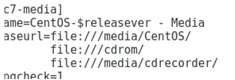

# Repository
Trên các repository (gọi tắt: repo) là các nơi chứa phần mềm tập trung trên mạng dành riêng cho một hệ thống nào đó. Trong đó, Ubuntu và 
Debian sử dụng repo nhiều nhất, kế đến là Fedora và openSuse. Mọi phần mềm đều được chứa tại repo và khi nào người dùng cần thì phần mềm sẽ được tải về từ repo, sau đó cài lên máy. Rất tiện lợi cho việc cập nhật và nâng cấp phần mềm.

Các gói cài đặt phần mềm có thể được lưu ở dạng file chạy trực tiếp (như .exe thường thấy trên Windows…) hoặc ở các định dạng phân phối dành riêng mà phổ biến nhất là .RPM và .DEB (các gói phần mềm này có thể cài đặt dễ dàng và gần như đã thành chuẩn chung cho việc phân phối phần mềm). Phần mềm cũng có thể được phân phối dưới dạng mã nguồn (nhất là phần mềm nguồn mở), người dùng phải tự biên dịch trên máy rồi cài đặt.

# YUM
### 1.Yum mirror base:

- /etc/yum.repos.d/CentOS-Base.repo

### 2.Yum epel:

- wget http://dl.fedoraproject.org/pub/epel/epel-release-latest-7.noarch.rpm

- rpm -ivh epel-release-latest-7.noarch.rpm

- Epel được lưu tại: /etc/yum.repos.d/epel.repo

VD:

- yum --enablerepo=epel info dhcp

- yum --enablerepo=epel insatll bind

### 3.Yum cdrom (Repo là đĩa cdrom)

- Mkdir /cdrom

- Mount /dev/cdrom /cdrom

- vi /etc/yum.repos.d/CentOS-Media.repo 

  

- yum --disablerepo=\* --enablerepo=c7-media install dhcp

### 4.Dùng yum để download:

- yumdownloader bind-utils

- Down vào 1 folder và down cả các gói phụ thuộc:

  yumdownloader samba httpd --destdir /download --resolve

  resolve: các gói phụ thuộc

### 5.Xóa cache: (metadata )

- yum clean all

- yum clean dhcp

### 6.Cài:

- yum install pkg

Cài lại:
- yum reinstall dhcp

### 7.Update:

-	Tất cả các gói: yum update

-	1 gói cụ thể: yum update firefox

### 8.Xóa gói cài:

- yum erase dhcp

- yum remove dhcp

### 9.	Hạ version:

- yum downgrade pkg

### 10.	Liệt kê các gói đã cài:

- Yum list installed

### 11.	Liệt kê các gói tồn tại trong repo:

- yum list available

### 12.	liệt kê 1 gói trong repo và xem gói cài chưa:

- yum list bind

- yum list nginx

### 13.	Xem 1 gói đã cài chưa:

- yum list installed nginx

- yum list installed | grep dhcp

### 14.	Tìm kiếm 1 gói trong repo:

- yum search dhcp

- yum search nginx

### 15.	Xem thông tin gói

- yum info dhcp

# RPM

### 1.Cài gói:

- rpm -ivh “tên gói”

- rpm -ivh --nodeps “tên gói”

### 2.Xóa gói:

- rpm -e “tên gói”

- rpm xóa gói ko xóa gói phụ thuộc:

  - rpm -e --nodeps “tên gói”

  - rpm -e xóa hết cả gói phụ thuộc, trừ những gói phụ thuộc đang được dung bởi chương trình khác

### 3.Tìm kiếm:

- rpm -q “tên gói”  tìm kiếm 1 gói cụ thể đã được cài

- rpm -qa   hiển thị tất cả các gói đã được cài

- rpm -qc “tên gói”  tìm kiếm đường dẫn file cấu hình của gói

