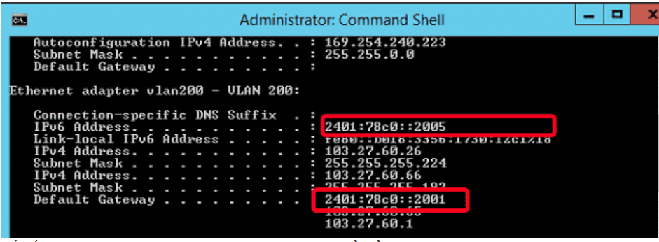

# 1.1-Địa chỉ IPv4

IPv4 (Internet Protocol version 4) là phiên bản thứ tư trong quá trình phát triển của các giao thức Internet. IP – Internet Protocol, là một giao thức của chồng giao thức TCP/IP thuộc về lớp Internet, tương ứng với lớp thứ ba (lớp network) của mô hình OSI. Ngày nay, IP gần như là giao thức lớp 3 thống trị, được sử dụng rộng rãi trong mọi hệ thống mạng trên phạm vi toàn thế giới.

# 1.2-Cấu trúc địa chỉ IPv4
Địa chỉ IP gồm 32 bit nhị phân, chia thành 4 cụm 8 bit (gọi là các octet). Các octet được biểu diễn dưới dạng thập phân và được ngăn cách nhau bằng các dấu chấm.
Địa chỉ IP được chia thành hai phần: phần mạng (network) và phần host.

Việc đặt địa chỉ IP phải tuân theo các quy tắc sau:
- Các bit phần mạng không được phép đồng thời bằng 0.

 
Ví dụ: Địa chỉ 0.0.0.1 với phần mạng là 0.0.0 và phần host là 1 là không hợp lệ.

- Nếu các bit phần host đồng thời bằng 0, ta có một địa chỉ mạng.

 
Ví dụ: Địa chỉ 192.168.1.1 là một địa chỉ có thể gán cho host nhưng địa chỉ 192.168.1.0 là một địa chỉ mạng, không thể gán cho host được.

- Nếu các bit phần host đồng thời bằng 1, ta có một địa chỉ broadcast.

Ví dụ: Địa chỉ 192.168.1.255 là địa chỉ broadcast cho mạng 192.168.1.0
# 1.3-Các lớp địa chỉ IPv4

Không gian địa chỉ IP được chia thành các lớp sau:

Lớp A:

- Địa chỉ lớp A sử dụng một octet đầu làm phần mạng, ba octet sau làm phần host.

- Bit đầu của một địa chỉ lớp A luôn được giữ là 0.

- Các địa chỉ mạng lớp A gồm: 1.0.0.0 -> 126.0.0.0.

- Mạng 127.0.0.0 được sử dụng làm mạng loopback.

- Phần host có 24 bit => mỗi mạng lớp A có (224 – 2) host.

Lớp B:

- Địa chỉ lớp B sử dụng hai octet đầu làm phần mạng, hai octet sau làm phần host.

- Hai bit đầu của một địa chỉ lớp B luôn được giữ là 1 0.

- Các địa chỉ mạng lớp B gồm: 128.0.0.0 -> 191.255.0.0. Có tất cả 214 mạng trong lớp B.

- Phần host dài 16 bit do đó một mạng lớp B có (216 – 2) host.

Lớp C:

- Địa chỉ lớp C sử dụng ba octet đầu làm phần mạng, một octet sau làm phần host.

- Ba bit đầu của một địa chỉ lớp C luôn được giữ là 1 1 0.

- Các địa chỉ mạng lớp C gồm: 192.0.0.0 -> 223.255.255.0. Có tất cả 221 mạng trong lớp C.

- Phần host dài 8 bit do đó một mạng lớp C có (28 – 2) host.

Lớp D:

- Gồm các địa chỉ thuộc dải: 224.0.0.0 -> 239.255.255.255

- Được sử dụng làm địa chỉ multicast.

  Ví dụ: 224.0.0.5 dùng cho OSPF; 224.0.0.9 dùng cho RIPv2

Lớp E:

      Từ 240.0.0.0 trở đi.

- Được dùng cho mục đích dự phòng.

# 1.4-Địa chỉ Private và địa chỉ Public

Địa chỉ IP được phân thành 2 loại: private và public.

- Private: chỉ được sử dụng trong mạng nội bộ (mạng LAN), không được định tuyến trên môi 

trường Internet. Có thể được sử dụng lặp lại trong các mạng LAN khác nhau.

- Public: là địa chỉ được sử dụng cho các gói tin đi trên môi trường Internet, được định tuyến 

trên môi trường Internet. Địa chỉ public phải là duy nhất cho mỗi host tham gia vào Internet.

Dải địa chỉ private (được quy định trong RFC 1918):

Lớp A: 10.x.x.x

Lớp B: 172.16.x.x -> 172.31.x.x

Lớp C: 192.168.x.x

Kỹ thuật NAT (Network Address Translation) được sử dụng để chuyển đổi giữa IP private và IP public.

 
Ý nghĩa của địa chỉ private: được sử dụng để bảo tồn địa chỉ public.

# 1.5-Địa chỉ Broadcast
Gồm 2 loại:

– Direct broadcast: ví dụ như 192.168.1.255

– Local broadcast: 255.255.255.255

Để phân biệt hai loại địa chỉ này, ta xét ví dụ sau:

Xét host có địa chỉ IP là 192.168.2.1. Khi host này gửi broadcast đến 255.255.255.255, tất cả các host thuộc mạng 192.168.2.0 sẽ nhận được gói broadcast này, còn nếu nó gửi broadcast đến địa chỉ 192.168.1.255 thì tất cả các host thuộc mạng 192.168.1.0 sẽ nhận được gói broadcast (các host thuộc mạng 192.168.2.0 sẽ không nhận được gói broadcast này).

# 1.6-Subnet mask và số prefix length

Subnet mask:

- Subnet mask là một dãy nhị phân dài 32 bit đi kèm với một địa chỉ IP để cho phép xác định được network mà IP này thuộc về. Điều này được thực hiện bằng phép toán AND địa chỉ IP với subnet-mask theo từng bit một.

Ví dụ: Xét địa chỉ IP 192.168.1.1 với subnet-mask là 255.255.255.0. Để xác định địa chỉ mạng của địa chỉ này, thực hiện AND 192.168.1.1 với 255.255.255.0

Để đơn giản,phần network của địa chỉ chạy đến đâu, các bit 1 của subnet-mask này chạy tới đó; ứng với các bit phần host của địa chỉ, các bit của subnet-mask nhận giá trị bằng 0.

Các subnet-mask chuẩn của các địa chỉ lớp A, B, C:

Lớp A: 255.0.0.0

Lớp B: 255.255.0.0

Lớp C: 255.255.255.0

# 1.7-Prefix length:

Một cách khác để xác định địa chỉ IP là sử dụng số prefix – length. 
Số prefix – length là số bit mạng trong một địa chỉ IP. 
Giá trị này được viết ngay sau địa chỉ IP và ngăn cách bởi dấu “/”.

Ví dụ:    192.168.1.1/24

172.168.2.1/16

10.0.0.8/8

# 2.1-IPv6
Do số lượng địa chỉ IPv4 sắp cạn kiệt nên người ta đã phát triển ra IPv6

IPv6 ra đời đã giải quyết được những hạn chế tồn tại của IPv4 trong hệ thống internet do
không gian lưu trữ lớn. IPv4 có không gian truy cập 32 bit, tương đương 4 tỷ địa chỉ. Còn IPv6 có không gian là 128 bit, lớn hơn gấp 4 lần so với IPv4.

- Độ bảo mật cao hơn.
- Khả năng định tuyến được tăng cao.
- Cấu hình được thiết kế theo hướng đơn giản hơn so với IPv4.

Các lợi ích mà IPv6 đã và đang mang đến cho người dùng đó là:

- Cho phép không gian địa chỉ lớn, giúp việc quản lý không gian này trở nên dễ dàng hơn.
- Quản trị dễ dàng hơn. Do IPv6 có khả năng tự động cấu hình mà không cần đến máy chủ DHCP. Trong khi đó, IPv4 cần DHCP để cấu hình.
= Định tuyến IPv6 có thiết kế phân cấp nên cấu trúc tốt.
- IPv6 hỗ trợ tốt hơn về Multicast.
Việc sắp xếp và định dạng header được thực hiện khoa học và tối ưu giúp việc bảo mật thông tin được cải tiến hơn.
IPv6 hỗ trợ tốt cho các thiết bị di động.
# 2.2-Cấu trúc của IPv6

Cấu trúc của một IPv6 gồm 128 bit, được phân thành 8 nhóm. Trong đó, mỗi nhóm có 16 bit và được phân chia bởi dấu “:”.

Một địa chỉ IPv6 được thể hiện theo cấu trúc sau:

FEDC:BA98:768A:0C98:FEBA:CB87:7678:1111:1080:0000:0000:0070:0000:0989:CB45:345F

Vì cấu trúc quá dài nên người ta thường bỏ số 0 ở đầu mỗi nhóm để rút gọn. Đối với nhóm nào chỉ có duy nhất dãy số 0 thì nó sẽ được biểu diễn bằng dấu “::”

# 2.2-Cấu trúc của Address Prefixes

Address Prefixes có cấu trúc tương tự IPv4 CIDR. Cách thể hiện của nó là IPv6-address/ prefix-length. 

Trong đó:

- IPv6-address: Địa chỉ IPv6 với giá trị bất kỳ.

- Prefix-length: Số bit liền kề nhau trong prefix.

Ví dụ: Quy tắc biểu diễn của 56 bit prefix 200F00000000AB là

200F::AB00:0:0:0:0/56

200F:0:0:AB00::/56

Lưu ý: Với địa chỉ IPv6, kí hiệu “::” chỉ được dùng duy nhất 1 lần trong một sự biểu diễn.
# 2.3-Các thành phần của IPv6

Địa chỉ IPv6 có 3 thành phần: site prefix, subnet ID và interface ID. Trong đó:

Site prefix: Đây là thông số được gán với website thông qua ISP. Do đó, toàn bộ máy tính ở cùng vị trí sẽ chia sẻ với nhau bằng một site prefix. Có thể thấy, đặc tính của site prefix là khi đã nhận ra mạng của người dùng và cho phép truy cập thông qua internet thì nó sẽ hướng đến việc dùng chung.
Subnet ID: Đây là thành phần bên trong website. Nó được dùng để miêu tả cấu trúc site của mạng. Vì thế, một IPv6 subnet sẽ có cấu trúc tương đương một nhánh mạng đơn.
Interface ID: Cấu trúc của nó tương tự ID trong IPv4. Các thông số sẽ nhận dạng một host riêng. Interface ID có cấu hình tự động. 
Ví dụ: Địa chỉ IPv6 có cấu trúc: 2001:0f68:0000:0000:0000:0000:1986:69af bao gồm:

- Site prefix: 2001:0f68:0000

- Subnet ID: 0000

- Interface ID: 0000:0000:1986:69af

# 2.4-Phân loại địa chỉ IPv6 connectivity

Có 3 loại địa chỉ IPv6:

- Unicast: Một địa chỉ Unicast được chỉ định riêng cho một cổng của node IPv6. Khi có một gói tin gửi đến địa chỉ Unicast, nó sẽ được đưa đến cổng đã chỉ định bởi địa chỉ đó.
- Multicast: Đây là nhóm các cổng IPv6. Khi một gói tin gửi đến địa chỉ Multicast thì nó sẽ được toàn bộ thành viên trong nhóm multicast xử lý.
- Anycast: Đây là địa chỉ đăng ký cho nhiều cổng (tức trên nhiều node). Khi có gói tin gửi đến địa chỉ Anycast, nó sẽ được chuyển đến một cổng bất kỳ, tuy nhiên, phần lớn là đến cổng gần nhất.

# 2.5- Cài đặt IPv6

