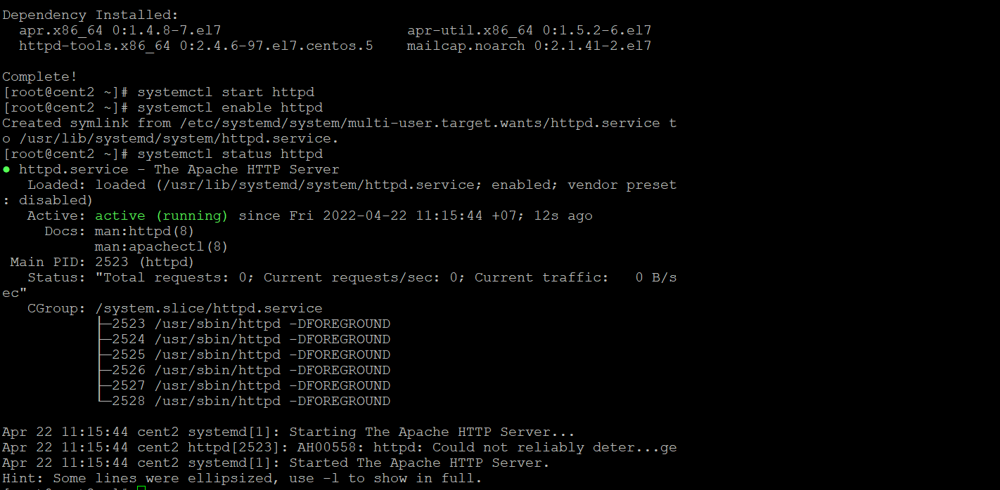
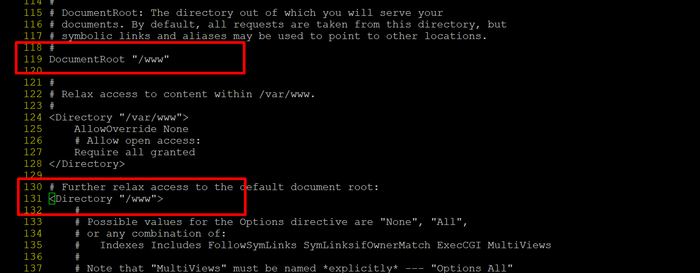
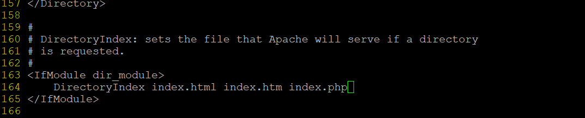
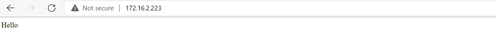

# Tìm hiểu và cài đặt webserver sử dụng apache 
## 1. Web server là gì?
- Ở khía cạnh phần cứng, web server là một server lưu trữ các tài nguyên mà tạo nên một trang web và nó gửi các tài nguyên đó đến client yêu cầu.
- Ở khía cạnh phần mềm, web server bao gồm một số phần mềm kiểm soát người dùng truy cập, nó sử lý thông tin và trả về trang web hay tài nguyên cho người dùng.
## 2. Apache 
### 2.1.Apache là gì?

Apache là một phần mềm mã nguồn mởi miễn phí được cài đặt trên các server(web server) để xử lý các yêu cầu tới máy chủ theo giao thức HTTP. Apache có tên chính thức là Apache HTTP Server

Ưu điểm của Apache:
- Là phần mềm mã nguồn mở, miễn phí kể cả cho mục đích thương mại. 
- Apache đáng tin cậy, ổn định với nhiều hệ điều hành 
- Apache linh hoạt với cấu trúc module
- Apache dễ dàng cấu hình và thân thiện với người mới dùng.
- Hoạt động hiệu quả với các web site wordpress
- Apache có cộng đồng lớn và sẵn sàng hỗ trợ bất cứ lúc nào.
- Apache là phần mềm đa nền tảng(Unix, Linux và Windows).

Nhược điểm:
- Hiệu năng kém nếu website có lượng truy cập lớn.
- Nhiều tùy chọn dẫn đến nhiều điểm yếu trong bảo mật.

### 2.2. Cài đặt Apache.

Cài đặt Apache trên Centos 7
- Sử dụng lệnh sau để cài đặt Apache bằng yum:
```
sudo yum install httpd -y
```

- Khởi động và enable dịch vụ
```
systemctl start httpd 
systemctl enable httpd
```

- Kiểm tra trạng thái của service:
```
systemctl status httpd
```



- Kiểm tra port được sử dụng bởi httpd:
```
netstat -natp | grep httpd
```

- Tạo folder chứa data web

```
mkdir /www
```

- Chỉnh sửa Document root /www , thêm vào các file giao diện index, 

Chỉnh sửa file cấu hình của httpd

```
/etc/httpd/conf/httpd.conf

```





- Khởi động lại httpd và enable cùng hệ thống



