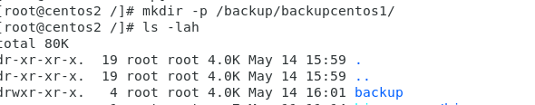
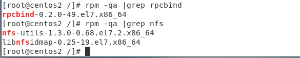
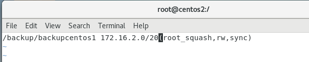
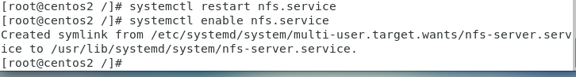
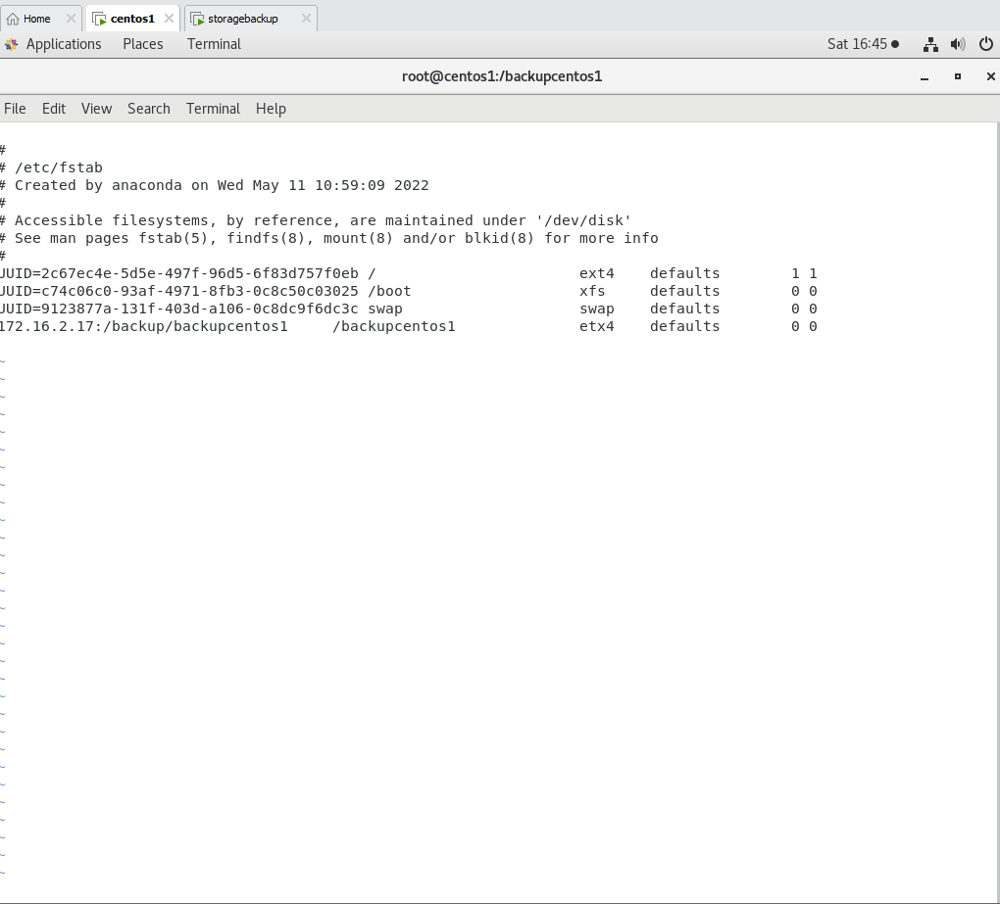
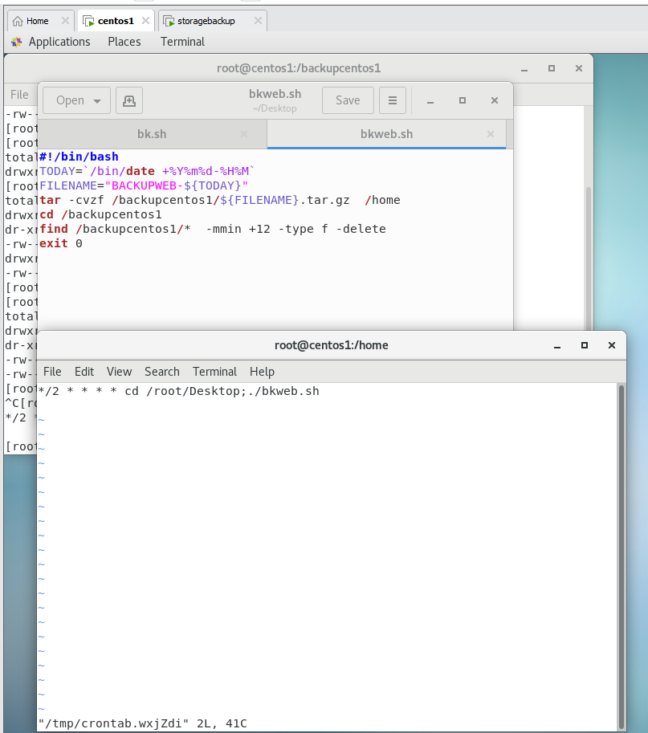
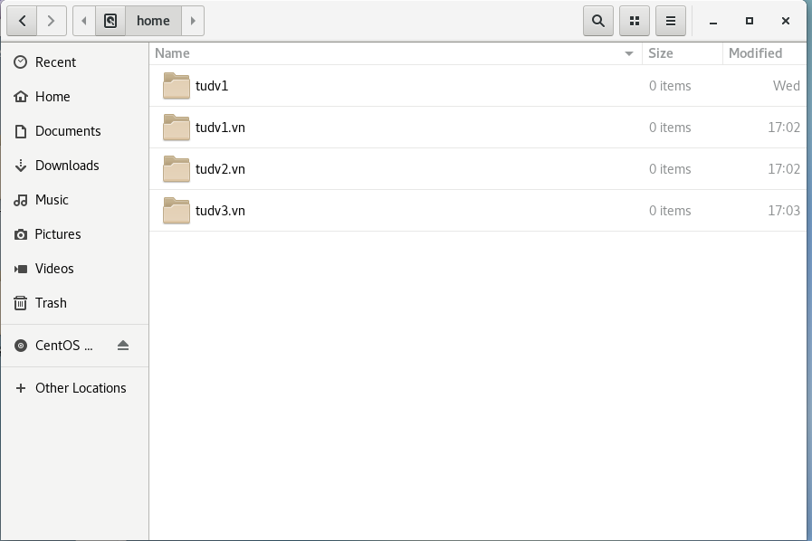

# Lên lịch BACKUP

## 1-Crontab

- Crontab (CRON TABLE) là một tiện ích cho phép thực hiện các tác vụ một cách tự động theo định kỳ, ở chế độ nền của hệ thống. Crontab là một file chứa đựng bảng biểu (schedule) của các entries được chạy.

- Bằng cách sử dụng các lệnh trong Linux Crontab ta có thể tạo những task chạy vào những giờ cụ thể đặt trước, như vào giờ nào trong ngày, vào giờ nào trong ngày vào thứ mấy trong tuần….

## 2-Crontab làm việc thế nào?

Một số lệnh thường dùng:


crontab -e: tạo,  chỉnh sửa các crontab
crontab -l: Xem các Crontab đã tạo
crontab -r: xóa file crontab

## 3-Cài đặt crontab

```
yum install cronie

```

- Start crontab và tự động chạy mỗi khi reboot:

```
service crond start
chkconfig crond on
```

## 4-Tạo Shell scriptting

- Shell script là 1 tập hợp các lệnh được thực thi nối tiếp nhau, bắt đầu 1 shell script thường có ghi chú comment mở đầu bằng ```#``` như :

```
#!/bin/bash
# Copyright (c) ABC.asia
# Script Test
HELLO="Xin chào, "
HELLO=$(printf "%s %s" "$HELLO" "$(whoami)" "!")
DAY="Hôm nay là ngày "
DAY=$(printf "%s %s" "$DAY" "$(date)")
echo $HELLO
echo $DAY

```


- Trước khi làm bất cứ điều gì với script, cần thông báo với system rằng chuẩn bị có shell chạy bằng dòng lệnh ``` #!/bin/bash```
để soạn thảo shell script thì có thể gõ ngay trên terminal hoặc dùng các trình soạn thảo vi,nano,vim,gedit... sau đó lưu lại file *.sh, ví dụ test.sh ( lưu thành file.sh cho dễ nhận dạng)
sau đó thiết lập quyền thực thi cho shell $chmod +x test.sh
rồi chạy script bằng 1 trong 3 cách: bash test.sh, sh test.sh, ./test.sh

## 5-Tạo shellscript kết hợp crontab để backup tự động theo thời gian các thư mục chứa dữ liệu

- Chuẩn bị : 2 máy centos1 có ip là 172.16.2.22 chạy webserver,centos2 có ip là 172.16.2.17 chạy NFS shares với centos1

   -  Thư mục /home trên centos1 chứa toàn bộ data các web /home/tudv1;/home/tudv2...
   -  Thư mục /backup1 trên centos1 là thư mục sharing với /backup2 trên centos2
   -  Tạm thời tắt selinux và filrewalld để làm lab.


### 5.1 Cấu hình centos2

- Trên máy centos2 tạo thư mục chứa backup của centos1 ,trong backupcentos1 sẽ chứa databackup từ centos1


```
mkdir -p /backup/backupcentos1

```


- Kiểm tra 2 gói cần thiết , thông thường 2 gói này sẽ được cài sẵn là rpcbind và nfs-utils



```
chown -R nfsnobody:nfsnobody /backup/backupcentos1

chmod 755 /backup/backupcentos1

``` 
- Chỉnh sửa trong exports

```
vi /etc/exports
 
```

Chèn nội dung sau:

/backup/backupcentos1 172.16.2.0/20(root_squash,rw,sync)



- Cho dải kết nối là 172.16.2.0/20

- (root_squash,rw,sync): Thiết lập quyền thư mục share với quyền read-write, root_squash - truy 
cập nfs bằng user nfsnobody


- Khởi động lại dịch vụ




### 5.2 Trên máy centos1

```
mkdir /backup

mount -t nfs 172.16.2.17:/backup/backupcentos1 /backupcentos1

```

- Lưu vào fstab



- Khởi động lại 2 dịch rpcbind và nfs-utils

### 5.3 Tạo script backup tự động data tên centos1 về centos2

- Lên lịch Crontab và đoạn shellscript tại centos1




- Giải thích như sau:

  - Lên lịch 2 phút 1 lần chạy script

  - Khi chạy script : Đóng gói và nén toàn bộ /home vào backupcentos1 với ``tên đặt theo BACKUPWEB+ biến Filename thay đổi theo thời gian tương ứng ``

  - sau đó cd vào /backupcentos1  tìm và xóa tất cả các file mà quá 12 phút tính từ thời điểm script chạy

- Kết quả: 

- Home trên centos1



- Trên centos2 :

