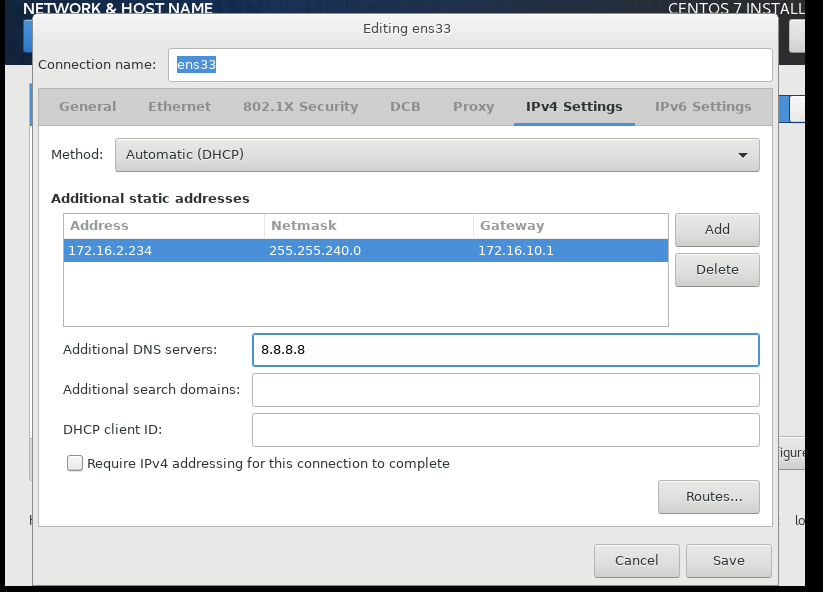

# Lên lịch BACKUP

## 1-Crontab

- Crontab (CRON TABLE) là một tiện ích cho phép thực hiện các tác vụ một cách tự động theo định kỳ, ở chế độ nền của hệ thống. Crontab là một file chứa đựng bảng biểu (schedule) của các entries được chạy.

- Bằng cách sử dụng các lệnh trong Linux Crontab ta có thể tạo những task chạy vào những giờ cụ thể đặt trước, như vào giờ nào trong ngày, vào giờ nào trong ngày vào thứ mấy trong tuần….

## 2-Crontab làm việc thế nào?

Một số lệnh thường dùng:

- crontab -e: tạo,  chỉnh sửa các crontab

- crontab -l: xem các Crontab đã tạo

- crontab -r: xóa file crontab

## 3-Cài đặt crontab

```
yum install cronie

```

- Start crontab và tự động chạy mỗi khi reboot:

```
service crond start
chkconfig crond on
```

## 4-Tạo Shell scriptting

- Shell script là 1 tập hợp các lệnh được thực thi nối tiếp nhau, bắt đầu 1 shell script thường có ghi chú comment mở đầu bằng ```#``` như :

```
#!/bin/bash
# Copyright (c) ABC.asia
# Script Test
HELLO="Xin chào, "
HELLO=$(printf "%s %s" "$HELLO" "$(whoami)" "!")
DAY="Hôm nay là ngày "
DAY=$(printf "%s %s" "$DAY" "$(date)")
echo $HELLO
echo $DAY

```


- Trước khi làm bất cứ điều gì với script, cần thông báo với system rằng chuẩn bị có shell chạy bằng dòng lệnh ``` #!/bin/bash```
để soạn thảo shell script thì có thể gõ ngay trên terminal hoặc dùng các trình soạn thảo vi,nano,vim,gedit... sau đó lưu lại file *.sh, ví dụ test.sh ( lưu thành file.sh cho dễ nhận dạng)
sau đó thiết lập quyền thực thi cho shell $chmod +x test.sh
rồi chạy script bằng 1 trong 3 cách: bash test.sh, sh test.sh, ./test.sh

## 5-Tạo shellscript kết hợp crontab để backup tự động theo thời gian các thư mục chứa dữ liệu

- Chuẩn bị : 2 máy centos1 có ip là 192.168.19.222 chạy storage nfs,centos2 có ip là 192.168.2.223 chạy webhosting

   -  Thư mục /home trên centos2 chứa toàn bộ data các web /home/tudv1.vn;/home/tudv2.vn...

   -  Thư mục /backup/may1 trên centos1 là thư mục sharing với /backup trên centos2

   -  Tạm thời tắt selinux và filrewalld để làm lab.

   - Tiến hành backup /home trên centos2 vào /backup trên centos2


### 5.1 Cấu hình centos1

- Làm nfs server:

- Cài packages NFS vào máy bằng lệnh:

```
yum install nfs-utils nfs-utils-lib

```

- Enable auto start service khi start/reboot server:

```

systemctl enable rpcbind

systemctl enable nfs-server

systemctl enable nfs-lock

systemctl enable nfs-idmap

```

Start service:

```

systemctl start rpcbind

systemctl start nfs-server

systemctl start nfs-lock

systemctl start nfs-idmap

```
- Tiếp theo, tạo share folder trên server.

- Tạo một share folder tên ‘/backup/may1’ trên máy server và cho phép client user có thể đọc và ghi lên thư mục này.

```

mkdir -p /backup/may1

chmod 666 /backup/may1/

chown -R nfsnobody:nfsnobody /backup/may1

```
- Lệnh chown trên là client sẽ truy 
cập nfs bằng user nfsnobody


- Export shared directory trên NFS Server:

   - Edit file /etc/exports,

```
vi /etc/exports

```
   - Thêm đoạn sau vào /etc/exports

```
/backup/may1 192.168.19.0/24(root_squash,rw,sync)

```


  - /backup/may1: Thư mục chỉ định share trên server
192.168.19.0/24: Lớp mạng được phép sử dụng thông tin share từ server 
  - (root_squash,rw,sync): Thiết lập quyền thư mục share với quyền read-write, root_squash - truy 
cập nfs bằng user nfsnobody



- Lưu lại và thoát ra khởi động lại nfs

```
systemctl restart nfs-server

```

### 5.2 Cấu hình máy chạy webserver

- Cấu hình bên máy Client:

- Cài đặt package NFS :

```
yum install nfs-utils nfs-utils-lib

```

- Enable NFS services :

```
systemctl enable rpcbind

systemctl enable nfs-server

systemctl enable nfs-lock

systemctl enable nfs-idmap

```

- Start NFS service:

```
systemctl start rpcbind

systemctl start nfs-server

systemctl start nfs-lock

systemctl start nfs-idmap

```

- Tạo share từ server vào client như lệnh dưới

```
mount -t nfs 192.168.19.222:/backup/may1 /backup

```
- Lưu moutn khi khởi động

```
vi /etc/fstab

```
- Thêm vào dưới cùng:


Như vậy là NFS đã được mount thành công.


### 5.3 Tự động hóa backup:

- Trên máy chạy web có thư mục home chứa dữ liệu các domain


- Trên máy webserver tạo file bk.sh tại /

```
vi bk.sh

```
- Thêm vào đoạn sau:

```
#!/bin/bash
TODAY=`/bin/date +%Y%m%d-%H%M`
FILENAME="WEBMAY1-${TODAY}"
tar -cvzf /backup/${FILENAME}.tar.gz /home
cd /backup
find /backup/* -mmin +12 -type f -delete
echo Da backup thanh cong ${FILENAME} >> /backup/log.txt
exit 0
```
- Chú thích:
  - Biến TODAY thay đổi theo thời gian của máy
  - Biến FILENAME thay đổi theo TODAY
  - tar.. Đóng gói và nén thư mục /home tại /backup với tên là FILENAME ,FILENAME là biến tên, tên này thay đổi theo biến thời gian TODAY
  - sau đó di chuyển vào thư mục /backup
  - tìm tất cả các file trong backup và xóa tất cả các file mà cớ thời gian >12 phút kể từ lúc thực thi lúc tìm kiếm này và ghi 1 đoạn nhật ký " Da backup thanh cong FILENAME tại log.txt
  - Không trả giá trị (ko in)gì nếu ko lỗi

- Tạo cronetab:

```
crontab -e

```
- Thêm vào 1 đoạn có ý nghĩa là cữ mỗi 2 phút mọi thời gian cd vào / và chạy bk.sh( bk.sh đã cấp quyền thực thi)

```
*/2 * * * * cd /;./bk.sh

```

- Kiểm tra kết quả: Trên máy nfs storage


- Cách 2 phút máy web backup 1 lần, đến bản cuối cùng máy đã tự xóa bản 20h00


