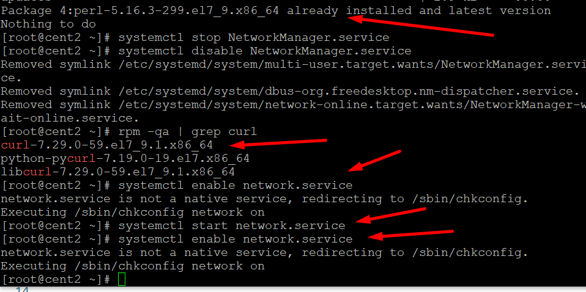
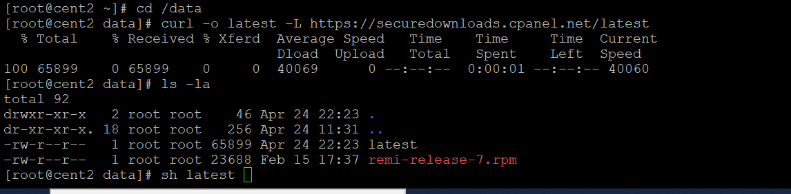
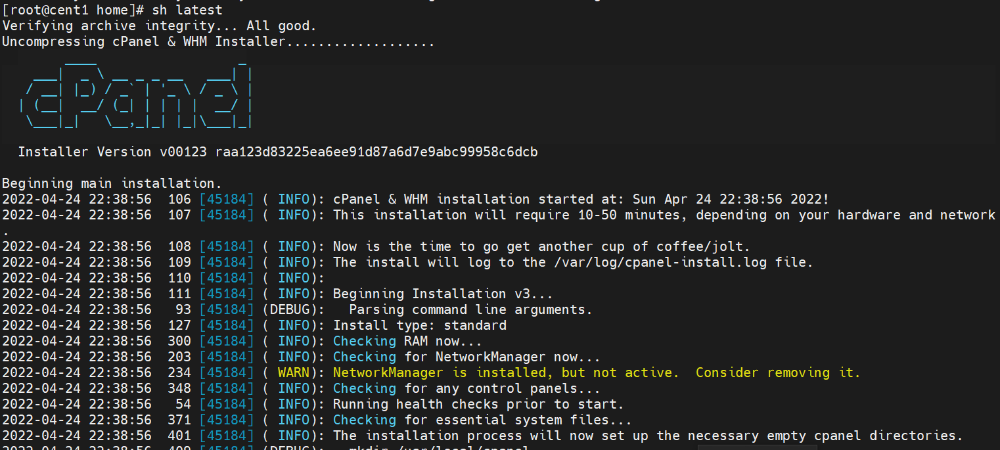
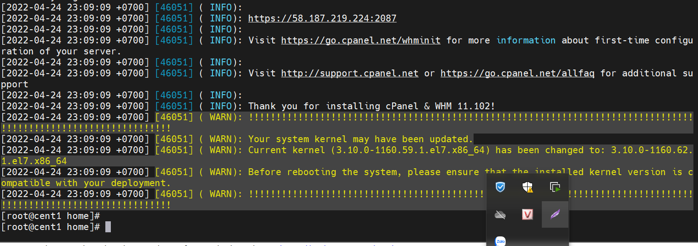
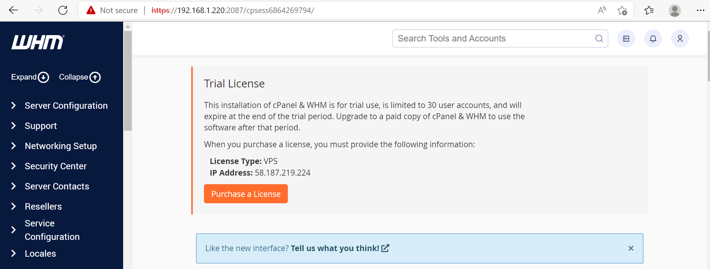

# cPanel

Web Host Manager(WHM), là một chương trình có rất nhiều tính năng mạnh mẽ cho phép người quản trị truy cập tới những vị trí cuối cùng của cPanel Hosting. WHM quản lý tất cả như quản lý Server, quản lý DNS tên miền, quản lý khách hàng, quản lý đơn hàng…Với giao diện dễ sử dụng cung cấp cho khách hàng những tiện ích mạnh mẽ nhất để kiểm soát tất cả các chức năng. Hệ thống này cũng giúp bạn cập nhật thường xuyên những phiên bản mới nhất và nâng cao giúp hệ thống quản lý mạnh mẽ hơn.

cPanel là một giao diện web quản lý Hosting ở phía khách hàng và là một trong những WHM tốt nhất hiện nay. Với giao diện dễ nhìn, đa dạng về chức năng và liên tục cho ra các bản cập nhật mới nhất đã khiến cPanel là một trong những control phát triển và được tin dùng nhất thời điểm hiện tại.

# Cài cPanel trên centos7

- 1 server trống rỗng

- Tắt Selinux

- Tắt Network Manager

Từ phiên bản 68 trở đi, cPanel sẽ không hỗ trợ Network Manager service , nên  cần tắt dịch vụ này đi trước khi cài đặt:

```
systemctl stop NetworkManager.service
systemctl disable NetworkManager.service
systemctl enable network.service
systemctl start network.service
```

- Update yum

```
yum update -y

```

- Cài đặt 2 gói perl và curl

``` 
yum install perl
yum install curl

```


- Cài đặt cPanel

```
cd /home
curl -o latest -L https://securedownloads.cpanel.net/latest
sh latest

```










- Sau khi cài xong cần có tài khoản sử dụng

Đăng ký dùng thử liense 15 ngày 

https://cpanel.net/


