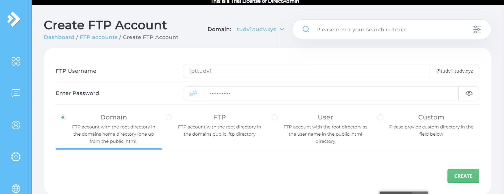

# Tạo và sử dụng FTP trên DirectAdmin
Bước 1: Tạo tài khoản FTP 
- Vào `Menu` -> tab `User` -> `Account Manager` -> `FTP Management` -> `Create FTP Account`

- Tại đây sẽ có 4 tùy chọn để set đường dẫn dữ liệu cho tài khoản FTP
	+ `Domain`: Tùy chọn này cho phép truy cập vào thư mục chứa mã nguồn của tài khoản FTP (public_html)
	+ `FTP`: Tùy chọn này cho phép truy cập vào public_ftp của domain
	+ `User`: Tùy chọn này cho phép truy cập vào thư mục FTP của user
	+ `Custom`: Tùy chọn này cho phép tùy chỉnh đường dẫn truy cập bất kỳ
- Thông thường ta chọn `Domain` để chỉnh sửa, upload hay download dữ liệu trên website
- Sau khi điền đầy đủ thông tin, nhấn `CREATE` để tạo tài khoản FTP

- Ở đây mình tạo tài khoản FTP cho domain của tudv1 tên ftptudv1

Bước 2: Kết nối FTP với WinSCP

- Nhấp `Login` để kết nối đến server

>> Như vậy ta đã kết nối thành công đến đường dãn chứa file và có thể upload or download file

