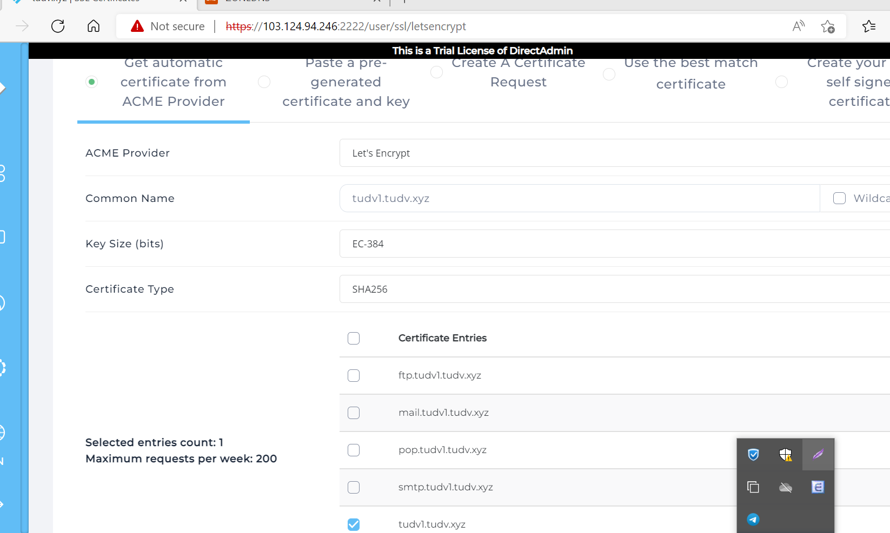
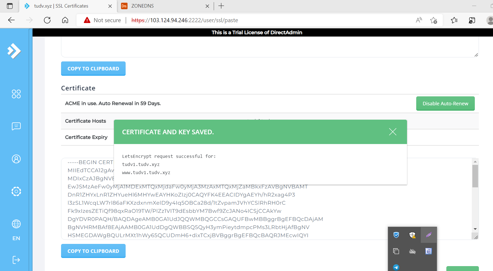
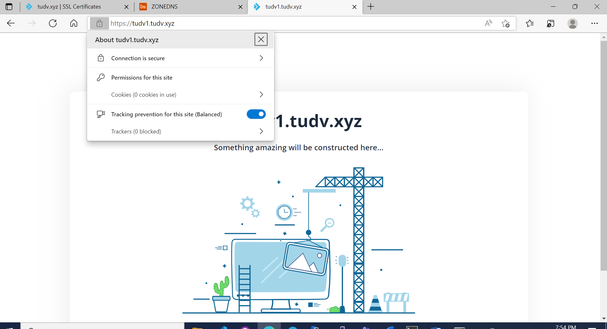

# Cài đặt SSL Let's Encrypt trên DirectAdmin
- Vào `Menu` -> `Account Manager` -> `SSL certificates` -> chọn tab đầu tiên `Get automatic certificate from ACME Provider` và thiết lập như sau

- Tiến hành đăng nhập để kiểm tra 

