# Upload Source WordPress cho 1 user trên DA
Bước 1: Tạo User và gán domain cho User

Ở đây đã tạo user tudv1 với miền tudv1.tudv.xyz

Bước 2: Tạo database cho domain. Vào tùy chọn `MySQL Management` click vào `Create New Database`

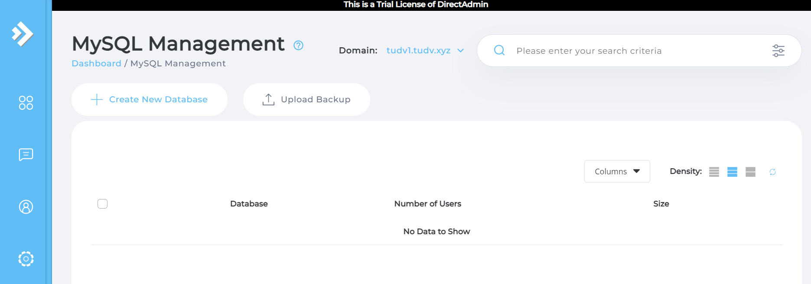

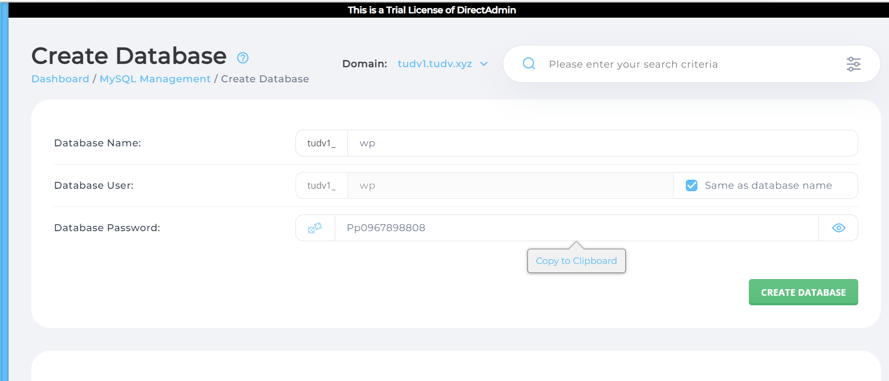

Bước 3: Download WordPress 
- Vào trang chủ wordpress và tải file wordpress mới nhất  về máy tính

Bước 4: Upload Source WordPress = FTP

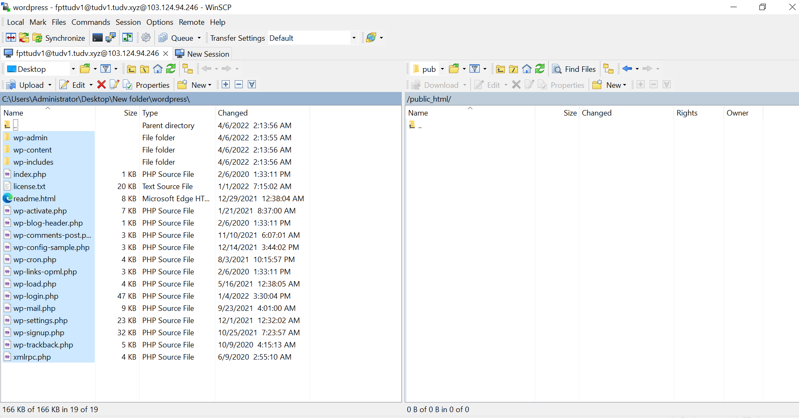

- Đổi tên file `wp-config-sample.php` thành `wp-config.php` và chỉnh sửa cấu hình trong file đó tương ứng với database đã tạo trước đo

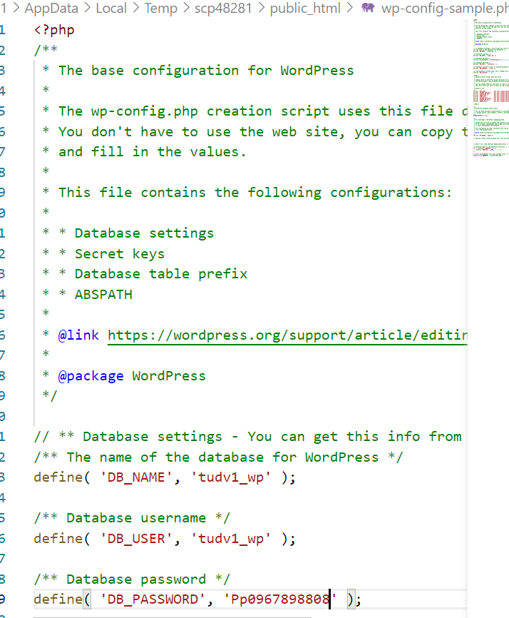

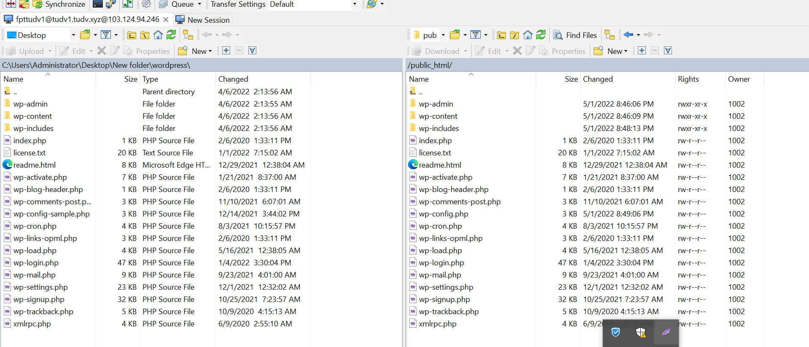

- Tiến hành vào trang quản trị để thiết lập https://tudv1.tudv.xyz

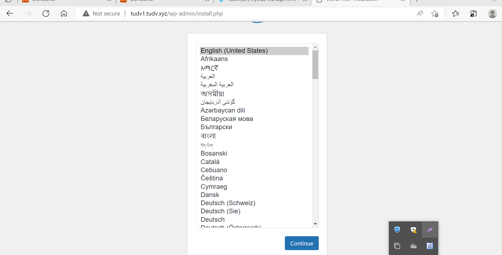

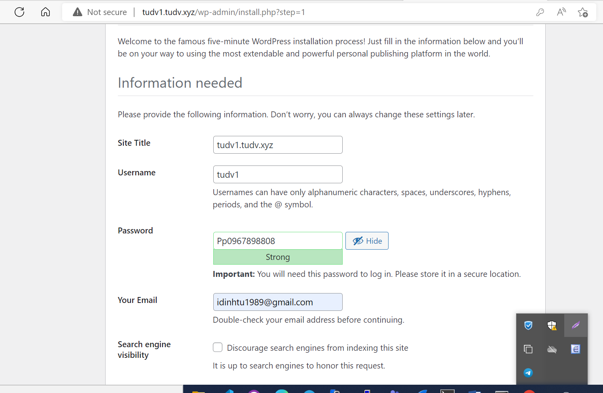

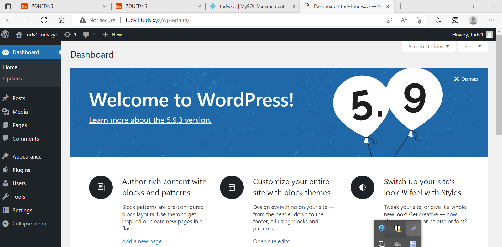

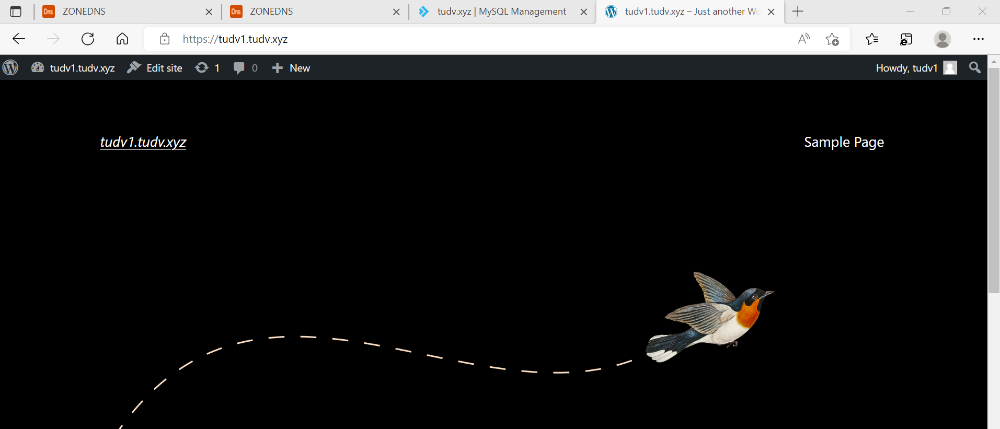

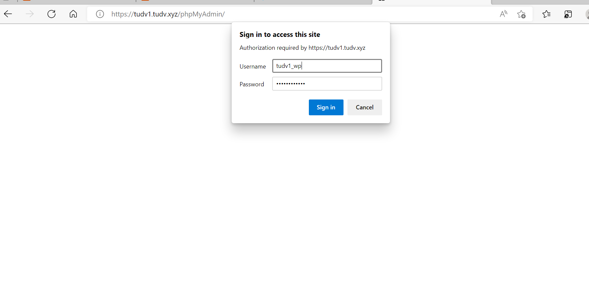

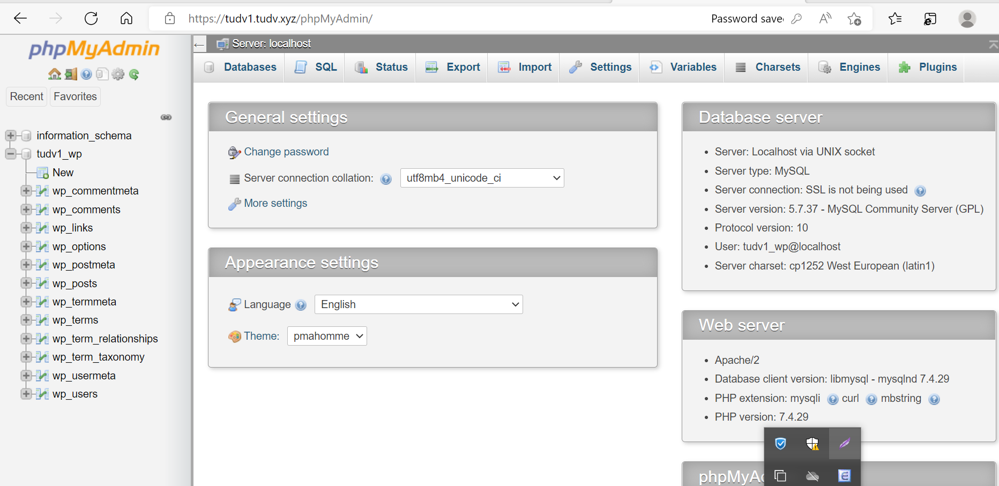