# Backup data trong DirectAdmin
- Tạo 2 bài viết trước khi backup

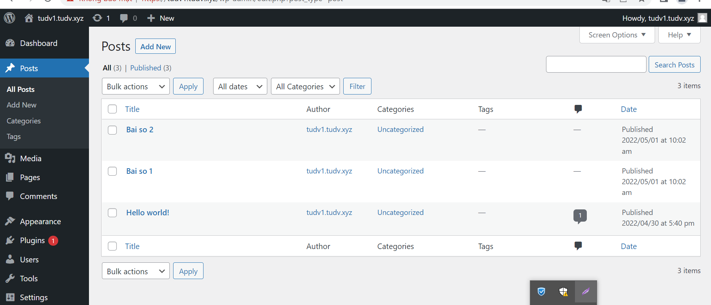

Bước 1: Đăng nhập vào trang quản trị. Vào `Menu` -> tab `User` -> `Advanced Features` -> `Create/Restore Backups`

Bước 2: Lựa chọn các mục cần backup và nhấp vào `CREATE BACKUP`
- Website Data: Backup dữ liệu website
- E-mail: Backup Email
- FTP: Backup tài khoản FTP
- Databases: Backup cơ sở dữ liệu

-> Tùy vào nhu cầu backup mà ta chọn. Chọn tất cả để tạo bản full backup

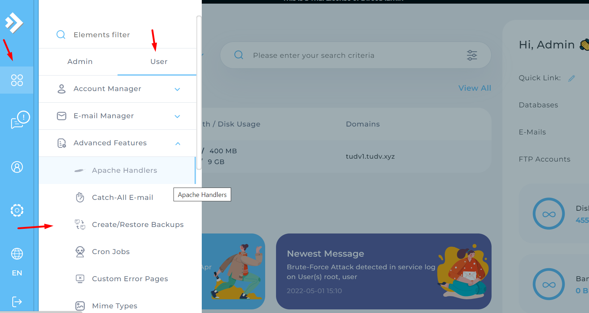

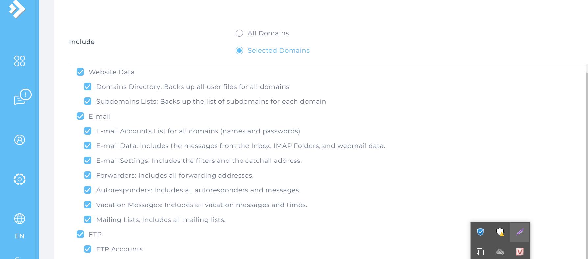

Bước 3: Chờ hệ thống backup và nén lại thành 1 file backup
- Sau khi thực hiện xong, hệ thống sẽ gửi thông báo qua tin nhắn
- Nếu như nhận được thông báo `Your backups are now ready` có nghĩa là bản backup đã được tạo thành công

- Ta vào `System Info & Files` -> `File Manager` -> `Backups` để kiểm tra

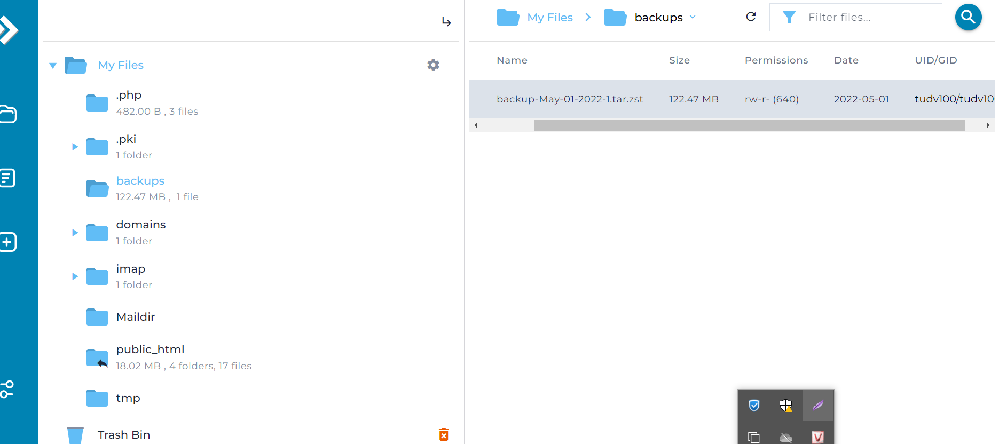

# Restore từ bản Backup
- Xóa tất cả bài viết trước khi Restore

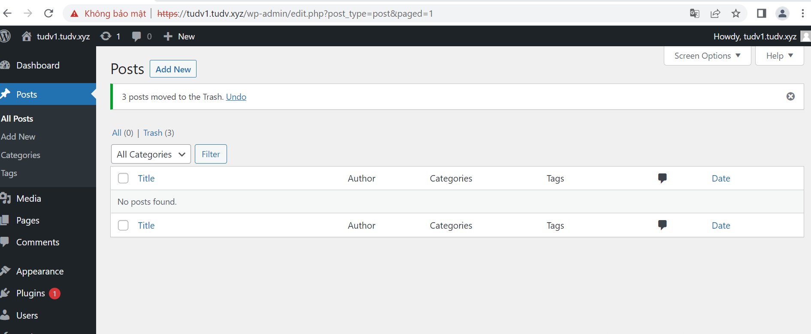
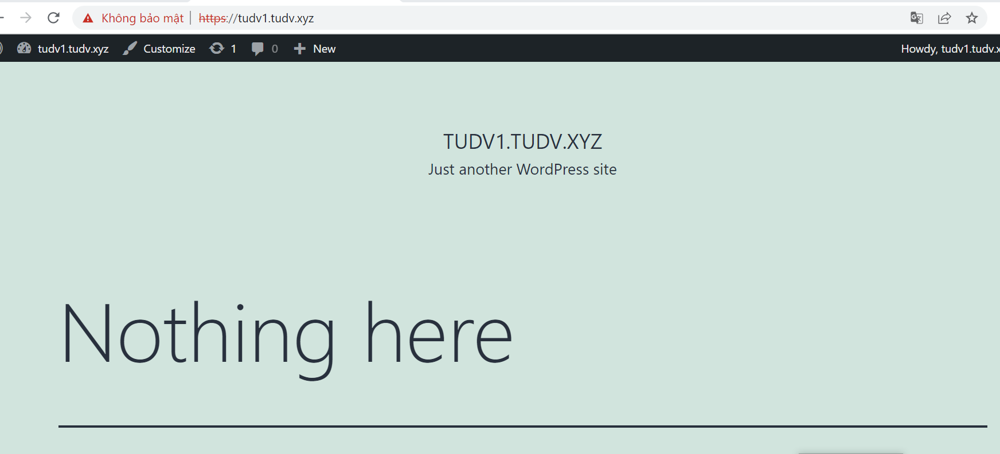

- Tại `Advanced Features` -> `Create/Restore Baclups` chọn `Restore Backup`

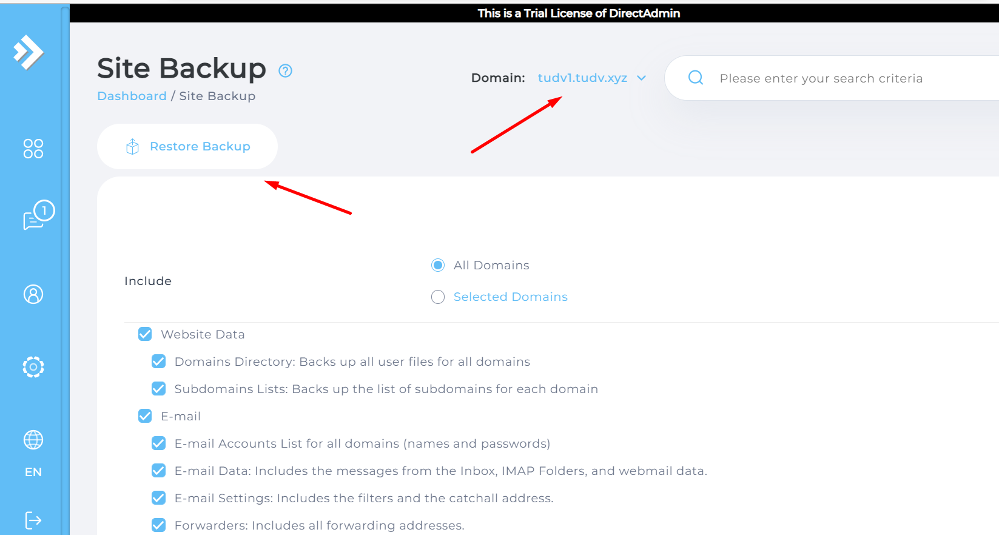

- Chọn đúng bản backup cần restore
- Nhấn `RESTORE` để tiến hành khôi phục 

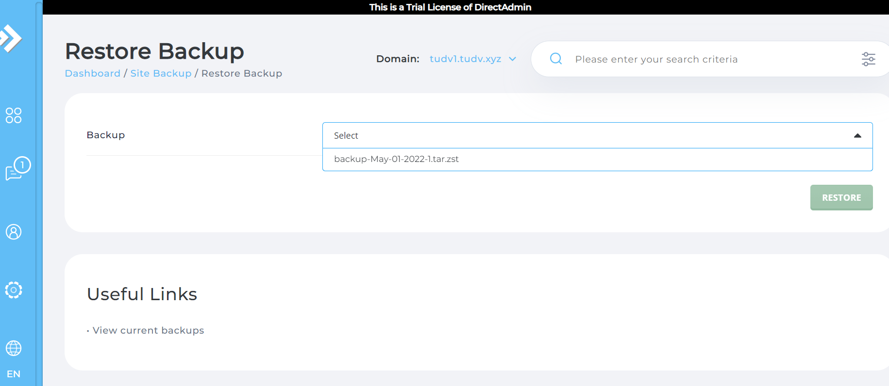

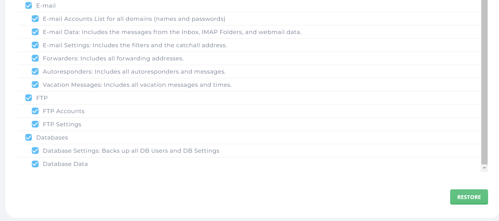
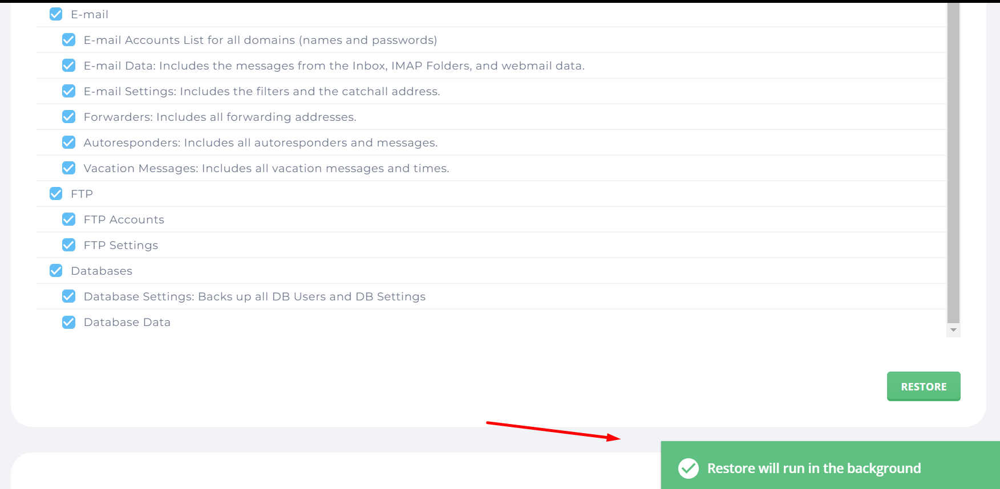

- Để xem quá trình restore thành công hay chưa hãy vào `Message` để xem 
- Nếu có thông báo `Your User files have been restored` là đã restore thành công

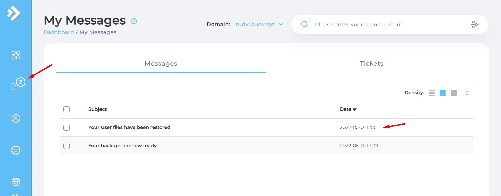

- Sau khi kiểm tra ta thấy bài viết bị xóa đã được khôi phục

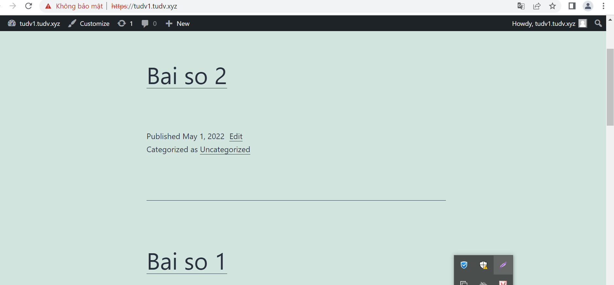