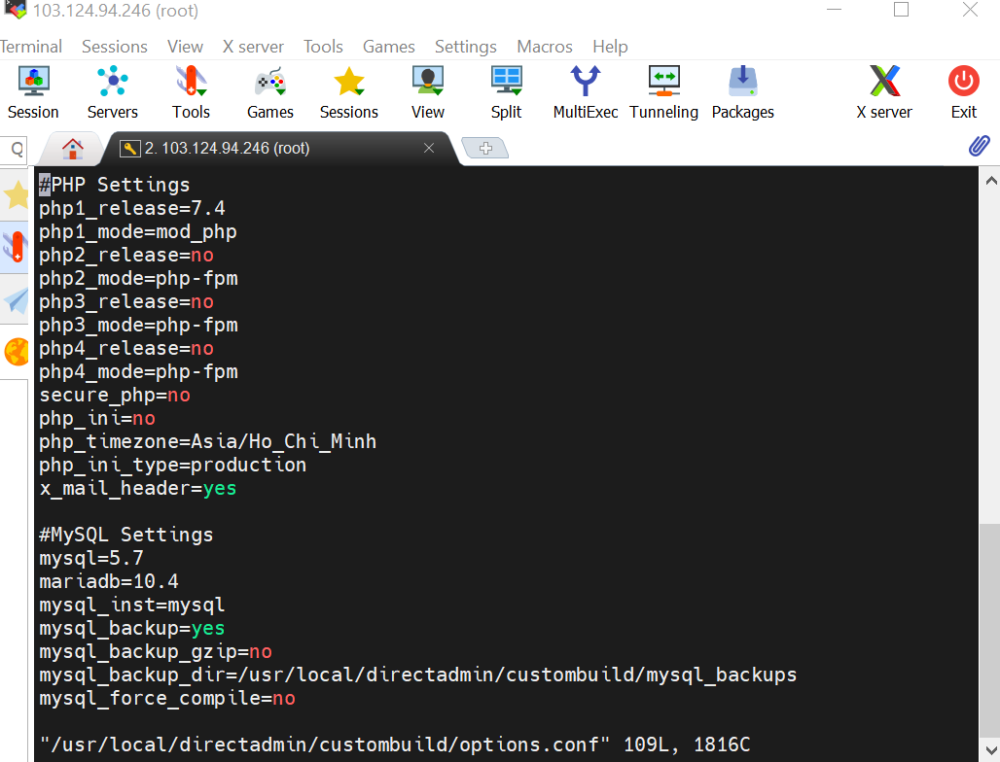
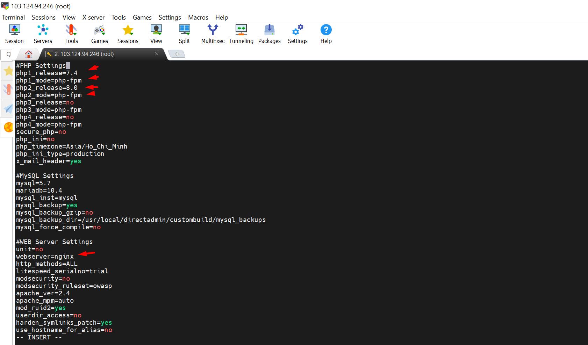
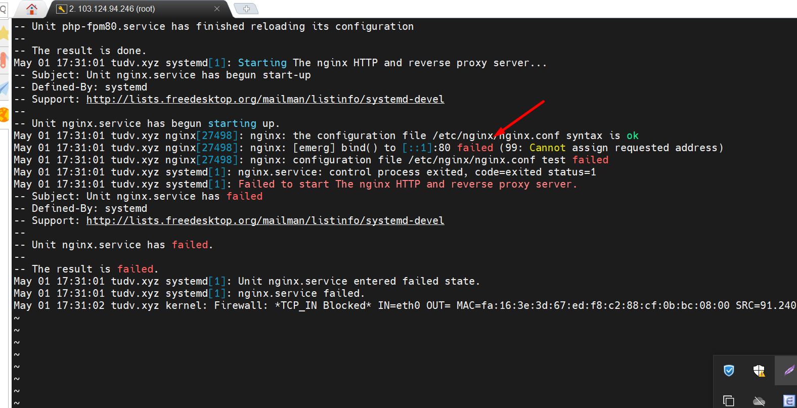
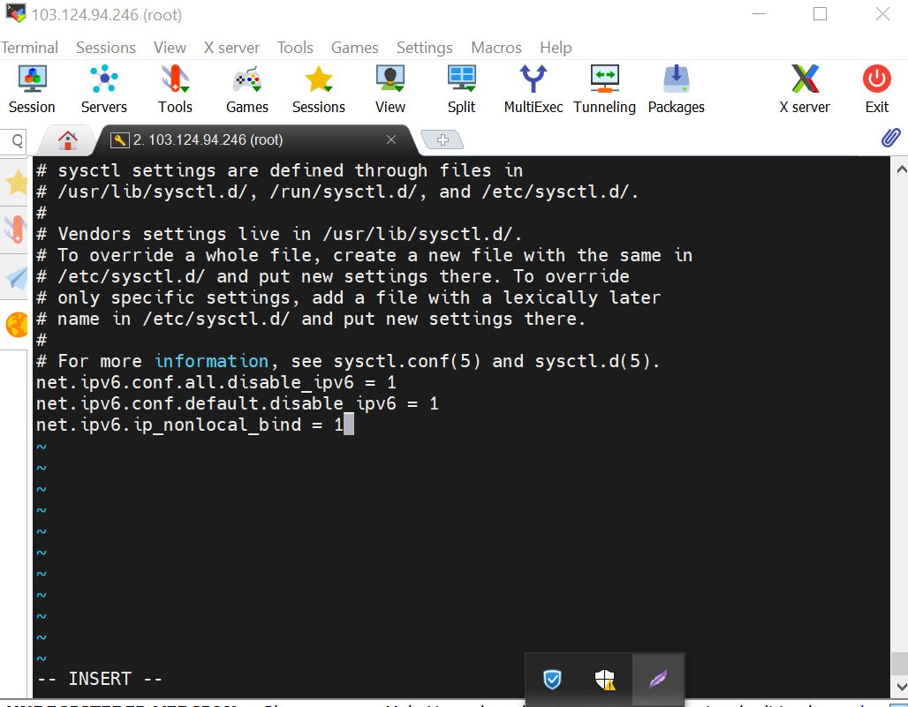
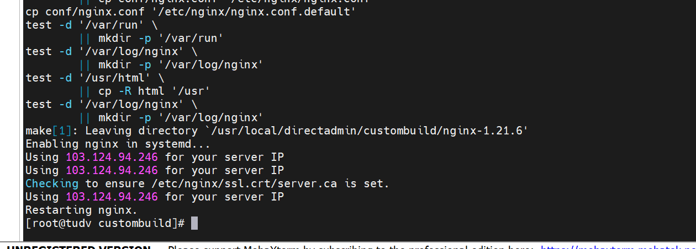
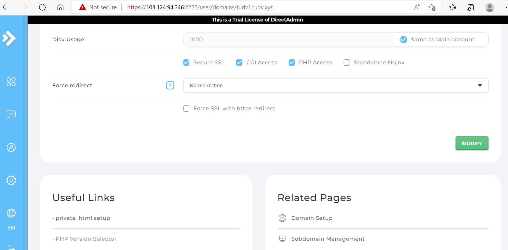
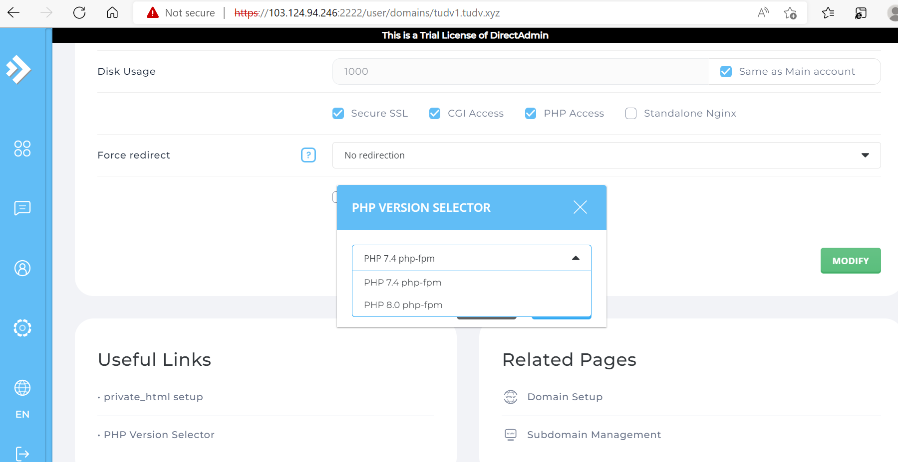
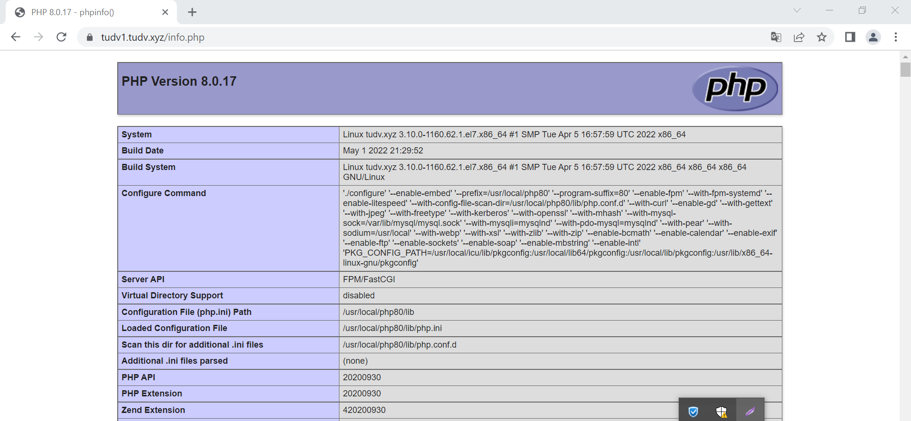

# Build PHP + Nginx trên DirectAdmin
- Vào thư mục CustomBuild
```sh
cd /usr/local/directadmin/custombuild
```

- Kiểm tra các phiên bản PHP đang được build
```sh
vi /usr/local/directadmin/custombuild/options.conf
```



- Ta thấy có thể build đồng thời 4 phiên bản PHP trên DirectAdmin. Và đã có sẵn 1 phiên bản php 7.4 mode_php chạy apache
- Để build thêm 1 phiên bản PHP 8.0 mod php-fpm , web server nginx và phpMyAdmin ta cần chỉnh sửa thông tin trong file `/usr/local/directadmin/custombuild/option.conf` như sau





- Thoát và lưu

- Sau đó ta chạy các lệnh để build đúng như thiết lập
```sh
./build update
./build nginx
./build php n
./build rewrite_confs
```
- Khi buid nginx dễ gặp lỗi IPv6 bind 




Khi gặp phải lỗi nginx: [emerg] bind() to [::1]:80 failed (99: Cannot assign requested address) khi build từ apache sang nginx
Lỗi là do không bind được localhost Ipv6


- Khắc phục

```
vi /etc/sysctl.conf

thêm dòng : net.ipv6.ip_nonlocal_bind = 1

reboot

```



- Sau khi máy khởi động xong,chúng ta tiếp tục di chuyển trở lại custombuid : 

```
cd /usr/local/directadmin/custombuild

```

 và tiếp tục với câu lệnh buid nginx. vì trước đó đã chạy lệnh tải về php 7.2

```

./build nginx

```



```

./build php n

```
- Kiểm tra xem website hiện tại đang dùng phiên bản php nào




- Mặc định đang chạy 7.4


- Đổi sang 8.0




- Vào `File Manager` tạo một file `info.php` trong thư mục `public_html` để kiểm tra phiên bản



