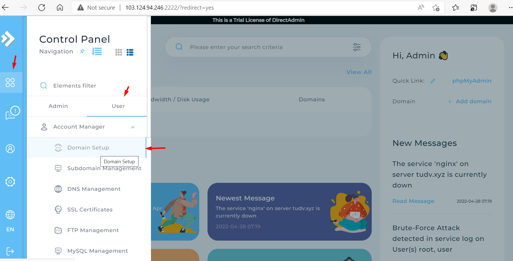
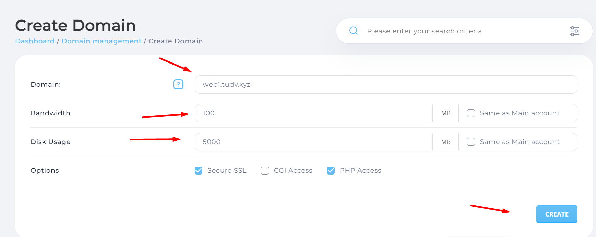
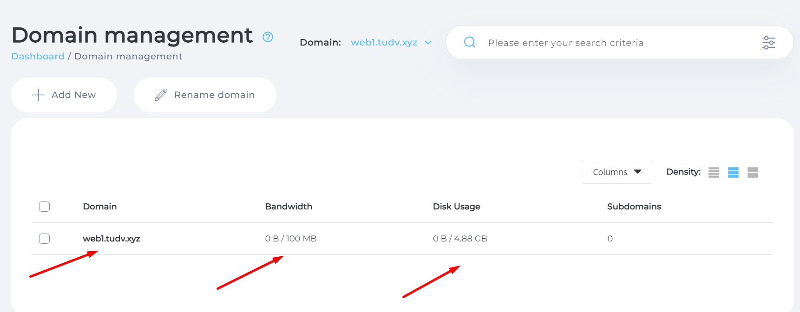
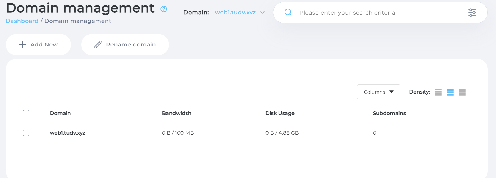
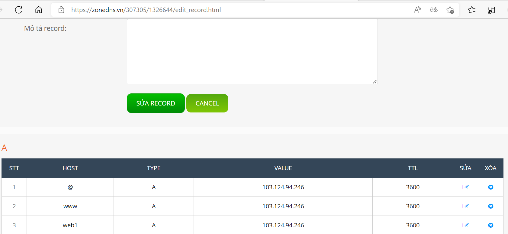

# Add domain để kết nối máy chủ

- Chọn menu

- Chọn user

- Chọn domain setup



```
Domain: nhập domain muốn quản lý
Bandwidth : băng thông truy cập 
Dung lượng cho dịch vụ domain : 5 Gb
Cho SSH
PHP access


```







- Đảm bảo bạn đã phải tạo subdomain và có bản ghi dns

