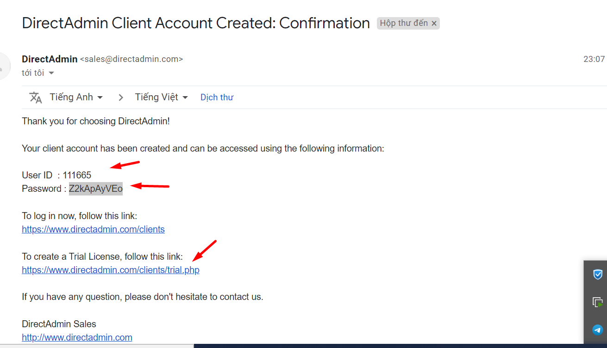
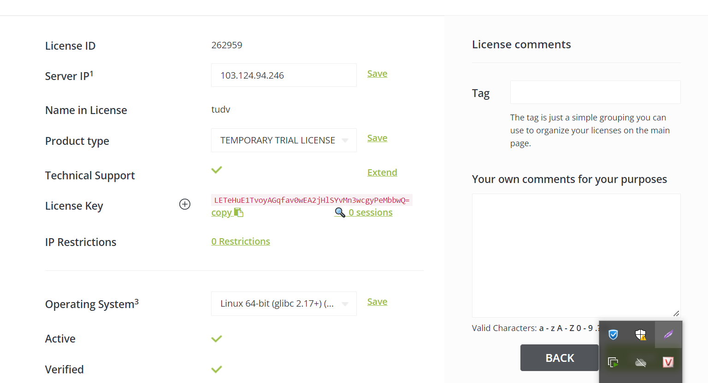
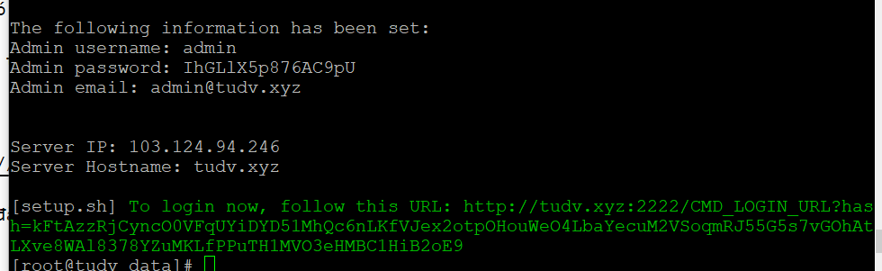
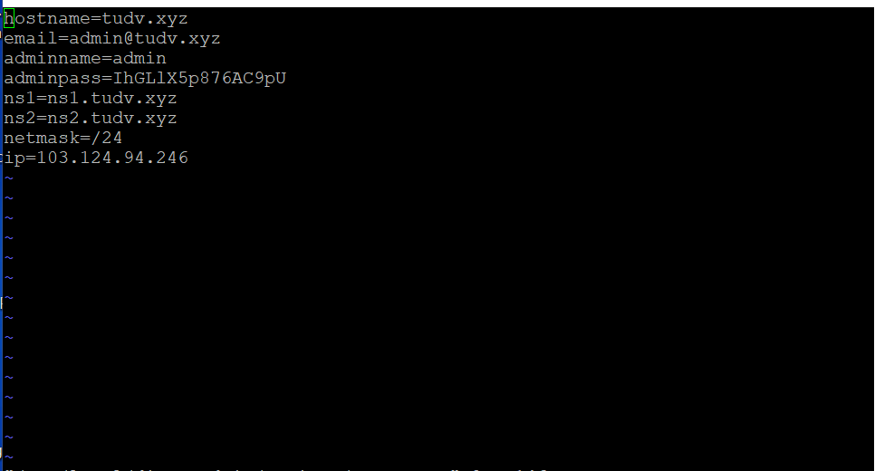

# 1. TỔNG QUÁT:
• Dễ dàng trong quản lý: DirectAdmin là một hệ thống dành riêng cho các máy chủ chia sẻ, rất dễ dàng trong việc phân chia và quản lý tài nguyên máy chủ.

• Tốc độ: DirectAdmin là hệ thống quản lý nhanh và không đòi hỏi nhiều về tài nguyên so với các hệ thống quản lý máy chủ chia sẻ khác.

• Tin cậy: Hệ thống sẽ được phục hồi sau các sự cố nhằm hạn chế thời gian hệ thống hoạt động mà không tạo ra hiệu quả. DirectAdmin tự động khởi động lại các dịch vụ cần thiết khi dịch vụ đó bị lỗi.


2. TÍNH NĂNG PHỤC VỤ QUẢN LÝ CỦA ADMIN:

• Tạo và thay đổi các tài khoản quản lý và đại lý – Việc tạo lập rất nhanh chóng và dễ dàng với việc thêm các tài khoản đại lý và các tài khoản quản lý phụ.

• Gói dịch vụ - Người quản trị có thể tạo ra các gói tài nguyên cho các tài khoản đại lý và phân phối cho các tài khoản người dùng cuối.

• Danh sách người dùng – Chức năng cho phép xem danh sách các tài khoản người dùng, sắp xếp và thay đổi thông tin.

• Quản trị DNS – Chức năng cho phép tạo, sửa hay xóa bất kỳ bản ghi DNS nào trên máy chủ.

• Mục đích sử dụng IP – Cài đặt IP trên máy chủ và quy định mục đích sử dụng IP cho các tài khoản người dùng cuối (IP chia sẻ hay IP riêng).

• Thông tin hệ thống – Truy cập tức thời tới thông tin về trạng thái hoạt động của các dịch vụ trên máy chủ.

• Thống kê quá trình sử dụng – Thống kê các thông số trạng thái của hệ thống và các thông tin liên quan, thống kê về tài nguyên đã sử dụng.


3. TÍNH NĂNG CHO ĐẠI LÝ (Reseller):

• Mục đích sử dụng IP – Cài đặt IP trên máy chủ và quy định mục đích sử dụng IP cho các tài khoản người dùng cuối thông qua các tùy chọn có sẵn do quản trị hệ thống quy định (IP chia sẻ hay IP riêng).

• Thống kê đối với tài khoản đại lý, đại lý có thể xem thống kê đầy đủ tài nguyên sử dụng đối với tài khoản đại lý của mình và các khách hàng của mình, sắp xếp thông tin theo các tình huống cần phân tích.

• Tạo/thay đổi tài khoản – Tạo tài khoản, danh sách, thay đổi hay xóa nhanh chóng và dễ dàng.

• Gói tài nguyên – Đại lý có thể tạo các gói tài nguyên riêng của mình và áp dụng cho các khách hàng mà không cần quy định lại mỗi khi tạo tài khoản mới cho khách hàng.

• Thêm/thay đổi gia diện – Giao diện của đại lý có thể thêm, thay đổi với mục đích cá biệt hóa bảng điều khiển (control panel).

• Thông tin hệ thống – Truy cập tức thời tới thông tin về trạng thái hoạt động của các dịch vụ trên máy chủ.

• Tạo ra thông tin máy chủ ảo của mình đối với các khách hàng.


4. TÍNH NĂNG CHO NGƯỜI DÙNG:

• Email – Tạo tài khoản email, cài các luật cho email trên tất cả tên miền do tài khoản quản lý, chuyển tiếp, tự động trả lời, tự động từ chối, lọc, bản ghi MX, webmail, xác thực SMTP.

• FTP – Tạo/thay đổi/xóa tài khoản FTP, quy định đăng nhập nặc danh (anonymous), tạo FTP cho tài khoản với tên miền phụ (sub domains).
• DNS – Thay đổi DNS, bản ghi A, bản ghi CNAME, bản ghi NS, bản ghi MX và bản ghi PTR.

• Thống kê – kiểm tra tài nguyên đã sử dụng (dung lượng và băng thông), nhật ký truy cập site, xem thông tin về tài khoản, thông tin về lượt truy cập qua Webalizer, chạy các ngôn ngữ như CGI, xem các thành phần cài thêm của PHP, Perl, sử dụng phpMyAdmin..

• MS FrontPage – Tối ưu hóa việc sử dụng các website tạo bởi MS FrontPage.

• Tên miền phụ (Sub domains) – Tạo/xóa/thống kê tên miền phụ, tạo các tài khoản FTP cho từng tên miền phụ.

• Trình quản lý file – Quản lý, sao chép, di chuyển, đổi tên, xóa và thay đổi quyền truy cập, sửa và tạo file.

• CSDL MySQL – Tạo/xóa CSDL, tạo tài khoản có quyền truy cập, thay đổi mật khẩu truy cập, sử dụng phpMyAdmin.

• Tạo các bản sao lưu website đầy đủ. Khôi phục website từ các bản sao lưu.

• Bảo vệ thư mục – Người dùng có thể tạo tài khoản và mật khẩu để hạn chế quyền truy cập vào một số thư mục nhất định.

• Cài đặt xác thực SSL, xem các thông tin về máy chủ, cài đặt các tác vụ định kỳ, liên kết các domain song song

# 2. Cài đặt

- Đăng ký tài khoản: tại https://www.directadmin.com/

- Kiểm tra mail : lấy id và mk đăng nhập vào link trial, chọn get trial





- Copy liense dùng thử trong quá trình cài đặt sẽ sử dụng:

- Cài đặt các gói cần thiết cho DirectAdmin
```
yum install wget gcc gcc-c++ flex bison make bind bind-libs bind-utils openssl openssl-devel perl quota libaio libcom_err-devel libcurl-devel gd zlib-devel zip unzip libcap-devel cronie bzip2 cyrus-sasl-devel perl-ExtUtils-Embed autoconf automake libtool which patch mailx bzip2-devel lsof glibc-headers kernel-devel expat-devel
```
```
yum install -y psmisc net-tools systemd-devel libdb-devel perl-DBI xfsprogs rsyslog logrotate crontabs file
```

- Tải DirectAdmin và phân quyền cho nó
```
mkdir /data && cd data

wget http://www.directadmin.com/setup.sh && chmod 755 setup.sh
```
```
./setup.sh
```

- Quá trình cài đặt hoàn tất đăng nhập vào domain:2222



- Thông tin về tài khoản lưu tại

```
/usr/local/directadmin/scripts/setup.txt

```
