# FIREWALLD

Trên mỗi hệ điều hành đều có firewall mềm, trên centos 7 chạy sẵn firewalld.service,là 1 phần mềm có thể giúp bảo vệ máy tính của bạn bằng cách lọc lưu lượng và chặn các truy cập không mong muốn.

Rule firewall : có thể được tạo sẵn (zone ) hoặc tự tạo mà trên mỗi zone đó ta có thể cho phép các dịch vụ nào đó hoạt động hoặc chặn không cho hoạt động( define hoặc ko add service vào zone)

Định nghĩa các service  đc mô tả trong: `/usr/lib/firewalld/services/`

- Kiểm tra trạng thái:

  - `firewall-cmd --state`

Output = running

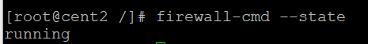

- Cho về default zone 

  - `firewall-cmd --get-default-zone`

- Rules:

  - `firewall-cmd --list-all`

- Since we haven’t given firewalld any commands to deviate from the default zone, and none of our interfaces are configured to bind to another zone, that zone will also be the only “active” zone (the zone that is controlling the traffic for our interfaces). We can verify that by typing:

  - `firewall-cmd --get-active-zones`

- Xem danh sách các zone :

  - `firewall-cmd --get-zones`

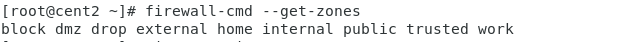

- List all services
  - `firewall-cmd --get-services`

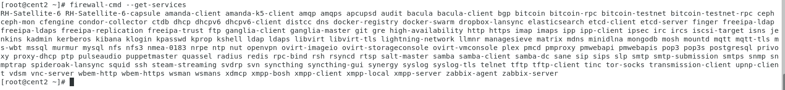

- **You can enable a service for a zone using the --add-service= parameter. The operation will target the default zone or whatever zone is specified by the --zone= parameter. By default, this will only adjust the current firewall session. You can adjust the permanent firewall configuration by including the --permanent flag.**

  For instance, if we are running a web server serving conventional HTTP traffic, we can allow this traffic for interfaces in our “public” zone for this session by typing:

  - `firewall-cmd --zone=public --add-service=http`
- You can leave out the --zone= if you wish to modify the default zone. We can verify the operation was successful by using the --list-all or --list-services operations:

  - `firewall-cmd --zone=public --list-services`

  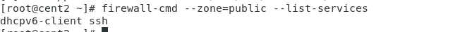

- Once you have tested that everything is working as it should, you will probably want to modify the permanent firewall rules so that your service will still be available after a reboot. We can make our “public” zone change permanent by typing:  
  - `firewall-cmd --zone=public --permanent --add-service=http`

- You can verify that this was successful by adding the --permanent flag to the --list-services operation. You need to use sudo for any --permanent operations:  

  - `firewall-cmd --zone=public --permanent --list-services`

- Your “public” zone will now allow HTTP web traffic on port 80. If your web server is configured to use SSL/TLS, you’ll also want to add the https service. We can add that to the current session and the permanent rule-set by typing:

  - `firewall-cmd --zone=public --add-service=https`

  - `firewall-cmd --zone=public --permanent --add-service=https`

- One way to add support for your specific application is to open up the ports that it uses in the appropriate zone(s). This is done by specifying the port or port range, and the associated protocol for the ports you need to open.

  For instance, if our application runs on port 5000 and uses TCP, we could add this to the “public” zone for this session using the --add-port= parameter. Protocols can be either tcp or udp:

  - `firewall-cmd --zone=public --add-port=5000/tcp`

- List ports   

  - `firewall-cmd --zone=public --list-ports`

- Runing range port:

  - `firewall-cmd --zone=public --add-port=4990-4999/udp`  

- After testing, we would likely want to add these to the permanent firewall. You can do that by typing:

  - `firewall-cmd --zone=public --permanent --add-port=5000/tcp`

  - `firewall-cmd --zone=public --permanent --add-port=4990-4999/udp`

  - `firewall-cmd --zone=public --permanent --list-ports`

- Reload your firewall to get access to your new service:

  - `firewall-cmd --reload`

# Tạo zone riêng:

- Ví dụ zone tên publishweb cho dịch vụ web

  - `firewall-cmd --permanent --new-zone=publicweb`

- Khởi động lại firewalld
 
  - `firewall-cmd --reload`
  

- Add service ssh http và https  và các port 22 80 443 ( **Lưu ý tham số có mặt --permanent hoặc ko có mặt --permanent, điều này liên quan đến add các service tạm thời -sau lệnh restart dịch vụ firewalld hoặc vĩnh viễn, nếu vĩnh viễn thì thêm tham số --permanent** )

  - `firewall-cmd --zone=publicweb --add-service=ssh --permanent`

  - ` firewall-cmd --zone=publicweb --add-service=http  --permanent`

  - ` firewall-cmd --zone=publicweb --add-service=https  --permanent`

  - `firewall-cmd --reload`

  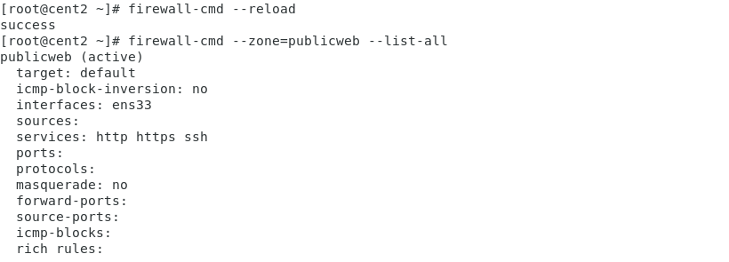

  - ` firewall-cmd --zone=publicweb --list-all`

  - `firewall-cmd --zone=publicweb --add-port=22/tcp --permanent`
  - `firewall-cmd --zone=publicweb --add-port=80/tcp --permanent`
  - `firewall-cmd --zone=publicweb --add-port=443/tcp --permanent`
  - `firewall-cmd --reload`

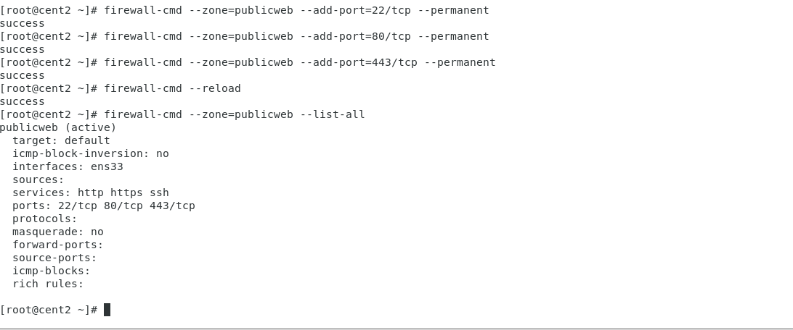

- Kích hoạt zone publicweb

  - `firewall-cmd --get-active-zones=publicweb`

- Khởi động lại firewalld

  - `service firewalld restart`

- Show lại zone đang chạy

  - `firewall-cmd --zone=publicweb --list-all`

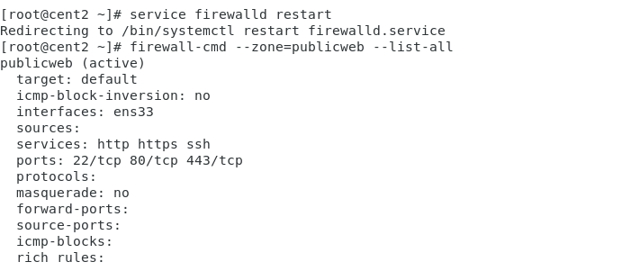

- Kiểm tra IP máy chủ và thử kết nối ssh

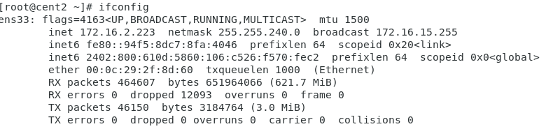 

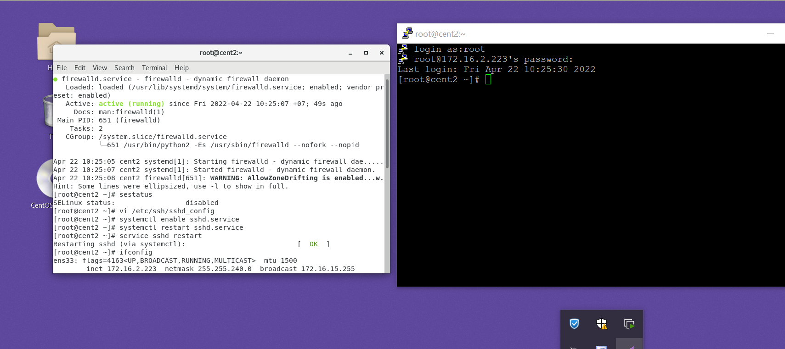

- Thử đổi port ssh là 2222 trong /etc/ssh/sshd_config , và add port mới trên firewalld cho ssh, 

ssh được mô tả trong: `/usr/lib/firewalld/services/ssh.xml`

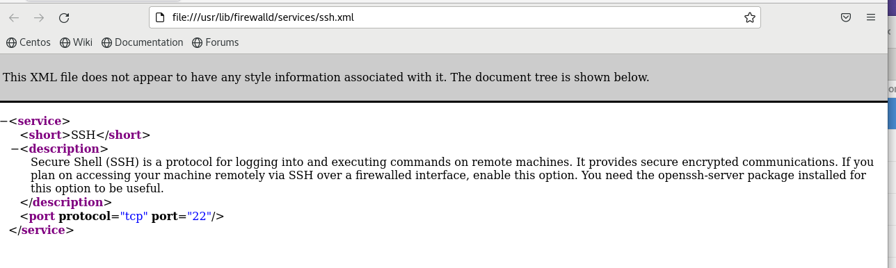

- `
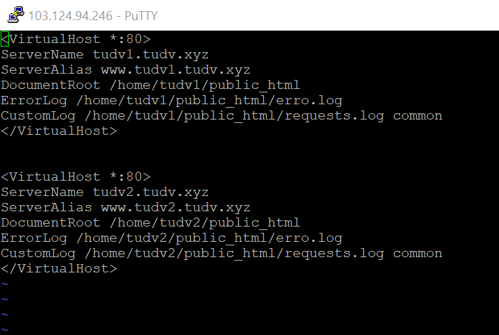
- `firewall-cmd --zone=publicweb --add-port=2222/tcp --permanent`

- Dùng putty trên host win10 kết nối ssh với VM `172.16.2.223/20`

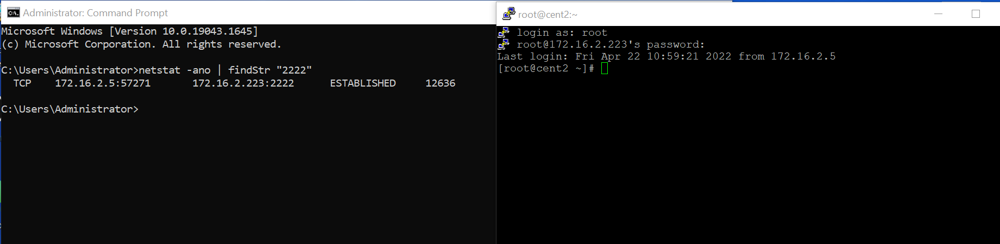

