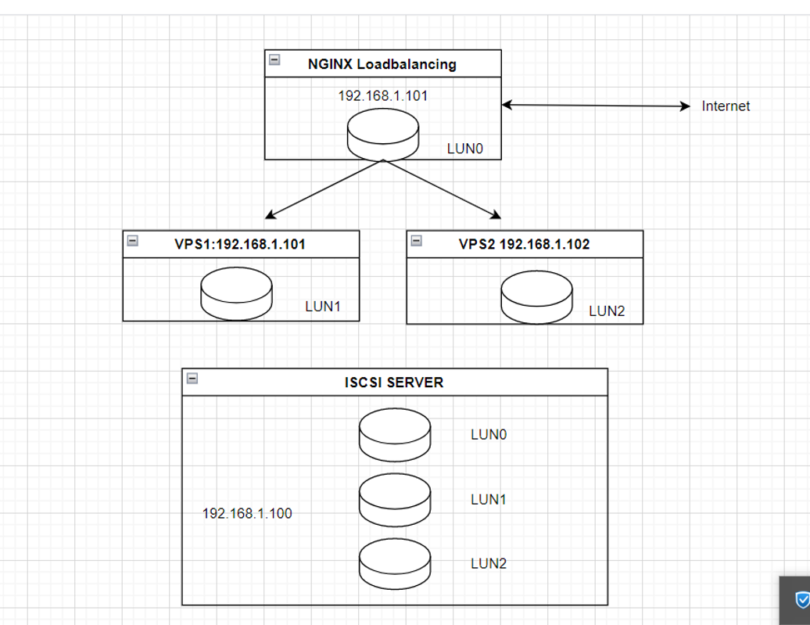
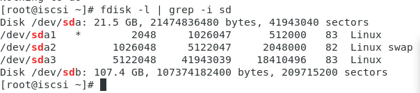
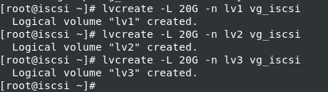
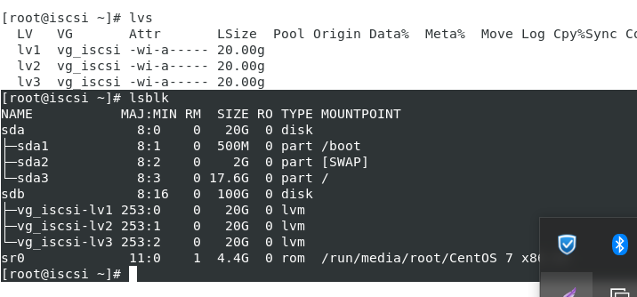
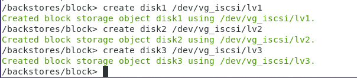
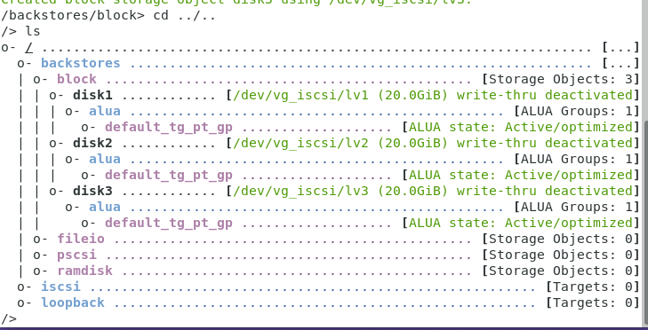
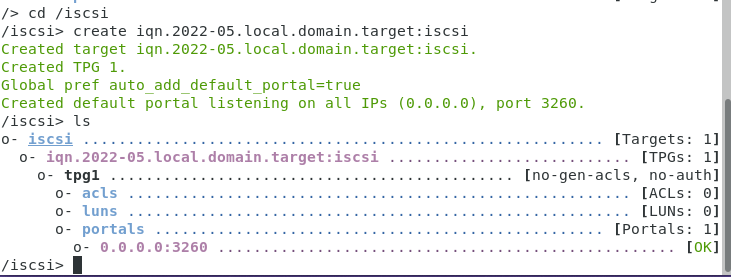
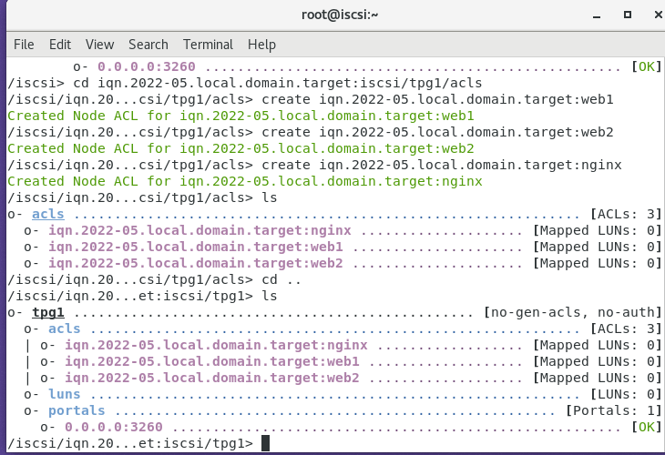
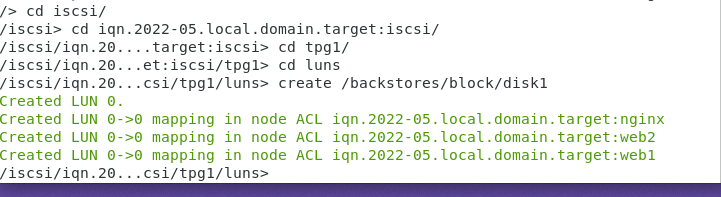
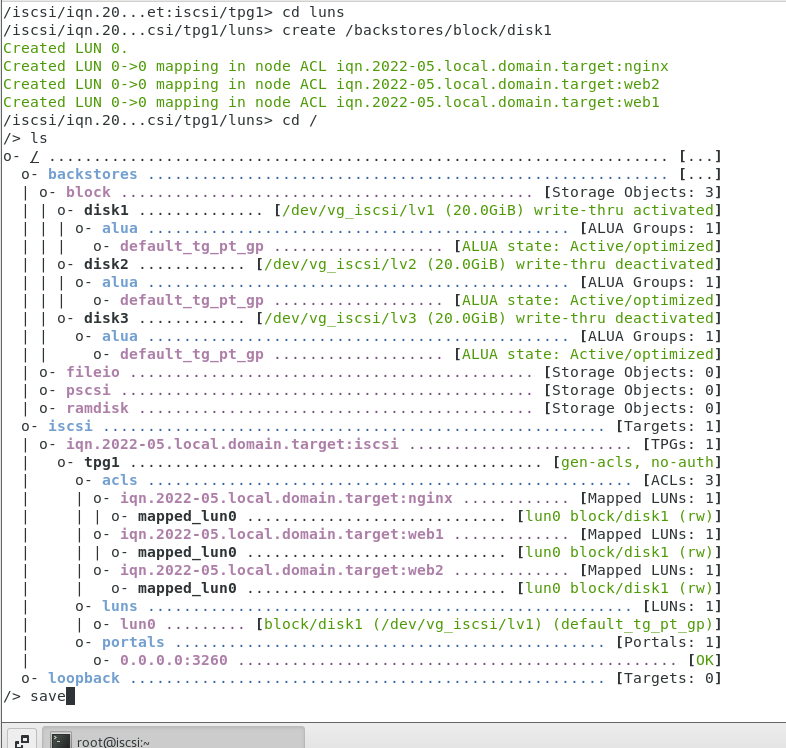

# Mô Hình



- Mô tả :
  - Máy 192.168.1.100 Chạy hệ điều hành centos và có 1 cụm ổ đĩa đã RAID là sdb, tạo lvm trên sdb để tạo các LUN = giao thức scsi phân phát ổ đĩa cho các vps chạy hệ điều hành trên các LUN đó.
  - VPS1 chạy HĐH centos,web 1 lấy LUN1 từ ISCSI server
  - VPS2 chạy HĐH centos,web2 lấy LUN2 từ ISCSI server là web chạy cân bằng tải với web1, đồng bộ dữ liệu web
  - Nginx là 1 VPS chạy cấu hình cân bằng tải loại round robin.Cũng lấy LUN0 để cài centos

# Cấu hình ISCSI SERVER( tên máy iscsi)  

- Trên iscsi gắn thêm 1 sdb =100GB, ta sẽ tạo các lvm1,lvm2,lvm3 trên vg tạo từ sdb, mỗi lvm =20GB.

- Đảm bảo yum đã update

```
yum update -y

```
- Tắt selinux:

- Kiểm tra firewalld , nếu ở trạng thái active thì tí nữa add port scsi:

- Cài đặt 

```
yum install targetcli -y

```
- Kiểm tra ổ đĩa gắn thêm đã nhận chưa:

```
fdisk -l | grep -i sd

```



- Khởi tạo một physical volum

```
[root@ iscsi~]# pvcreate /dev/sdb

```

- Tạo một Volume  group có tên là vg_iscsi

```
[root@ iscsi~]#  vgcreate vg_iscsi /dev/sdb
```
- Tạo 3 LVM1 ,LVM2,LVM3 có kích thước 20GB mỗi loại.

```

lvcreate -L 20G -n lv1 vg_iscsi

lvcreate -L 20G -n lv2 vg_iscsi

lvcreate -L 20G -n lv3 vg_iscsi

```


- Kiểm tra =``lvs`` hoặc ``lsblk``




- Chúng ta đã tạo đc 3 logical volum trên vg_iscsi

- Login vào Targetcli đã cài ở trên và di chuyển đến khối block để khởi tạo ISCSI

```
targetcli

cd /backstores/block

```

- Tạo một block ISCSIx có tên là iscsi1 trong logical volume lv1,lv2 và lv3 đã tạo

```

/backstores/block> create disk1 /dev/vg_iscsi/lv1

/backstores/block> create disk2 /dev/vg_iscsi/lv2

/backstores/block> create disk3 /dev/vg_iscsi/lv3

```
- Ở phần trên giải thích từng mục để hiểu thì block thuộc về phần Backstores sau khi tạo xong được phân vùng thì quay trở lại bên ngoài để vào phần iscsi



- Trong phần ISCSI này thì khởi tạo kết nối iqn như sau :



```
cd /iscsi

```

```

/iscsi> create iqn.2022-05.local.domain.target:iscsi

```
- Trong đó :

2022-5 là mốc thời gian

local.domain là tên miền công ty

target chỉ máy chủ

iscsi tên máy chủ



- Hệ thống sẽ tạo TPG Authentication TPG1 và khởi tạo default sẽ chạy với port 3260

- Khi đã tạo TPG Authentication thì bắt buộc sẽ phải set rule cho kết nối này bằng cách đi thẳng vào vùng acls với lệnh sau

```
/iscsi> cd iqn.2022-05.local.domain.target:iscsi/tpg1/acls

create iqn.2022-05.local.domain.target:web1

create iqn.2022-05.local.domain.target:web1

create iqn.2022-05.local.domain.target:nginx

```



- Dùng cd.. ra ngoài một node và set set attribute authentication bằng 0, và tại sao lại là không vì 0 là không xác thực (No Authentication)

```
set attribute authentication=0

```
- Tiếp theo set attribute generate_node_acls=1 là bỏ qua chế độ ALC

```
set attribute generate_node_acls=1

```
- Vào LUNS



```

/iscsi/iqn.20...csi/tpg1/luns> create /backstores/block/disk1 

```


