# Mô hình:


- Giới thiệu :

  - LUN ( Logical unit number Tạm gọi là các Đĩa ảo logical, có có tính mở rộng size mà ko làm gián đoạn các dịch vụ chạy trên đó,Nó đc tạo ra và sẽ chia sẻ từ ISCSI server)
  - Trên máy ISCSI server chỉ chạy storage và backup các LVM LUN nghĩa là backup đc cả hệ điều hành các máy ảo.
  - VM1 và VM2 chạy web server , dữ liệu được đồng bộ
  - Nginx : nhiệm vụ cân bằng tải 2 web

## 1- LVM + ISCSI target server :

## 1.1- LVM

- Khái niệm:


## 1.2- SERVER : Cài centos7, add thêm 3 ổ cứng sdb sdc sdd , nhóm 3 ổ tạo thành 1 lvm , chia lvm này thành các LUNs


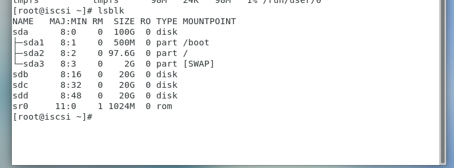

- Tạo logical volum trên sdb sdc sdd: lấy hết phần cứng gắn vào thêm ở sdb sdc sdd:

```
fdisk /dev/sdb

```

```

[root@iscsi ~]# fdisk /dev/sdb
Welcome to fdisk (util-linux 2.23.2).

Changes will remain in memory only, until you decide to write them.
Be careful before using the write command.

Device does not contain a recognized partition table
Building a new DOS disklabel with disk identifier 0xf7cedab2.

Command (m for help): n
Partition type:
   p   primary (0 primary, 0 extended, 4 free)
   e   extended
Select (default p): 
Using default response p
Partition number (1-4, default 1): 
First sector (2048-41943039, default 2048): 
Using default value 2048
Last sector, +sectors or +size{K,M,G} (2048-41943039, default 41943039): 
Using default value 41943039
Partition 1 of type Linux and of size 20 GiB is set

Command (m for help): m
Command action
   a   toggle a bootable flag
   b   edit bsd disklabel
   c   toggle the dos compatibility flag
   d   delete a partition
   g   create a new empty GPT partition table
   G   create an IRIX (SGI) partition table
   l   list known partition types
   m   print this menu
   n   add a new partition
   o   create a new empty DOS partition table
   p   print the partition table
   q   quit without saving changes
   s   create a new empty Sun disklabel
   t   change a partition's system id
   u   change display/entry units
   v   verify the partition table
   w   write table to disk and exit
   x   extra functionality (experts only)

Command (m for help): t
Selected partition 1
Hex code (type L to list all codes): 8e
Changed type of partition 'Linux' to 'Linux LVM'

Command (m for help): w
The partition table has been altered!

Calling ioctl() to re-read partition table.
Syncing disks.
[root@iscsi ~]# 

```

- Làm tương tự cho sdc và sdd

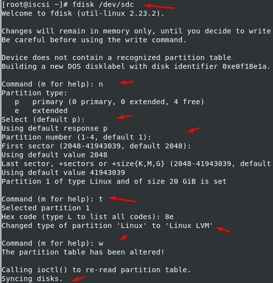

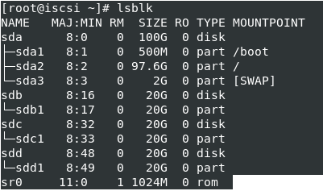

- Tạo Physical Volum :

    - Từ các partition /dev/sdb1 /dev/sdc1 /dev/sdd1 ta tạo các Physical Volume bằng lệnh sau
    
```
pvcreate /dev/sdb1

pvcreate /dev/sdc1

pvcreate /dev/sdd1

```
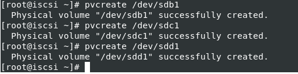

- Kiểm tra bằng lệnh pvs hoặc pvdisplay xem các physical volume đã được tạo chưa :

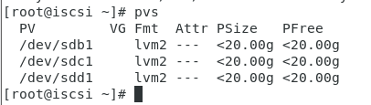

- Tạo Volume group:
    - Sau khi tạo các Physical Volume ta gộp các PV đó thành 1 Volume Group bằng lệnh sau :

```
vgcreate vgstorage /dev/sdb1 /dev/sdc1 /dev/sdd1

```

- Dùng các lệnh vgs hoặc vgdisplay để kiểm tra :

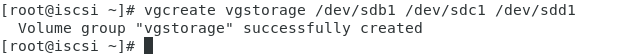

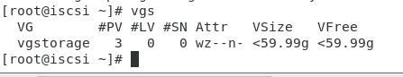

- Tạo Logical Volume:

Từ một Volume group , ta tạo các Logical Volume để sử dụng bằng lệnh sau :

```

lvcreate -L 50Gi -n lv1 vgstorage  ; tạo lvm tên "lv1" dung lượng 50Gi .


```

- Trong đó :

  - L : Chỉ ra dung lượng của logical volume

  - n : Chỉ ra tên của logical volume

  - Kiểm tra bằng lệnh lvs hoặc lvdisplay

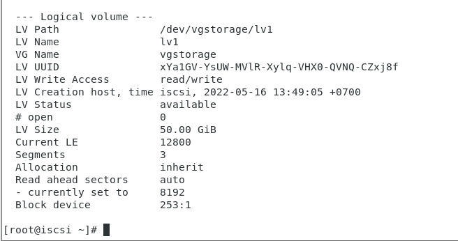


## 1.3 - Thiết lập ISCSI trên server:

- Chúng ta sẽ tạo các LUNS tạm gọi là các đĩa trên lvm để các máy khác có thể sử dụng theo mô tả bằng hình:


- Chúng ta có 1 LVM tên là lv1


- Sử dụng công cụ Targetcli và cd vào blockstores 

```
Trong Enterprise Linux 6, thuật ngữ lưu trữ sao lưu được sử dụng cho các ánh xạ được tạo trong mục tiêu. Bây giờ chúng được gọi là các đối tượng lưu trữ. Trong Enterprise Linux 7, chúng tôi sử dụng thuật ngữ backstore để chỉ các loại thiết bị hỗ trợ khác nhau như thiết bị khối và khối lượng logic. Backstore được hỗ trợ bởi mục tiêu LIO iSCSI bao gồm FILEIO, BLOCK, PSCSI và các đĩa RAM sao chép bộ nhớ. Các kho lưu trữ FILEIO là lưu trữ được hỗ trợ bởi tệp Linux. FILEIO có thể là viết lại hoặc viết qua. Sử dụng tính năng ghi ngược cho phép bộ đệm ẩn của hệ thống tệp Linux có thể cải thiện hiệu suất. Tuy nhiên, nó cũng làm tăng khả năng mất dữ liệu, vì vậy bạn nên ghi lại. Để tạo một kho lưu trữ FILEIO, chúng tôi sẽ sử dụng đường dẫn / backstores / fileio với một lệnh phụ tạo. Chúng ta có thể tắt ghi lại bằng cách thêm tùy chọn write_back = false cho thiết bị. Các kho lưu trữ BLOCK có thể là bất kỳ thiết bị nào tồn tại trong / sys / block.

Điều này bao gồm các thiết bị vật lý như đĩa cứng, đĩa thể rắn, ổ đĩa quang như CD và DVD, cũng như ổ đĩa RAID và LVM. Để tạo một kho lưu trữ BLOCK, chúng tôi sẽ sử dụng đường dẫn / backstores / block với lệnh phụ create. Trong ví dụ này, chúng tôi đang sử dụng thiết bị chặn / dev / sdb để dự phòng. Trong PSCSI, thiết bị là thiết bị SCSI được truyền qua. Bất kỳ thiết bị lưu trữ nào hỗ trợ truyền trực tiếp SCSI mà không cần mô phỏng và cũng có thiết bị thoát trong / procs / scsi / scsi đều có thể được sử dụng cho kho lưu trữ này. Để tạo một kho lưu trữ phía sau PSCSI cho ổ đĩa DVD của chúng tôi, chúng tôi sử dụng đường dẫn / backstores / pscsi và chỉ định thiết bị phụ trợ của / dev / sr0. Do sự phức tạp khi chuyển qua các lệnh SCSI qua một thiết bị, bạn nên sử dụng kho lưu trữ BLOCK nếu có thể. Trong một số trường hợp, độ phức tạp của chuyển qua SCSI bị ảnh hưởng. Chúng tôi cũng có thể tạo các kho lưu trữ RAMDISK được hỗ trợ bởi bộ nhớ. Đây là những hình ảnh trong RAM thường không liên tục khi khởi động lại nhưng rất nhanh. Điều này cho phép chúng tôi có RAMDisks với mô phỏng SCSI đầy đủ, rất tốt cho việc lưu trữ khối lượng lớn dễ bay hơi khi cần IO cao. Để tạo một kho lưu trữ RAMDISK hỗ trợ bộ nhớ, chúng tôi sẽ sử dụng đường dẫn / backstore / ramdisk và chỉ định kích thước.

Để xem backstores hoạt động như thế nào, hãy tạo một tệp IO backstore. Đảm bảo rằng RA của bạn đã chọn một BM được khởi động và bạn đã đăng nhập. Trong một thiết bị đầu cuối, chạy CLI mục tiêu bằng cách nhập sudo, dấu cách, targetcli và nhấn enter. Nhập mật khẩu của bạn nếu được nhắc. Chúng ta sẽ bắt đầu bằng cách liệt kê tất cả các đối tượng hiện có bằng cách nhập ls. Chúng ta có thể thấy rằng chúng ta không có backstores, đối tượng lưu trữ hoặc mục tiêu. Để tạo tệp IO backstore, hãy gõ vào / backstores / fileio space create space file1, đó là tên của nó, space, /tmp/disk1.img, đây là tệp trên ổ đĩa sẽ trở lại backstore này. Không gian, 200 đô M, đó là kích thước. Dấu cách, viết, gạch dưới trở lại bằng false. Và nhấn enter. Trong trường hợp này, chúng tôi đã tắt tính năng viết lại được khuyến nghị. Để xem kho hàng của chúng tôi, hãy nhập ls và nhấn enter. Bây giờ chúng ta có thể thấy rằng chúng ta có một tệp IO backstore có tên là file1 tồn tại tại /tmp/disk1.img. Trong phần còn lại của chương này, chúng ta sẽ tạo các thành phần khác nếu cần.

```

```
targetcli

/>cd backstores/block

```

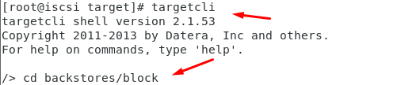

```
create disk1 /dev/vgstorage/lv1

```


```


- Trở lại targetcli

```
cd /iscsi tạo iqn

create iqn.2022-05.tudv.xyz.target:iscsi

```

  - 2022-5 là mốc thời gian

  - tudv.xyz là tên miền cty

  - target chỉ máy chủ

  - iscsi tên máy chủ iscsi storage

TPG1 dùng port 3260 để chuyển storage xuống


- Tiếp theo:

```

cd /iscsi/iqn.2022-05.tudv.xyz.target:iscsi/tpg1/acls

```


acls: accesslist, kiểu điều kiện kết nối

```
create iqn.2022-05.tudv.xyz.target:web1

```

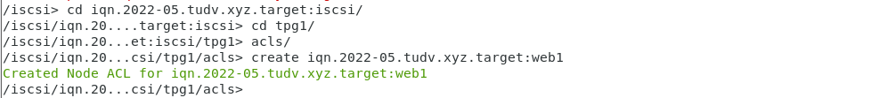

```
cd /iscsi/iqn.2020-05.tudv.xyz.target:iscsi/tpg1/luns

```

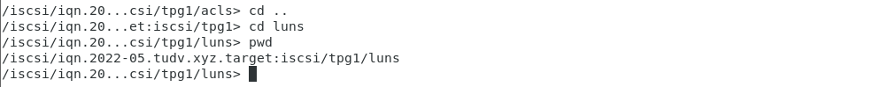

```
create /backstores/block/disk1


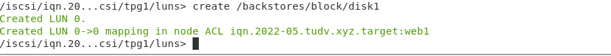

>> LUN0 đã đc map cho máy tên là web1

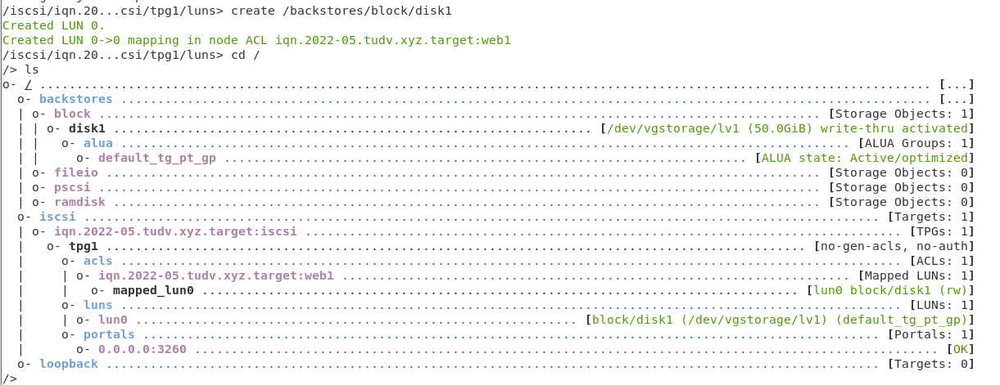


```
systemctl enable iscsi.service

firewall-cmd --permanent --add-port=3260/tcp

success

firewall-cmd --reload

```


## Cài os trên máy tên web1 = LUN0 từ máy chạy iscsi:

- Trên máy chạy iscsi target: `` Tắt selinux``


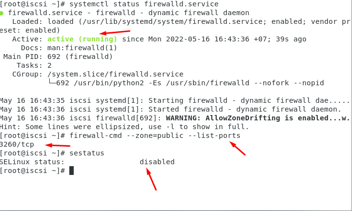

- Trên máy vps1:

Khi cài đặt :


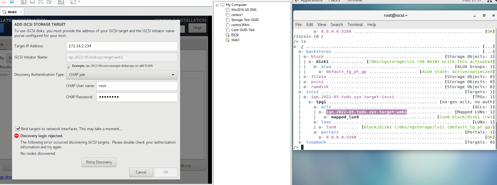


