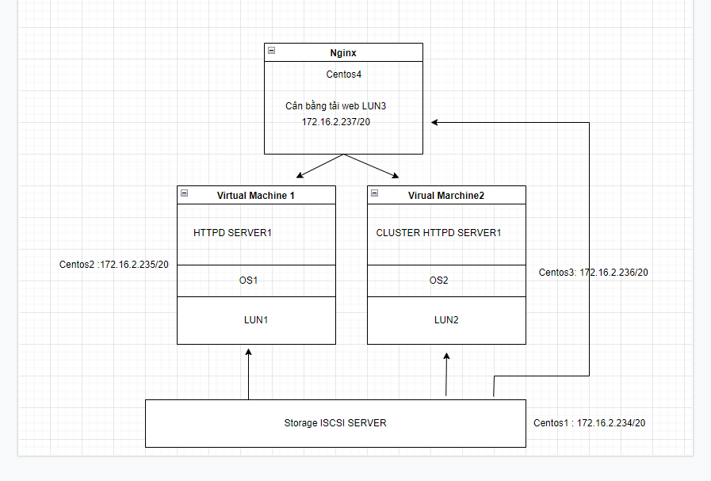
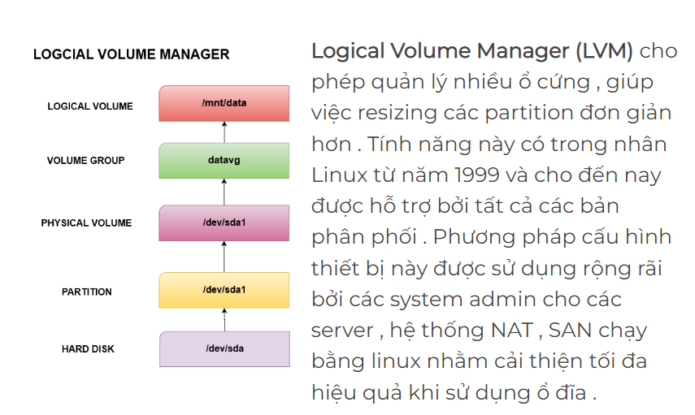
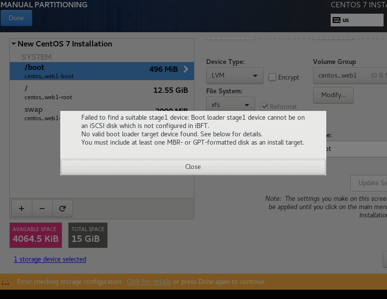

# Mô hình:



- Giới thiệu :

  - LUN ( Logical unit number Tạm gọi là các Đĩa ảo logical, có có tính mở rộng size mà ko làm gián đoạn các dịch vụ chạy trên đó,Nó đc tạo ra và sẽ chia sẻ từ ISCSI server)
  - Trên máy ISCSI server chỉ chạy storage và backup các LVM LUN nghĩa là backup đc cả hệ điều hành các máy ảo.
  - VM1 và VM2 chạy web server , dữ liệu được đồng bộ
  - Nginx : nhiệm vụ cân bằng tải 2 web

## 1- LVM + ISCSI target server :

## 1.1- LVM

- Khái niệm:



## 1.2- SERVER : Cài centos7, add thêm  ổ cứng sdb


- Cài đặt lvm2

```
yum install lvm2 y

```

- Phân vùng 8e  trên sdb(sdb1,sdb2,sdb3) : 3 ổ mỗi ổ 20G


```
fdisk /dev/sdb

```


- Làm tương tự cho sdb2 sdb3


- Tạo Physical Volum :

    - Từ các partition /dev/sdb1 /dev/sdb2 /dev/sdb3 ta tạo các Physical Volume bằng lệnh sau
    
```
pvcreate /dev/sdb1

pvcreate /dev/sdb2

pvcreate /dev/sdb3

```


- Kiểm tra bằng lệnh pvs hoặc pvdisplay xem các physical volume đã được tạo chưa :


- Tạo Volume group:

    - Sau khi tạo các Physical Volume ta gộp các PV đó thành 1 Volume Group bằng lệnh sau :

```
vgcreate vg1 /dev/sdb1 

vgcreate vg2 /dev/sdb2

vgcreate vg3 /dev/sdb3 


```

- Dùng các lệnh vgs hoặc vgdisplay để kiểm tra :


- Tạo Logical Volume:

Từ một Volume group , ta tạo các Logical Volume lv1 lv2 lv3 để sử dụng bằng lệnh sau :

```

lvcreate -L 15Gi -n lv1 vg1  ; tạo lvm tên "lv1" dung lượng 15Gi

lvcreate -L 15Gi -n lv2 vg2  ; tạo lvm tên "lv2" dung lượng 15Gi 

lvcreate -L 15Gi -n lv3 vg3  ; tạo lvm tên "lv3" dung lượng 15Gi 


```


- Trong đó :

  - L : Chỉ ra dung lượng của logical volume

  - n : Chỉ ra tên của logical volume

  - Kiểm tra bằng lệnh lvs hoặc lvdisplay


## 1.3 - Thiết lập ISCSI trên server:

- Chúng ta sẽ tạo các LUNS tạm gọi là các đĩa trên lvm để các máy khác có thể sử dụng theo mô tả bằng hình:


- Chúng ta có 3 LVM tên là lv1,lv2,lv3


- Sử dụng công cụ Targetcli và cd vào blockstores 

```
yum install targetcli -y

```

```
Trong Enterprise Linux 6, thuật ngữ lưu trữ sao lưu được sử dụng cho các ánh xạ được tạo trong mục tiêu. Bây giờ chúng được gọi là các đối tượng lưu trữ. Trong Enterprise Linux 7, chúng tôi sử dụng thuật ngữ backstore để chỉ các loại thiết bị hỗ trợ khác nhau như thiết bị khối và khối lượng logic. Backstore được hỗ trợ bởi mục tiêu LIO iSCSI bao gồm FILEIO, BLOCK, PSCSI và các đĩa RAM sao chép bộ nhớ. Các kho lưu trữ FILEIO là lưu trữ được hỗ trợ bởi tệp Linux. FILEIO có thể là viết lại hoặc viết qua. Sử dụng tính năng ghi ngược cho phép bộ đệm ẩn của hệ thống tệp Linux có thể cải thiện hiệu suất. Tuy nhiên, nó cũng làm tăng khả năng mất dữ liệu, vì vậy bạn nên ghi lại. Để tạo một kho lưu trữ FILEIO, chúng tôi sẽ sử dụng đường dẫn / backstores / fileio với một lệnh phụ tạo. Chúng ta có thể tắt ghi lại bằng cách thêm tùy chọn write_back = false cho thiết bị. Các kho lưu trữ BLOCK có thể là bất kỳ thiết bị nào tồn tại trong / sys / block.

Điều này bao gồm các thiết bị vật lý như đĩa cứng, đĩa thể rắn, ổ đĩa quang như CD và DVD, cũng như ổ đĩa RAID và LVM. Để tạo một kho lưu trữ BLOCK, chúng tôi sẽ sử dụng đường dẫn / backstores / block với lệnh phụ create. Trong ví dụ này, chúng tôi đang sử dụng thiết bị chặn / dev / sdb để dự phòng. Trong PSCSI, thiết bị là thiết bị SCSI được truyền qua. Bất kỳ thiết bị lưu trữ nào hỗ trợ truyền trực tiếp SCSI mà không cần mô phỏng và cũng có thiết bị thoát trong / procs / scsi / scsi đều có thể được sử dụng cho kho lưu trữ này. Để tạo một kho lưu trữ phía sau PSCSI cho ổ đĩa DVD của chúng tôi, chúng tôi sử dụng đường dẫn / backstores / pscsi và chỉ định thiết bị phụ trợ của / dev / sr0. Do sự phức tạp khi chuyển qua các lệnh SCSI qua một thiết bị, bạn nên sử dụng kho lưu trữ BLOCK nếu có thể. Trong một số trường hợp, độ phức tạp của chuyển qua SCSI bị ảnh hưởng. Chúng tôi cũng có thể tạo các kho lưu trữ RAMDISK được hỗ trợ bởi bộ nhớ. Đây là những hình ảnh trong RAM thường không liên tục khi khởi động lại nhưng rất nhanh. Điều này cho phép chúng tôi có RAMDisks với mô phỏng SCSI đầy đủ, rất tốt cho việc lưu trữ khối lượng lớn dễ bay hơi khi cần IO cao. Để tạo một kho lưu trữ RAMDISK hỗ trợ bộ nhớ, chúng tôi sẽ sử dụng đường dẫn / backstore / ramdisk và chỉ định kích thước.

Để xem backstores hoạt động như thế nào, hãy tạo một tệp IO backstore. Đảm bảo rằng RA của bạn đã chọn một BM được khởi động và bạn đã đăng nhập. Trong một thiết bị đầu cuối, chạy CLI mục tiêu bằng cách nhập sudo, dấu cách, targetcli và nhấn enter. Nhập mật khẩu của bạn nếu được nhắc. Chúng ta sẽ bắt đầu bằng cách liệt kê tất cả các đối tượng hiện có bằng cách nhập ls. Chúng ta có thể thấy rằng chúng ta không có backstores, đối tượng lưu trữ hoặc mục tiêu. Để tạo tệp IO backstore, hãy gõ vào / backstores / fileio space create space file1, đó là tên của nó, space, /tmp/disk1.img, đây là tệp trên ổ đĩa sẽ trở lại backstore này. Không gian, 200 đô M, đó là kích thước. Dấu cách, viết, gạch dưới trở lại bằng false. Và nhấn enter. Trong trường hợp này, chúng tôi đã tắt tính năng viết lại được khuyến nghị. Để xem kho hàng của chúng tôi, hãy nhập ls và nhấn enter. Bây giờ chúng ta có thể thấy rằng chúng ta có một tệp IO backstore có tên là file1 tồn tại tại /tmp/disk1.img. Trong phần còn lại của chương này, chúng ta sẽ tạo các thành phần khác nếu cần.

```

```
targetcli

/>cd backstores/block

```

- Tạo một block ISCSIx có tên là disk1 trong logical volume lv1,lv2 và lv3 đã tạo

```

/backstores/block> create disk1 /dev/vg1/lv1

/backstores/block> create disk2 /dev/vg2/lv2

/backstores/block> create disk3 /dev/vg3/lv3
```


- Trở lại targetcli

```
cd /iscsi tạo iqn

create iqn.2022-05.tudv.xyz.target:iscsi

```

  - 2022-5 là mốc thời gian

  - tudv.xyz là tên miền cty

  - target chỉ máy chủ

  - iscsi tên máy chủ iscsi storage

  

TPG1 dùng port 3260 để chuyển storage xuống


- Tiếp theo:

```

cd /iscsi/iqn.2022-05.tudv.xyz.target:iscsi/tpg1/acls

```


acls: accesslist, kiểu điều kiện kết nối

```
create iqn.2022-05.tudv.xyz.target:web1

create iqn.2022-05.tudv.xyz.target:web2

create iqn.2022-05.tudv.xyz.target:nginx

```


- Dùng cd.. ra ngoài một node và set set attribute authentication bằng 0, và tại sao lại là không vì 0 là không xác thực (No Authentication)

```

/iscsi/iqn.20...ter/tpg1/>set attribute authentication=0

```


- Tiếp theo set attribute generate_node_acls=1 là bỏ qua chế độ ALC

```

/iscsi/iqn.20...ter/tpg1/>set attribute generate_node_acls=1

```


- Và bước tiếp theo đó là đi đến vùng LUNs để tạo LUN


```
create /backstores/block/disk1

create /backstores/block/disk2

create /backstores/block/disk3


```


- 3 iqn này map ping vào các LUns 0  1 2  , Luns nào cũng đc vì độ lớn lvm hiện tại nó cũng bằng nhau, Trong San hay Nas có chức năng **Bind to LunX >< Client** nên 1 khi đã fix cứng thì sau ko thể lẫn map

>> **Muốn tạo các LUNs map với tên disk1 2 3 trong ví dụ như nào đó mình chưa rõ ,vì mình cũng test các làm lần lượt**


- Đây là ảnh tạo lun1 xong tạo lun2 nó map thế này


- Bây giờ mình đi mapping hết 2 web1 và web2: iqn xong mới tạo nốt cái thứ 3 xem nó có map lun2 với nginx ko.

Ở đây làm 1 phát 3 LUNs và 3 máy nên ta sẽ cấu hình theo trình tự như sau

  - LUN0  map cho máy tên là web1
  - LUN1  map cho máy tên là web2
  - LUN2  map cho máy tên là nginx

>> Đây là cách làm lần lượt các disk và iqn


- Sau khi add config xong dùng cd.. ra node ngoài cùng và dùng ls để check lại xem chính xác hay chưa trước khi lưu lại


- Lưu lại


```
systemctl enable iscsi.service

firewall-cmd --permanent --add-port=3260/tcp

firewall-cmd --zone=public --permanent --add-service=iscsi-target

success


firewall-cmd --reload

```


## Cài os trên máy tên web1 = LUN0 từ máy chạy iscsi:

- Trên máy chạy iscsi target: `` Tắt selinux``

- web1: 




- Đây toàn lỗi do file iso chưa có bổ trợ hoặc j đó. ko cài đc nó làm bootloader


- Phải kết hợp với 1 ổ khác trên vmw mới cài đc, ổ trên là 20 của máy và 15Gb của iscsi tạo thành 35G tổng

```

Native UEFI iSCSI iBOOT installation not supported in Linux - IBM BladeCenter and System x
Troubleshooting

Problem
Current Linux kernels do not detect the iSCSI Boot Firmware Table (iBFT) when the iscsi_ibft module is loading in a native Unified Extensible Firmware Interface (UEFI) iBOOT installation. The result is that iBOOT on internet Small Computer System Interface (iSCSI) will not work during a native UEFI installation, resulting in installation failure. The issue is due to a bug in the Linux code. This failure occurs only during an iBOOT native UEFI installation. Legacy iBOOT installation is unaffected.

Resolving The Problem
Source
RETAIN tip: H205193

Symptom
Current Linux kernels do not detect the iSCSI Boot Firmware Table (iBFT) when the iscsi_ibft module is loading in a native Unified Extensible Firmware Interface (UEFI) iBOOT installation. The result is that iBOOT on internet Small Computer System Interface (iSCSI) will not work during a native UEFI installation, resulting in installation failure. The issue is due to a bug in the Linux code.

This failure occurs only during an iBOOT native UEFI installation. Legacy iBOOT installation is unaffected.

The behavior occurs during the native UEFI Linux installation, when the vendor-specific Linux installer gets to a point where the user chooses an iSCSI target as the boot device. Currently the iBFTs are not copied by the UEFI boot kernel into operating system memory space, and so no targets would be available for choosing.

There are no errors or warnings as the UEFI kernel simply cannot detect any target devices due to a bug in the Linux code, which attempts to evaluate the tables before they are copied to operating system memory.

Affected configurations
The system is configured with at least one of the following:

Red Hat Enterprise Linux 6 update 1, update 2
SUSE Linux Enterprise Server 11, any service pack
This tip is not system specific.

This tip is not option specific.

Note: This does not imply that the network operating system will work under all combinations of hardware and software.

Please see the compatibility page for more information: http://www.ibm.com/systems/info/x86servers/serverproven/compat/us/
Solution
There is a proposed fix for this bug by the Linux open source community. This fix would require each individual vendor to pull this fix in and incorporate it into a future release.

There is no end user applicable fix for currently GA versions of the vendor operating systems. The fix must be incorporated into the installation kernel of any vendor that plans to support this function in a future release.

Workaround
If a UEFI iBOOT installation is not specifically needed, then the user can instead perform a legacy iBOOT installation, which is unaffected by this native UEFI iBOOT installation kernel issue. This workaround is viable only if a native UEFI iBOOT installation is not required.

Applicable countries and regions
Worldwide

```

- Tiếp theo là lỗi khi iscsi mất kết nối: các máy client bị hỏng luôn


