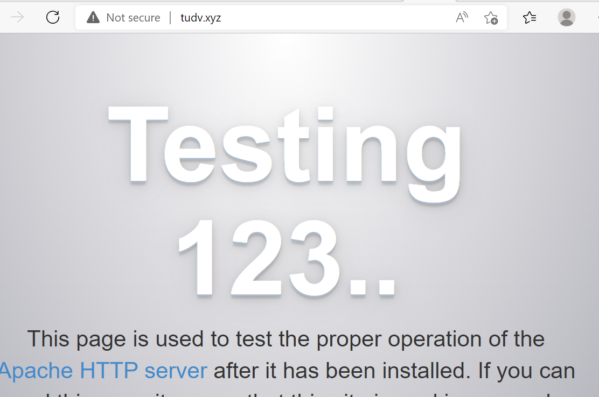

# LAMP

LAMP là sự kết hợp của Linux + Apache + MySQL + PHP.

Nó là một chồng các ứng dụng hoạt động cùng nhau trên một máy chủ web để lưu trữ một trang web. Mỗi chương trình riêng lẻ phục vụ một mục đích khác nhau, được kết hợp lại để tạo thành một giải pháp máy chủ web linh hoạt.
- Trong LAMP, Linux đóng vai trò là hệ điều hành của máy chủ xử lý tất cả các lệnh trên máy
- Apache là một phần mềm máy chủ web quản lý các yêu cầu HTTP để cung cấp nội dung cho trang web
- MySQL là một hệ quản trị cơ sở dữ liệu có chức năng duy trì dữ liệu của người dùng trên máy chủ
- PHP là một ngôn ngữ lập kịch bản cho phép giao tiếp phía máy chủ

## Cài đặt LAMP trên CentOS 7

- Máy chủ chạy centos7 Tên miền tudv.xyz IP= 103.124.94.246 

- Cấu hình Virtual host trong Apache: dạng 1 IP mà nhiều domain trỏ vào, mỗi 1 thư mục chứa dataweb chính nằm trong thư mục /home của mỗi 1 user tạo ra. 
- Ngược lại với kiểu cấu hình namespace trên là kiểu cấu hình nhiều địa chỉ IP trỏ về 1 domain, kiểu này là cấu hình làm ảo card mạng , các card mạng ảo này nhận IP ảo dựa trên 1 IP thật của máy chủ.

- Dưới đây em sẽ trình bày cách cấu hình LAMP Namespace và cài đặt SSL free cho máy ảo

## 1-Cài apache

- Xóa bộ nhớ cache  cập nhật

```
yum clean all

```


- Update yum

```
yum update -y

```
- Cài apache:

```
yum install httpd -y

```


- Khởi động và cho phép Apache khởi động cùng hệ thống mỗi khi máy reboot

```
systemctl start httpd
systemctl enable httpd
```
- Kiểm tra dịch vụ đã hoạt động chưa bằng cách nhập lệnh
```
systemctl status httpd
```


- Firewalld cho phép chạy http và https

```
firewall-cmd --zone=public --add-service=http  --permanent

firewall-cmd --zone=public --add-service=https  --permanent

firewall-cmd --reload
```




- Tạo user tudv1 là user trong đó  /home/tudv1/web sẽ là thư mục chứa dataweb tudv1.tudv.xyz
  
  
```
useradd tudv1 
passwd tudv1
```
- Chuyển vai trò sang tudv1

``` 
su tudv1

mkdir /home/tudv1/public_html

chmod 711 /home/tudv1      ;mục đích chỉ có user tudv1 toàn quyền với home của user tudv1 

cd home/tudv1/


chmod 755 public_html             ;để mọi người có quyền vào đc

```


  

- Cấu hình file userdir: /etc/httpd/conf.d/userdir.conf khi cài xong httpd sẽ được tạo ra

```
vi /etc/httpd/conf.d/userdir.conf
```


   - Trong đó có 1 vài chỉ thị: Mặc định userdir tắt, phải bỏ # đằng trước để kích hoạt. Khi chúng ta dùng userdir thì mặc định đường dẫn chứa web theo gợi ý sẽ là /home/*/public_html  là document Root của website đó.

   - AllowOverride= All 

   - Options None: không có thêm điều kiện nào đó để được phép truy cập

   

- Làm tương tự với user tudv2

```
useradd tudv2
passwd tudv2

```

- Sau đó chuyển sang vai trò người dùng tudv2

```

su tudv2

mkdir /home/tudv2/public_html
chmod 711 /home/tudv2
chmod 755 /home/tudv2/public_html

```

- Quay trở lại với user root:


- Cấu hình file virtualhost.conf

```
vi /etc/httpd/conf.d/virtualhost.conf
```


- Khai báo thể hiện


## 2- Cài mariadb

```
yum -y install mariadb mariadb-server
```

- Khởi động dịch vụ:

```
systemctl start mariadb
systemctl enable mariadb
service mariadb restart

```
- Cấu hình bảo mật MariaDB
```
mysql_secure_installation
```
 Khi được nhắc nhập mật khẩu, ta có thể nhấn `Enter` để trống hoặc cập nhật mật khẩu mới
- Sau đó làm các bước để thiết lập mật khẩu. Cuối cùng, tập lệnh sẽ yêu cầu định cấu hình một số biện pháp bảo mật, bao gồm:
	+ Xóa người dùng ẩn danh?
	+ Không cho phép đăng nhập từ xa?
	+ Xóa cơ sở dữ liệu thử nghiệm và truy cập vào nó?
	+ Tải lại bảng đặc quyền ngay bây giờ


## 3- Cài đặt PHP


- Cài đặt Remi Repository

```
yum -y install http://rpms.remirepo.net/enterprise/remi-release-7.rpm
```

- Cài đặt  và yum-utils kích hoạt kho lưu trữ EPEL repository
```
yum -y install epel-release yum-utils
```

- Muốn cài php8.0
```
 

yum-config-manager --enable remi-php80
```
- Cài các module của PHP 8.0

```

yum install -y php php-fpm php-ldap php-zip php-embedded php-cli php-mysql php-common php-gd php-xml php-mbstring php-mcrypt php-pdo php-soap php-json php-simplexml php-process php-curl php-bcmath php-snmp php-pspell php-gmp php-intl php-imap perl-LWP-Protocol-https php-pear-Net-SMTP php-enchant php-pear php-devel php-zlib php-xmlrpc php-tidy php-opcache php-cli php-pecl-zip unzip gcc

```


- Sau khi cài đặt thành công ta có thể kiểm tra phiên bản php bằng lệnh 
```
php -v
```

- Khởi động lại Apache để đảm bảo rằng nó hoạt động với PHP mới được cài đặt
```
systemctl restart httpd

```

## 4- Tạo cơ sở dữ liệu cho wordpress:

- Đăng nhập vào mysql
```
mysql -u root -p
```

- Nhập password root đã tạo cho MariaDB server đã tạo trước đó

- Tạo cơ sở dữ liệu

```
CREATE DATABASE wordpress1;

```

- Sau khi tạo xong cơ sở dữ liệu, ta cần tạo người dùng cho cơ sở dữ liệu đó.
```
CREATE USER tudv1@localhost IDENTIFIED BY 'Pp0967898808';
```

- Gán quyền admin cho tudv1 với đoạn cơ sở wordpress mới tạo:
```
GRANT ALL PRIVILEGES ON wordpress1.* TO tudv1@localhost IDENTIFIED BY 'Pp0967898808';
```

- Bây giờ người dùng có quyền truy cập vào cơ sở dữ liệu, ta cần xóa các đặc quyền để MySQL biết về những thay đổi đặc quyền gần đây mà ta đã thực hiện
```
FLUSH PRIVILEGES;

```


- Làm tương tự cho wordpress2:
```
CREATE DATABASE wordpress2;

```

- Sau khi tạo xong cơ sở dữ liệu, ta cần tạo người dùng cho cơ sở dữ liệu đó.
```
CREATE USER tudv2@localhost IDENTIFIED BY 'Pp0967898808';
```

- Gán quyền admin cho tudv2 với đoạn cơ sở wordpress mới tạo:
```
GRANT ALL PRIVILEGES ON wordpress2.* TO tudv2@localhost IDENTIFIED BY 'Pp0967898808';
```

- Bây giờ người dùng có quyền truy cập vào cơ sở dữ liệu, ta cần xóa các đặc quyền để MySQL biết về những thay đổi đặc quyền gần đây mà ta đã thực hiện
```
FLUSH PRIVILEGES;

exit

```


## 5 - Cài đặt WordPress
```
yum install wget

mkdir /data && cd /data
wget http://wordpress.org/latest.tar.gz
```

- Giải nén tệp vừa tải xuống
```sh
tar -xzvf latest.tar.gz
```


- Sau khi giải nén sẽ tạo ra một tệp có tên `WordPress`. Tiếp theo cần di chuyển tệp đó và nội dung của nó vào thư mục /home/tudv1/web


- Khai báo kết nối database của wordpress mới tải về

- Tạo tệp `wp-config.php` bằng cách sao chép tệp mẫu `wp-config-sample.php` mà WordPress đã cung cấp
```
cp wp-config-sample.php wp-config.php

```

- Chỉnh sửa tệp wp-config.php mới với thông tin cơ sở dữ liệu chính xác mà ta đã tạo ở trên
```sh
vi wp-config.php
```

- Thay đổi các giá trị `DB_NAME`, `DB_USER`, `DB_PASSWORD` thành các giá trị đã thiết lập ở trên


Đăng nhập vào http://tudv1.tudv.xyz


và http://tudv2.tudv.xyz


```

vi /home/tudv1/public_html/access.log