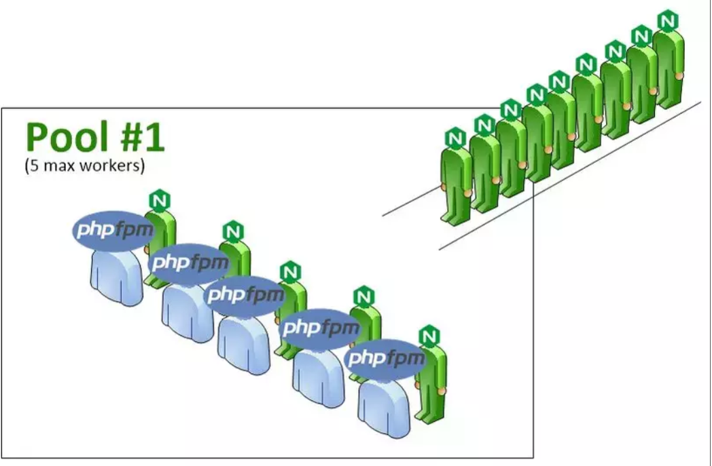
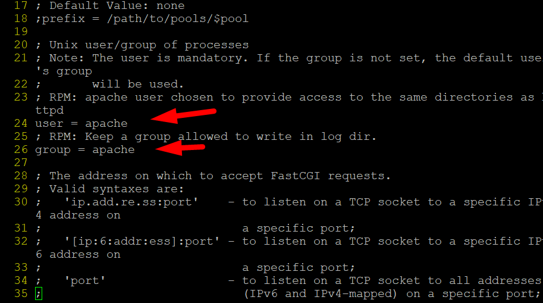
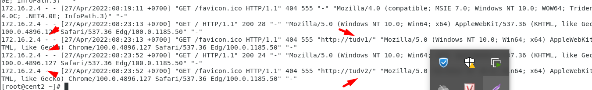

# LEMP

- LEMP là một nhóm phần mềm nguồn mở thường được cài đặt cùng nhau để cho phép máy chủ lưu trữ các trang web động và ứng dụng web. LEMP được viết tắt từ 4 thành phần của nó:
	+ L - Hệ điều hành Linux
	+ E - Nginx (Engine x) một máy chủ web
	+ M - Hệ quản trị cơ sở dữ liệu MySQL hoặc MariaDB
	+ P - Ngôn ngữ lập trình PHP


- Nginx Vitual Host: Trên 1 host chạy nhiều web( Nhiều domain trỏ về 1 IP )   


- Trên server sẽ cấu hình chạy 2 web site là:

    - tudv1 – đường dẫn: /home/tudv1/public_html
    - tudv2 – đường dẫn: /home/tudv2/public_html

# Cài đặt LEMP trên CentOS 7

### Cài đặt Nginx

- Máy chủ chạy nginx 192.168.1.223

- Trước tiên tắt selinux

```
vi /etc/sysconfig/selinux  :  selilux=disabled

```

## 1 - Cài NGINX

- Update yum và mở rộng thư viện :Nginx không có sẵn trong kho lưu trữ CentOS mặc định nên trước tiên chúng ta cần thêm kho lưu trữ EPEL bằng cách chạy lệnh :

```
yum update -y

yum install epel-release -y

```

- Cài đặt nginx


```
yum install nginx -y

```

- Khởi động dịch vụ

```
systemctl start nginx
systemctl enable nginx

```

- Mở 2 port firewalld zone public.

- Kiểm tra xem Nginx đã bind trên cổng 80 hay chưa bằng lệnh:

```

netstat -pnltu | grep nginx

```


- Truy cập thử


- Cài đặt Mariadb

```
yum install mariadb-server mariadb -y

```


- Chạy maria

```
systemctl start mariadb

systemctl enable mariadb

service mariadb restart

```
- Khai báo maria

```
mysql_secure_installation

```

 Enter current password for root (enter for none): ``Enter``

...khai báo 1 vài thông số...


#  2- Cài đặt kho lưu trữ Remi để có thể sử dụng các phiên bản PHP mới nhất
- Cài đặt kho Remi

```
mkdir /data && cd /data

yum install yum-utils -y

wget http://rpms.remirepo.net/enterprise/remi-release-7.rpm

rpm -Uvh remi-release-7.rpm

```


- Sau khi cài đặt gói Remi xong, cần chọn phiên bản PHP mà mình cần cài đặt và kích hoạt gói chứa phiên bản PHP đó

```

yum-config-manager --enable remi-php80

```

- Cài các module của PHP 8.0

```

yum install -y php php-fpm php-ldap php-zip php-embedded php-cli php-mysql php-common php-gd php-xml php-mbstring php-mcrypt php-pdo php-soap php-json php-simplexml php-process php-curl php-bcmath php-snmp php-pspell php-gmp php-intl php-imap perl-LWP-Protocol-https php-pear-Net-SMTP php-enchant php-pear php-devel php-zlib php-xmlrpc php-tidy php-opcache php-cli php-pecl-zip unzip gcc

```

- Xem phiên bản php mặc định

```
php -v

```


- PHP là thành phần để hiển thị nội dung động, nó xử lý các tập lệnh, kết nối với cơ sở dữ liệu MySQL để lấy thông tin và chuyển nội dung đã xử lý cho máy chủ web để hiển thị.

Không giống như Apache, Nginx cần một chương trình trung gian giữa nó và trình biên dịch PHP được gọi là PHP-FPM để xử lý các PHP request. Điều này giúp Nginx cải thiện hiệu suất đáng kể trên những trang PHP. Ngoài ra, chúng ta sẽ cần php-mysql, một mô-đun PHP cho phép PHP giao tiếp với cơ sở dữ liệu dựa trên MySQL.


- Tạo user và phân quyền
Trong phần này, chúng ta sẽ đi sâu hơn vào vai trò của PHP-FPM:

FPM là viết tắt của “FastCGI Process Manager”, mỗi khi có 1 request được gửi đến, nó sẽ được xử lý bởi 1 worker (process), PHP-FPM có nhiệm điều khiển công việc tải request đến worker, sinh và diệt các worker.
Tập hợp các worker lại với nhau được gọi là 1 pool (nhóm). và với 1 Server PHP-FPM có thể có nhiều pool, trong mỗi pool sẽ lại có nhiều worker đang xử lý request.



- Hình ảnh trên minh họa cách PHP-FPM điều phối request gửi đến, 1 worker chỉ có thể xử lý 1 request tại 1 thời điểm, trong pool này đang có 5 worker chờ để xử lý request, các request sẽ đợi đến khi có worker rảnh sẽ được PHP-FPM điều phối đi để xử lý

Lấy ví dụ thực tế với một dây chuyền sản xuất bánh kẹo. Ở đây PHP-FPM có trách nhiệm quản lý các worker (công nhân) đang đứng đợi các gói bánh (request) được chuyển tới bằng dây chuyền (Nginx). Sau khi đóng gói bánh vào thùng, công nhân (worker) đưa thùng bánh (response) trả lại dây chuyền (Nginx) để mang ra bán cho khách hàng. Mỗi công nhân chỉ xử lý 1 gói bánh 1 lúc thôi, khi xong thì mới xử lý đến gói bánh tiếp theo.


Vậy mục đích sinh ra pool để làm gì ? Việc tạo ra các pool riêng biệt trong thực tế là việc chạy nhiều website ở trên cùng 1 Server. Trong môi trường như này, khi các website đều chạy dưới quyền 1 user, nếu có lỗ hổng từ 1 website thì hacker có thể truy cập vào website để lấy cắp dữ liệu. Vì vậy ta nên chia ra mỗi website được xử lý bởi 1 pool riêng biệt, mỗi pool lại có owner User khác nhau làm tăng khả năng bảo mật. Ngoài ra, ở mỗi pool ta còn có thể cấu hình tối ưu cho riêng từng site để tăng hiệu suất.


- Tiến hành lập user cho từng website, không cung cấp cho chúng quyền đăng nhập hoặc liên kết thông tin nào khác:

```
useradd -s /sbin/nologin tudv1

useradd -s /sbin/nologin tudv2

```

- Thêm tudv1 và tudv2 vào group nginx để cho phép webserver tương tác với user và ngược lại.

```
usermod -a -G tudv1 nginx 

usermod -a -G tudv2 nginx

```
```
mkdir /home/tudv1/public_html          ; tạo foder public_html trong /home/tudv1

chown -R tudv1. /home/tudv1/public_html  ; Chuyển chủ sở hữu cá nhân và nhóm của folder public html cho cá nhân và nhóm tudv1 

chmod 750 /home/tudv1/  
mkdir /home/tudv2/public_html
chown -R tudv2. /home/tudv2/public_html
chmod 750 /home/tudv2/

```
- Cài đặt này sẽ làm user tudv1 không thể xem hay can thiệp được vào dữ liệu user tudv2, giống như công nghệ Userdir

- Cả 2 công nghệ Userdir apache và php-fpm  kiểu 1 host chạy nhiều website cho nhiều cty mà trên đó chỉ cần chạy 1 máy chủ linux, nhưng vấn đề đó chỉ xảy ra với các cty chọn gói dịch vụ hosting giá rẻ vì nếu như host có vấn đề thì coi như mấy chục web của mấy chục công ty đó cũng trục trặc 


- Tạo php-fpm pool mới cho từng site bằng cách copy file cấu hình mặc định:

```
cp /etc/php-fpm.d/www.conf /etc/php-fpm.d/fpm-tudv1.conf

cp /etc/php-fpm.d/www.conf /etc/php-fpm.d/fpm-tudv2.conf

```
- Xóa bỏ pool mặc định:

```

rm -f /etc/php-fpm.d/www.conf

```


- Cấu hình pool tudv1:

```

vi /etc/php-fpm.d/fpm-tudv1.conf

```





```
[www] = [tudv1]   ;   Dòng 4 
user= nginx       ;   Dòng 24
group =nginx      ;   Dòng 26 : 
listen = /var/run/tudv1-fpm.sock  ; Dòng 38

listen.owner = nginx  ;   Dòng 49 bỏ # đầu dòng
listen.group = nginx   ;  Dòng 50  bỏ # đầu dòng

```

- Chỉnh sửa trên đã thực hiện 3 việc:

   - Cấp quyền truy cập vào các thư mục như httpd cho user tudv1.

   - Thay đổi php-fpm từ listen trên cổng 9000 qua TCP sang listen trực tiếp trên socket file /var/run/tudv1-fpm.sock.

   - Thay đổi owner và group của tệp socket trên thành nginx.

- Cấu hình tương tự như vậy với tudv2

```
vi /etc/php-fpm.d/fpm-tudv2.conf
```

Tiến hành khởi động và enable php-fpm:

```

systemctl enable --now php-fpm

systemctl status php-fpm

```


- Cấu hình Nginx

- Ngoài file cấu hình mặc định /etc/nginx/nginx.conf, Nginx còn cung cấp thư mục /etc/nginx/conf.d để lưu trữ các file cấu hình cho từng trang web riêng biệt (khá tương tự với virtual host của Apache).

-Chúng ta sẽ tạo mới file cấu hình cho tudv1 và tudv2 của mình tại thư mục này:

```
vi /etc/nginx/conf.d/tudv1.conf

```
- Dán vào:

```
server {
    listen  80;
    server_name  tudv1;

    root   /home/tudv1/public_html;
    index index.php index.html;

    location / {
        try_files $uri $uri/ =404;
    }

    location ~ \.php$ {
        try_files $uri =404;
        fastcgi_pass unix:/var/run/tudv1-fpm.sock;
        fastcgi_index index.php;
        fastcgi_param SCRIPT_FILENAME $document_root$fastcgi_script_name;
        include fastcgi_params;
    }
}

```

```
vi /etc/nginx/conf.d/tudv2.conf
```
- Dán vào

```
server {
    listen  80;
    server_name  tudv2;

    root   /home/tudv2/public_html;
    index index.php index.html;

    location / {
        try_files $uri $uri/ =404;
    }

    location ~ \.php$ {
        try_files $uri =404;
        fastcgi_pass unix:/var/run/tudv2-fpm.sock;
        fastcgi_index index.php;
        fastcgi_param SCRIPT_FILENAME $document_root$fastcgi_script_name;
        include fastcgi_params;
    }
}

```

- Giải thích:

```
listen - cổng mà site sẽ lắng nghe. website1 listen trên port 80 nên sẽ ghi đè lên cấu hình mặc định của nginx.

server_name – Tên domain/sub của site

root – đường dẫn mã nguồn

fastcgi_pass – đường dẫn của file sock php-fpm

```

- Kiểm tra lỗi luôn: 
```
nginx -t

```


- Restart Nginx để áp dụng các thay đổi: 

```
systemctl restart nginx

```


- Test thử thêm vào các file index.php 1 đoạn thể hiện nội dung để xem sự hoạt động của php-fpm 

```
vi /home/tudv1/public_html/index.php

```


- Chỉnh sửa file host của win10


- Kiểm tra đường dẫn  log của nginx:tại : ``/etc/nginx/nginx.conf``





- Cài đặt database: Tạo 2 datase , mỗi 1 database wordpress1 và wordpress2 gắn liền với admin user tudv1 và tudv2


```
mysql -u root -p

```


- Up 1 wordpress mới nhất lên cùng 2 thư mục chứa web:


- Chỉnh sửa kết nối trong file php-config.php với database wordpress1:


- Làm tương tự với bên /home/tudv2/public_html


- Khởi động lại dịch vụ nginx và test thử:

```
service nginx restart

```


