#  Cài đặt mail Kerio
- Đổi tên máy chủ và cập nhật file /etc/hosts
- Stop postfix

```
systemctl disable postfix
systemctl stop postfix

```

- Check timezone: và set timezone HCM
 ```
 timedatectl
 ```
 
 ```
 timedatectl set-timezone Asia/Ho_Chi_Minh

 ```


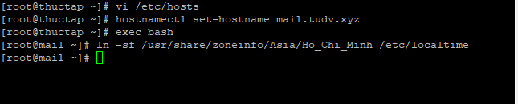

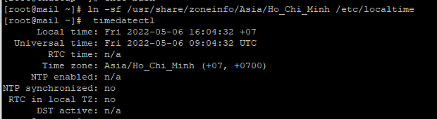


- Đăng ký và tải về bản phù hợp

https://www.gfi.com/products-and-solutions/email-and-messaging-solutions/kerio-connect/download/

- Dùng WinSCP upload lên máy chủ

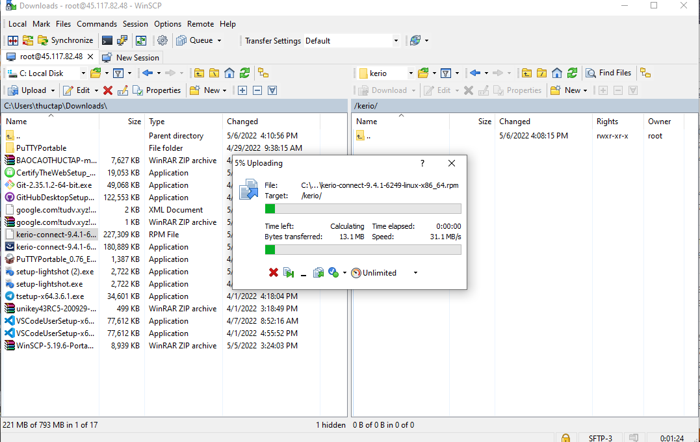

- Cài đặt

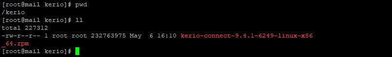

```

rpm -ivh ker*

```

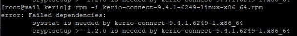


- Cài đặt sysstat và   cryptsetup

```
 yum install sysstat

 yum install  cryptsetup

 ```

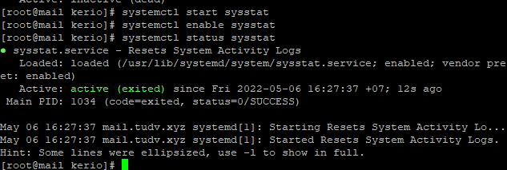

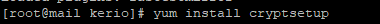

- Tiến hành cài đặt tiếp KERIO

 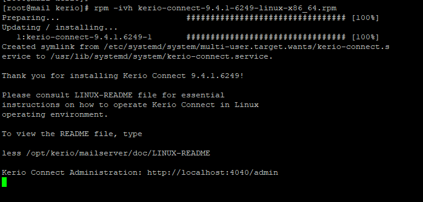


 - Mở firewall

```
firewall-cmd --zone=public --add-port=4040/tcp --permanent

firewall-cmd --reload

```


 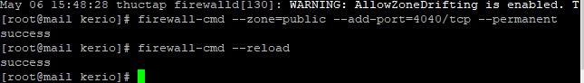

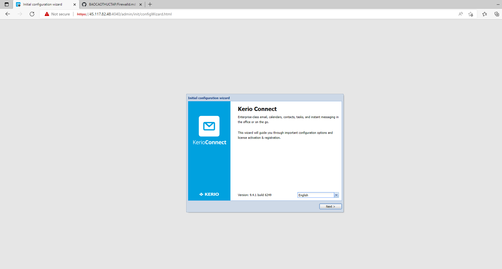


- Đăng nhập vào máy chủ port 4040 và tiến hành khai báo các thông số như tên miền, vùng cài đặt,đồng ý điều khoản, nhập liense free...

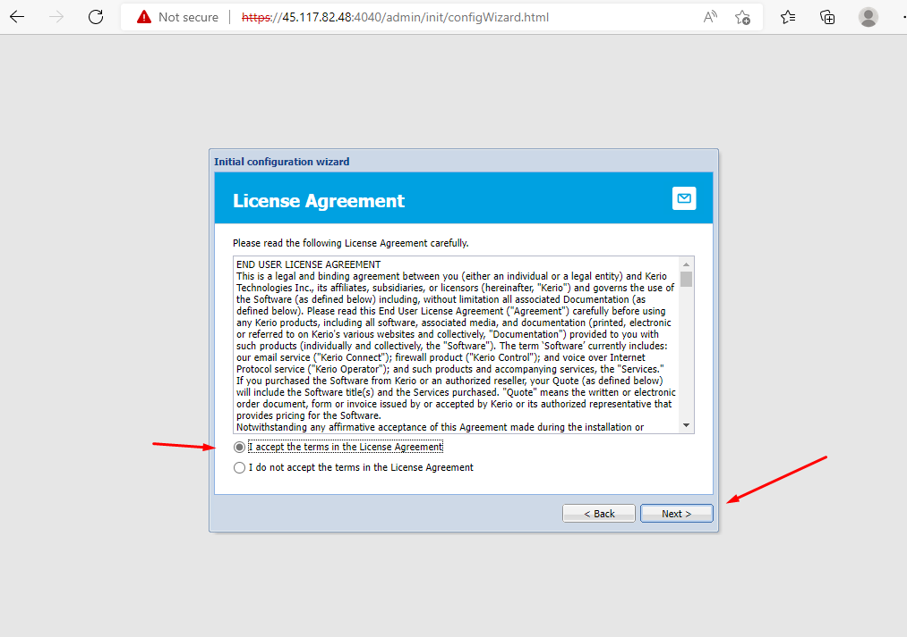
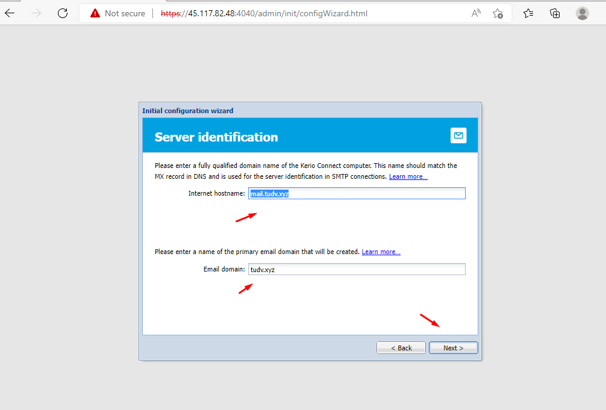
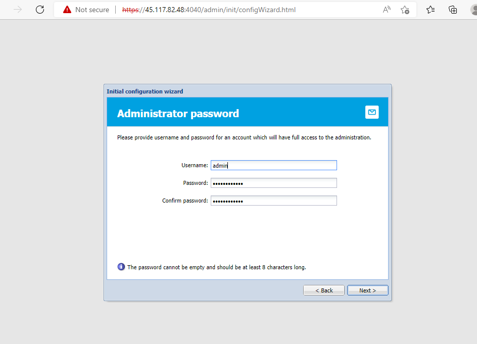
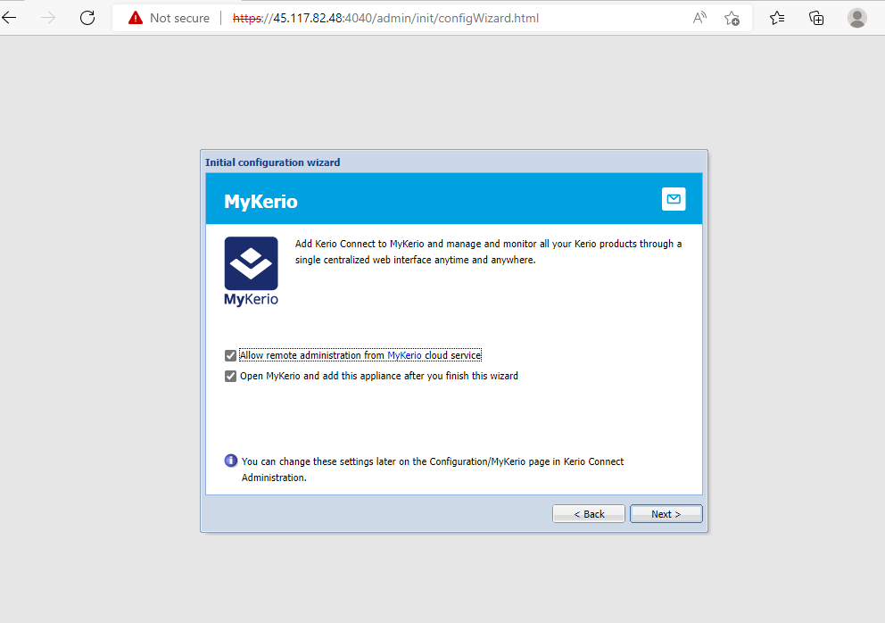
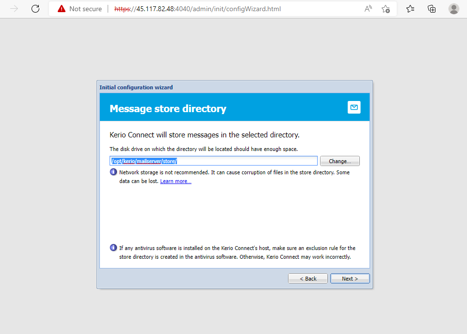
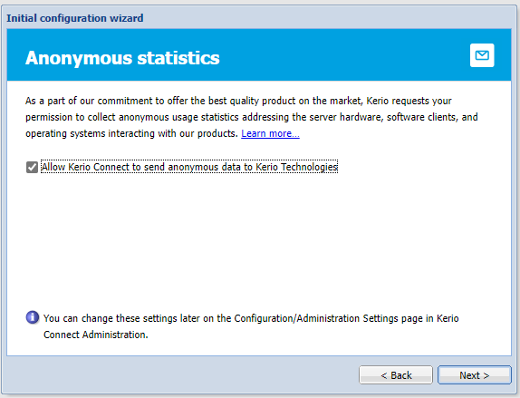
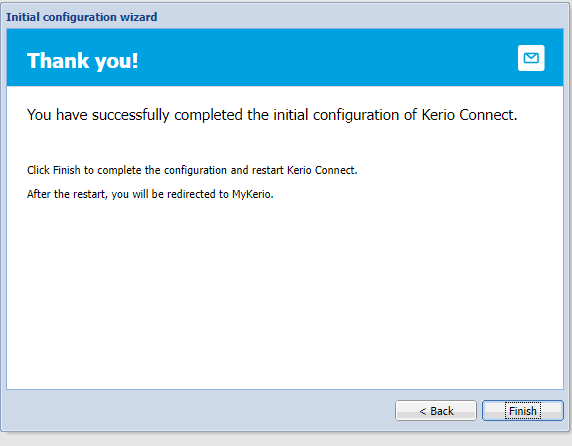

- Finish xong dịch vụ sẽ khởi động lại 

- Tiến hành đăng nhập lại

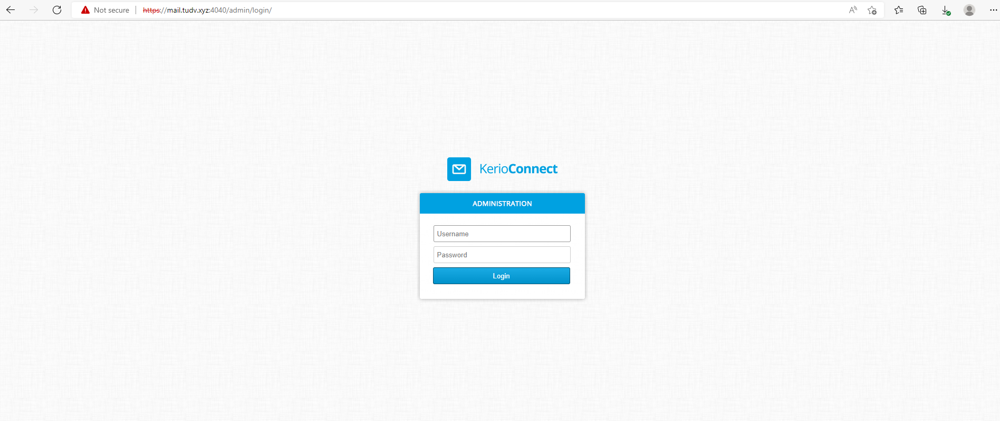
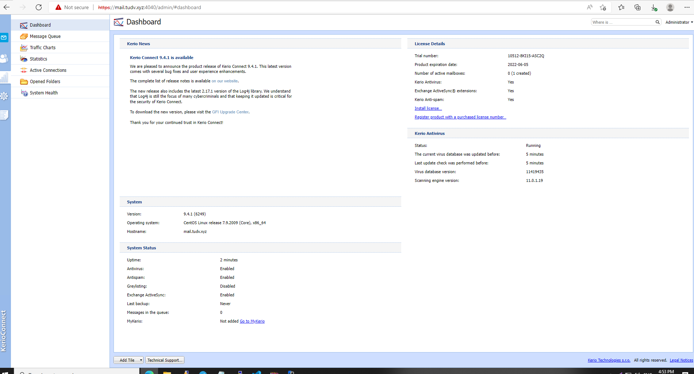

- Lệnh khởi động lại dịch vụ

```
service kerio-connect restart


```


- Test gửi thư:

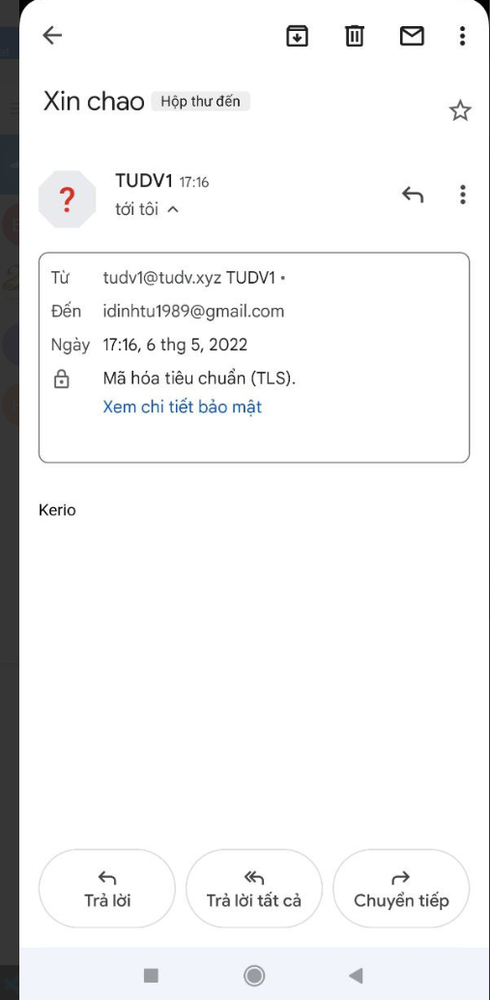

