# GROUP

- Nhóm mail thể hiện miêu tả 1 đặc điểm chung nào đó của các user để ,dễ dàng kiểm tra thông tin khi tìm kiếm

- Tạo nhóm :

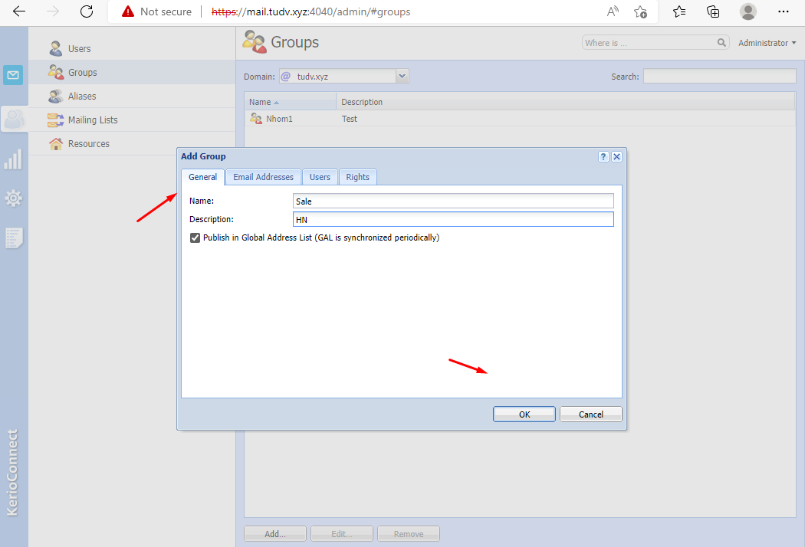

- Tên và mô tả của nhóm

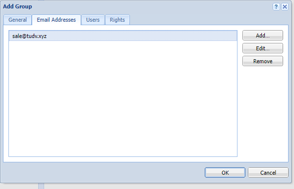

- Địa chỉ mail của nhóm dùng để broadcast mail

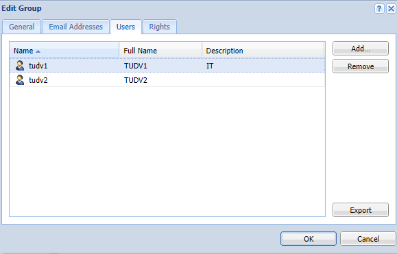

- Thành viên của nhóm

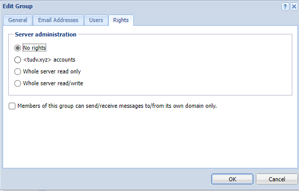

- Policy thêm cho nhóm

# USER

- Tạo user 

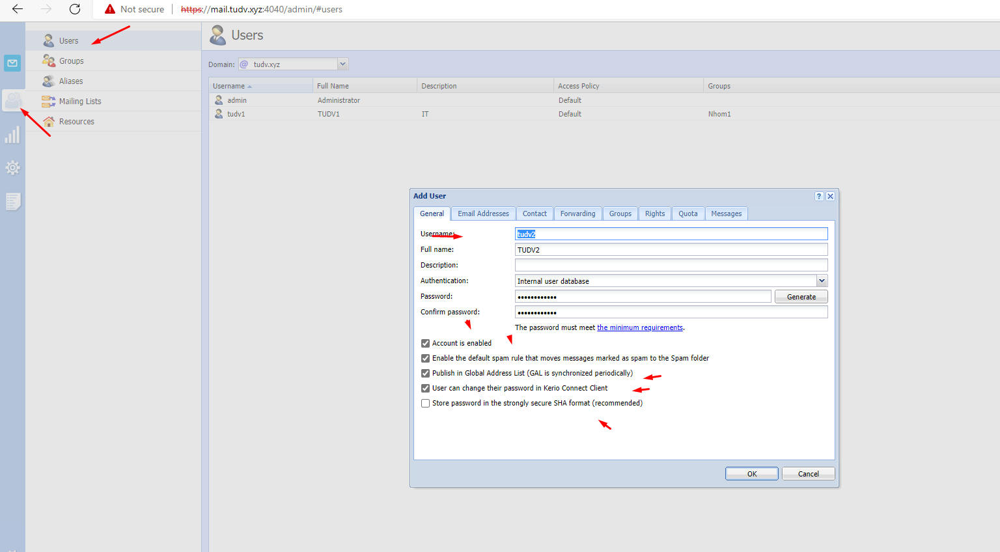

- Vài thông số tùy chọn đầu tiên như:
  - Kích hoạt tài khoản
  - Kích hoạt rule chống spam và di chuyển các thư được đánh dấu vào spam foler
  - User có thể đổi mật khẩu trên webmail client

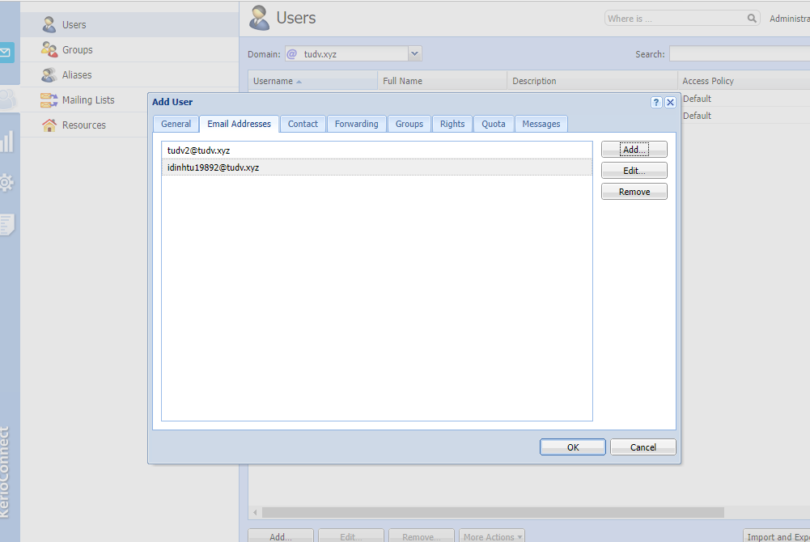 

- Địa chỉ mail  của user 

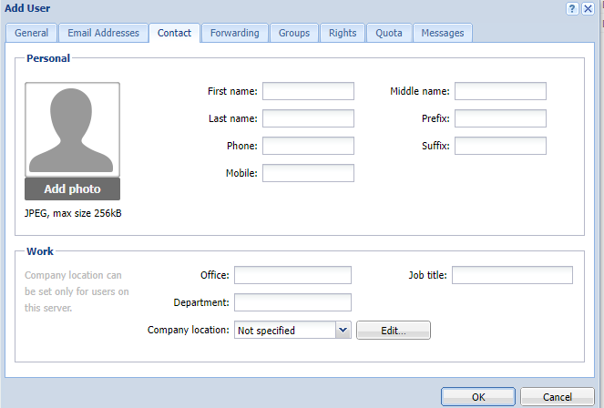

- Thêm 1 vài thông tin về User

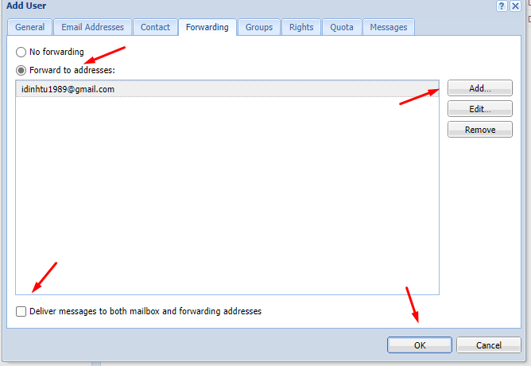

- Chuyển tiếp thư

  - Khi nhận thư nếu tích vào Deliver messs... mail sẽ lưu lại 1 bản ở mailbox của tudv2 và forwarding đến mail nhận idinhtu1989@gmail.com.
  ko tích thì ko giữ lại 1 bản sao

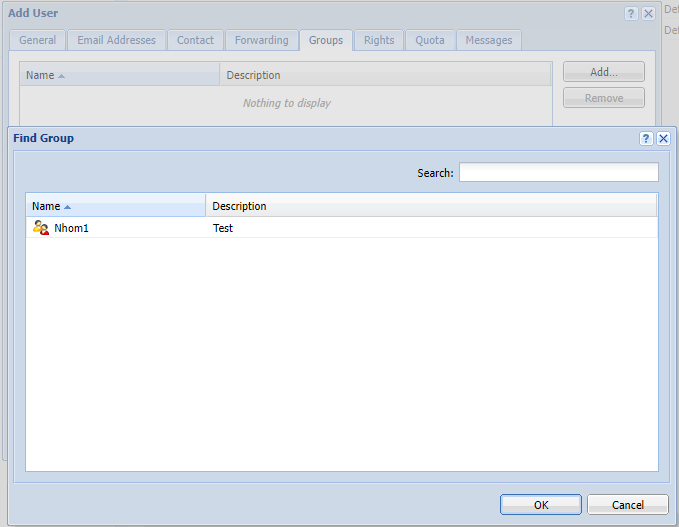

- Thêm vào 1 nhóm nào đó như Sale,IT,HCNS...

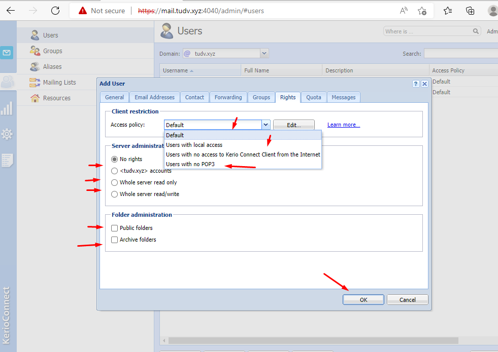

- Áp dụng policy nào với user:
  - Default: bình thường
  - Chỉ liên lạc được trong mạng
  - Không kết nối từ internet với webmail
  - Ko sử dụng được POP3
  ...

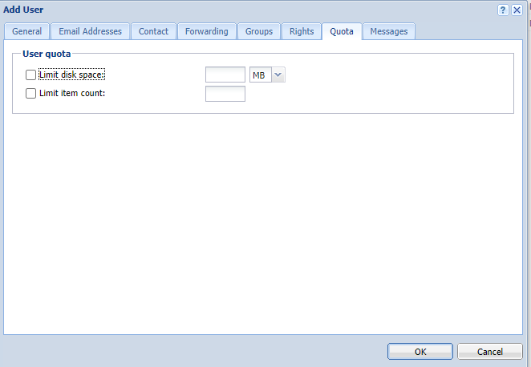
 - Quota cho mail user

 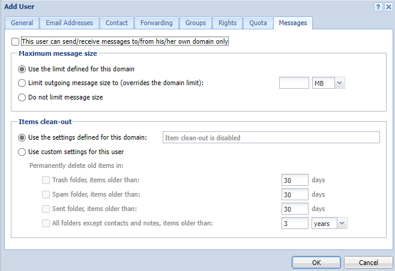

 - 1 vài tùy chọn policy thêm cho user

  
