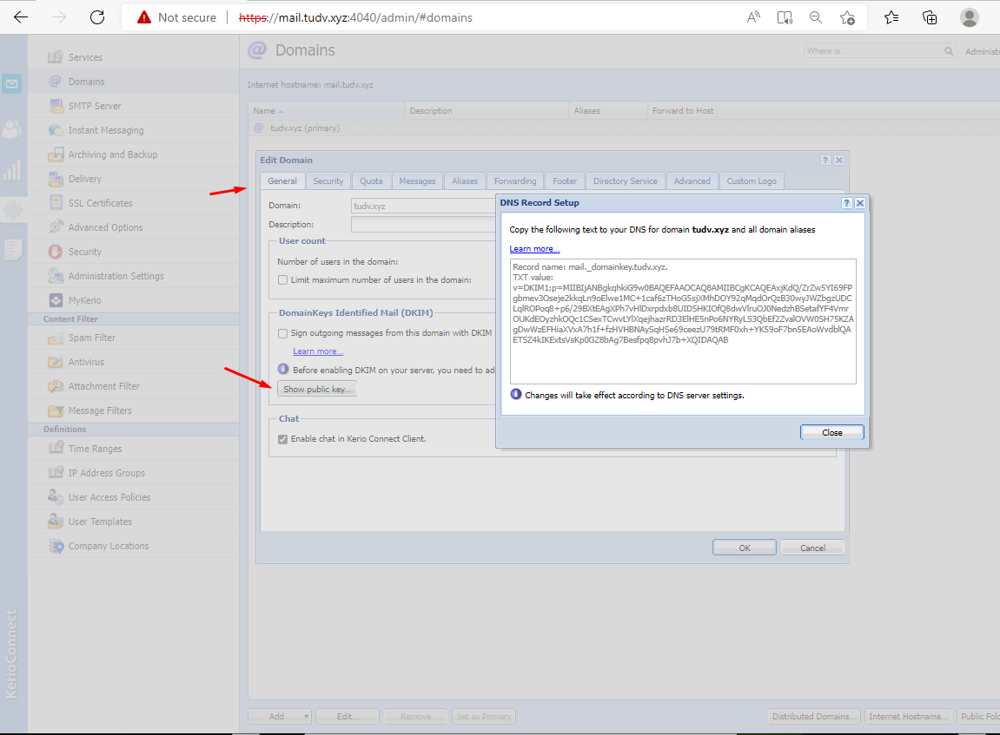
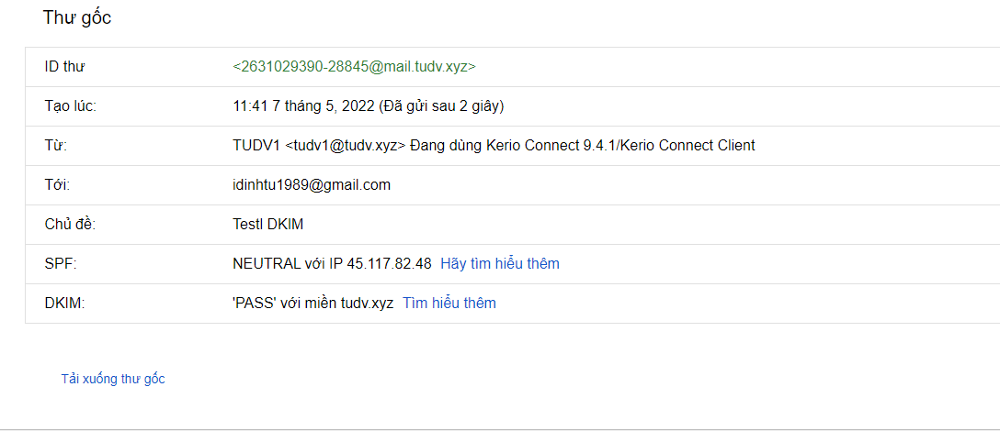

# Tạo bản ghi DKIM
- Vào `Configuration` - > `Domains` -> `Edit` domain muốn tạo DKIM

- Tại tab `General` -> `DomainKeys Identified Mail (DKIM)` click như hình dưới và `Show public key` để lấy thông tin giá trị và tên bản ghi DKIM

- Tạo bản ghi với thông tin DKIM vừa được lấy

- Kiểm tra 
