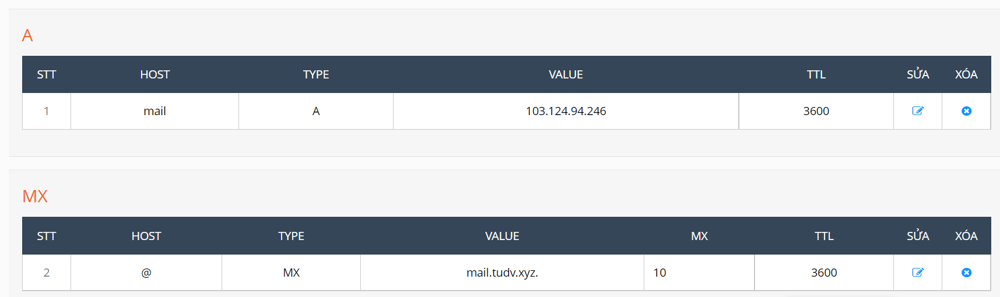
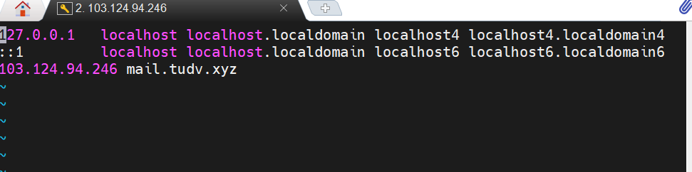
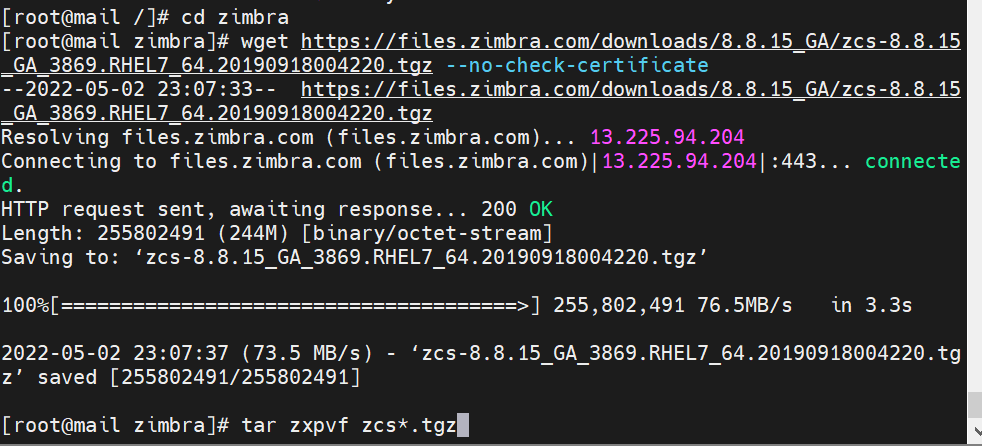
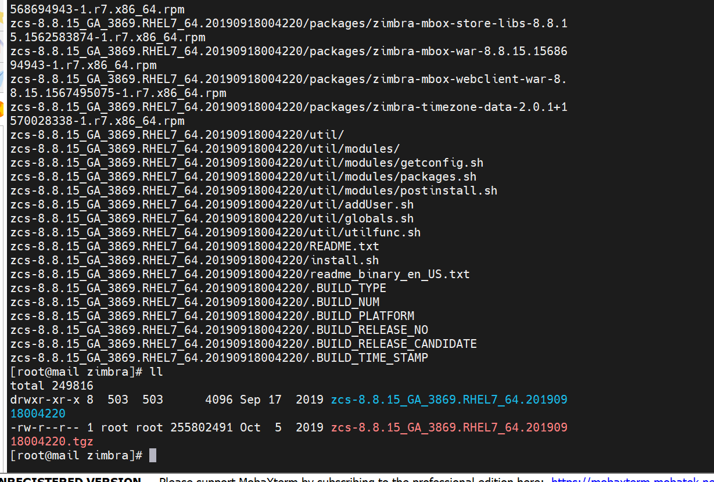
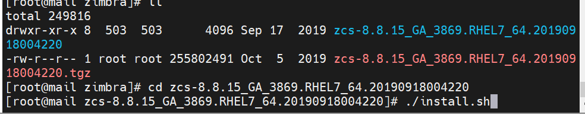

# Cài đặt mail zimbra

- Tiến hành trỏ bản ghi : 



- Tắt selinux
- Đổi tên:

```
hostnamectl set-hostname mail.tudv.xyz
exec bash

```

- Xóa posfix là dịch vụ mail được cài sẵn trên máy centos 

```
systemctl stop postfix
yum remove postfix -y

```


- Sau đó  cập nhật hệ thống  và reboot lại máy chủ để áp dụng
```
 yum update -y 
 reboot

```


- Sau khi máy khởi động lại xong  thêm dòng sau vào file hosts .

```
vi /etc/host

```




```
yum install unzip net-tools sysstat openssh-clients perl-core libaio nmap-ncat libstdc++.so.6 wget -y`

```



- Tạo folder zimbra và cd vào đó để tải file đóng gói

```
mkdir /zimbra && cd /zimbra
wget https://files.zimbra.com/downloads/8.8.15_GA/zcs-8.8.15_GA_3869.RHEL7_64.20190918004220.tgz --no-check-certificate

```


- Sau khi download về ta giải nén file ra

```

tar zxpvf zcs*.tgz

```
- Truy cập vào thư mục vừa giải nén và chạy lệnh ./install


[root@mail zcs-8.8.15_GA_3869.RHEL7_64.20190918004220]# ./install.sh

```
cd zcs* && ./install.sh

```



- Chon ``y`` toàn bộ , đó là những gói dịch vụ thiếu kèm theo


- Gõ y ở tất cả các option , n ở gói dnscache

```
Select the packages to install

Install zimbra-ldap [Y] y

Install zimbra-logger [Y] y

Install zimbra-mta [Y] y

Install zimbra-dnscache [Y] n

Install zimbra-snmp [Y] y

Install zimbra-store [Y] y

Install zimbra-apache [Y] y

Install zimbra-spell [Y] y

Install zimbra-memcached [Y] y

Install zimbra-proxy [Y] y

Install zimbra-drive [Y] y

Install zimbra-imapd (BETA - for evaluation only) [N] y

Install zimbra-chat [Y] y
Checking required space for zimbra-core

...

```


...

- Hệ thống sẽ bị sửa đổi. tiếp tục?

The system will be modified.  Continue? [N]``y``

...


DNS ERROR resolving MX for mail.tudv.xyz
It is suggested that the domain name have an MX record configured in DNS
Change domain name? [Yes] ``Yes``

Create domain: [mail.tudv.xyz] ``tudv.xyz``

    MX: mail.tudv.xyz (103.124.94.246)
    Interface: 127.0.0.1
    Interface: 103.124.94.246

Checking for port conflicts

...

Select, or 'r' for previous menu [r] ``4``

Password for admin@tudv.xyz (min 6 characters): [UZTxvBlB6K] ``Pp0967898808``

...


*** CONFIGURATION COMPLETE - press 'a' to apply

Select from menu, or press 'a' to apply config (? - help) a

Save configuration data to a file? [Yes] yes

Save config in file: [/opt/zimbra/config.9506]

Saving config in /opt/zimbra/config.9506...done.

The system will be modified - continue? [No] yes

Operations logged to /tmp/zmsetup.20220503-123347.log
Setting local config values...done.


- Khi cài đặt xong khởi động lại dịch vụ Zimbra 

```

su zimbra
zmcontrol restart

```


- Most logs are found in /opt/zimbra/log/:

