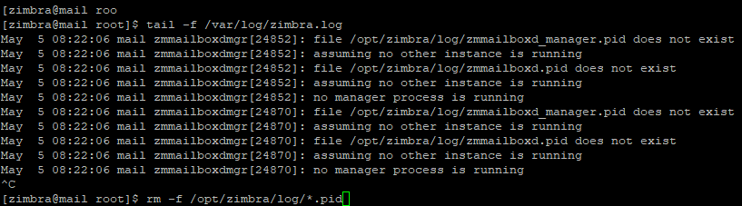

# Backup
Preparing to Back Up

Before we begin, make sure that you are logged in as a user that can perform the tasks outlined here.


It is always good practice to backup your copy of Zimbra in the event of unforeseen circumstances.

To prevent changes to any Zimbra databases during the backup processes you may wish to use:

>su zimbra

>zmcontrol stop


to terminate Zimbra.


If you get some kind of error, you may want to make sure that Zimbra has completely stopped by running:

>ps auxww | grep zimbra

and kill any left over processes such as the log.




- Making a Backup

Make sure that the copy location has enough space to support your backup copy (i.e. the /tmp folder probably isn't the best location).


Since all of the components Zimbra needs are stored in the Zimbra folder itself, you can simply copy the folder to a safe location.

It may be possible to create a cron job to do these tasks automatically. This it the command:

>cp -rp /opt/zimbra [location of backup]   /zimbra_backup


Depending on your hardware and the amount of data contained in your Zimbra installation, this process can take a while.

Note: It is a very good idea to tag your installation with the version/build of zimbra that will be backed up (ie 3.0.0_GA_156) and the date of backup. You'll need this later.


# Restore

Before restoring, you should make sure that all of the processes associated with the damaged/failed Zimbra installation are terminated. Failure to terminate all of the processes could have dire consequences. See "Preparing to Backup" for additional info.


1) Rename your "broken" Zimbra installation.

You may be able to scavenge data, if needed. If you simply do not want the old data, you can skip this part. This is how you do it:

- Rename /opt/zimbra thành /opt/zimbra_broken

>mv /opt/zimbra      /opt/zimbra_broken


You may want to move it completly out of the /opt folder just to be safe. After that, copy your backup Zimbra installation to the /opt folder and name it "zimbra" by using the following commands:

- Cẩn thận hơn thì mình nên copy 1 bản  dự phòng trước đó đến opt rồi đổi tên


```
cp -rp /backupzimbra/zimbra_broken/  /opt

mv /opt/zimbra_broken /opt/zimbra

```


- Sau đó ta tiến hành cài lại zimbra


>


- Reset permissions

If you are up and running now, you may have one more hurdle to overcome: permissions.

You may need to reset the permissions on the message store by running the following:

>chown -R zimbra:zimbra /opt/zimbra/store

>chown -R zimbra.zimbra /opt/zimbra/index

Also as root run the following:

/opt/zimbra/libexec/zmfixperms

- Vào thử

