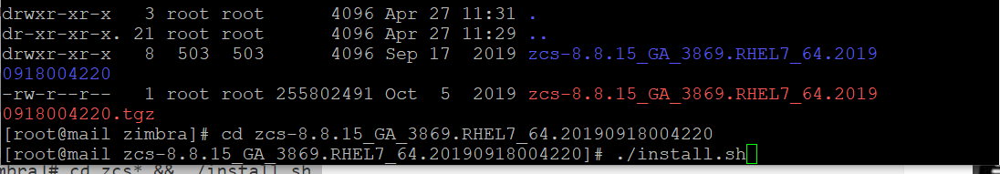

# Cài đặt mail zimbra

- Tắt selinux

- Xóa posfix là dịch vụ mail được cài sẵn trên máy centos 

```
systemctl stop postfix
yum remove postfix -y

```


- Sau đó bạn cập nhật hệ thống  và reboot lại máy chủ để áp dụng
```
 yum update -y 
 reboot

```

- Đổi tên máy :


```
hostnamectl set-hostname mail.tudv.xyz
exec bash

```

- Sau khi set hostname xong  thêm dòng sau vào file hosts .

```
vi /etc/host

```


- Chạy lệnh sau để install Zimbra & ZCS dependencies


- Sau khi download về ta giải nén file ra

```

tar zxpvf zcs*.tgz

```
- Truy cập vào thư mục vừa giải nén và chạy lệnh ./install

```
cd zcs* && ./install.sh

```


- Chon y toàn bộ , đó là những gói dịch vụ kèm theo


- Kết thúc khởi động lại dịch vụ:

```
su zimbra
zmcontrol restart

zmcontrol status

```

- Đảm bảo đầy đủ các bản ghi MX, PTR, SPF, DKIM, DMARC. Ngoài các bản ghi đã trỏ, ta trỏ thêm 2 bản ghi sau để tăng độ tin cậy của hệ thống mail.

- Thêm bản ghi PTR ở DNS server của hệ thống DNS nếu có thể

- Thêm bản ghi DKIM các thông số lấy từ email server
Active dkim cho domain


```

su - zimbra
/opt/zimbra/libexec/zmdkimkeyutil -a -d tudv.xyz

```

```
[zimbra@mail ~]$ /opt/zimbra/libexec/zmdkimkeyutil -a -d tudv.xyz
DKIM Data added to LDAP for domain tudv.xyz with selector BE39A93A-CB51-11EC-BA03-929B92D8C1A0
Public signature to enter into DNS:
BE39A93A-CB51-11EC-BA03-929B92D8C1A0._domainkey IN      TXT     ( "v=DKIM1; k=rsa; "
          "p=MIIBIjANBgkqhkiG9w0BAQEFAAOCAQ8AMIIBCgKCAQEAkqca8Yve3dszHwP34CPC0xF6B2Y7ZZ+DBua/nXZhuBoL6vDdZtOtmaIJ345X478HMaeGa592pU+68qGXMOZGTEumXT/EYfRNm9Kovxd4xKuCcMKm9+/Y1ZaSIfmNEt4Ck1euqjcvgBsTcbO0BiUnvb1srcuX/Q0mz0971rYrKwfx/p0mcq4q8uKRjO8hT6qNkYjY4ChgMsnBld"
          "a8nrirDPYxf/oBSWn+m3HrWGVRwjP06+aCM++XZKRqzqXSqgpfIpHZdLMDsv8gEoSHpx5Sy7/+bhbLWF8MKPrcTf86EVjikE7d20F9gKWaFF8kyihigdB70VZBBOs9xdTcAb3iewIDAQAB" )  ; ----- DKIM key BE39A93A-CB51-11EC-BA03-929B92D8C1A0 for tudv.xyz

```


- Đăng nhập vào admin web: https://IP:7071


