# Thêm 1 domain mới
- Trỏ bản ghi A và MX cho mail.tudv1.tudv.xyz

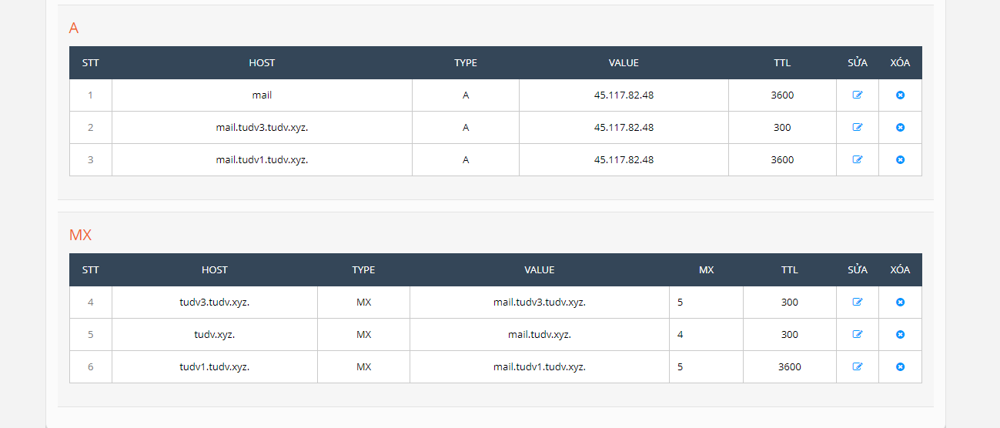


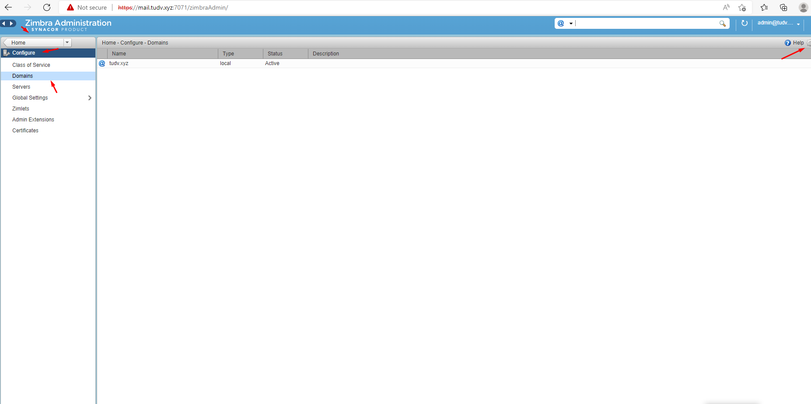

- Điền domain mới và dịch vụ

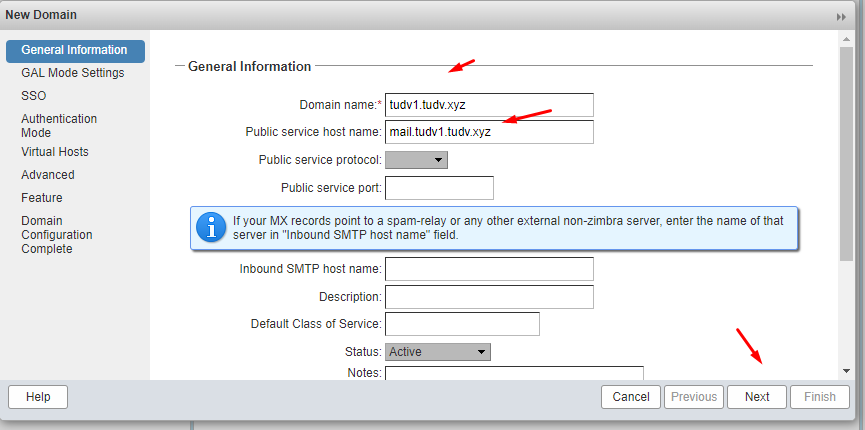

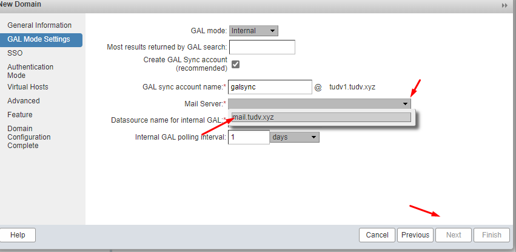

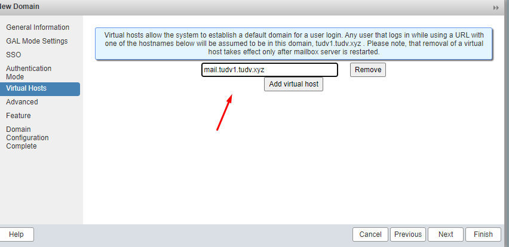

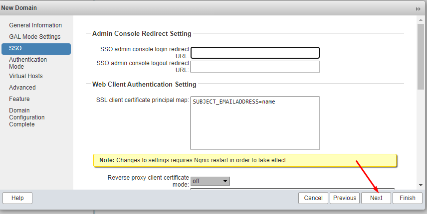

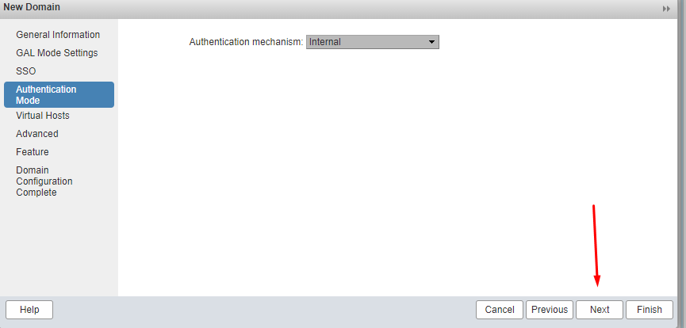

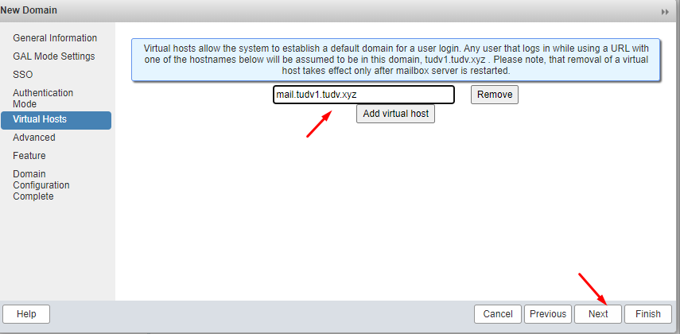

- Next và Finish


- Tạo tài khoản


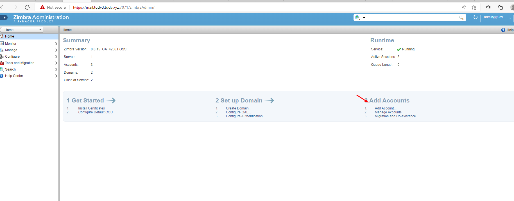

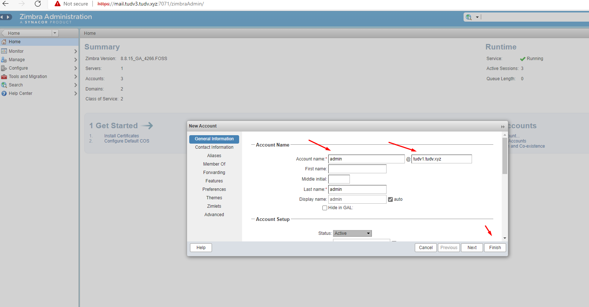

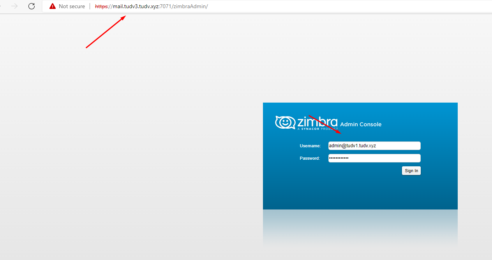

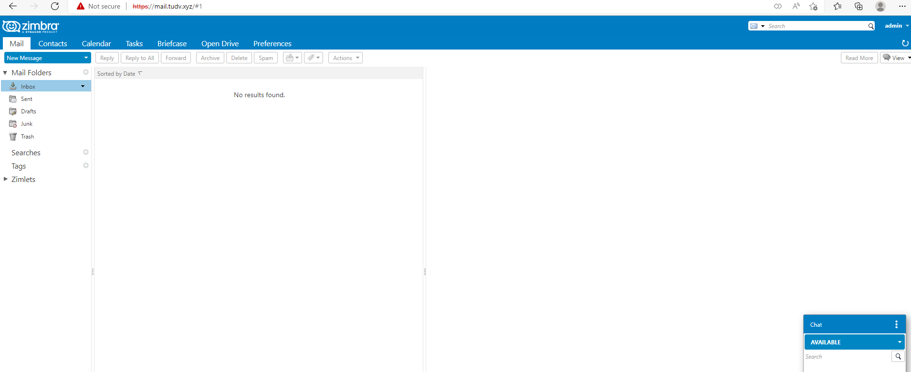


# Đổi domain:

- Chuyển domain tudv3.tudv.xyz về domain tudv.xyz

- Backup dữ liệu zimbra: /opt/zimbra với ổ cắm thêm :

```
rsync -axvzKHS /opt/zimbra /mnt/zimbra_backup

```
- Take a backup of your Zimbra Server (dedicated or VM).

- Tạo bản ghi A và MX cho domain tudv.xyz  


- Trong file /etc/hosts:

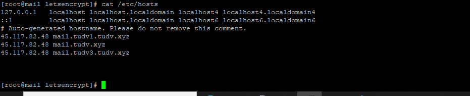


- Ở đây ta đổi domain mail.tudv3.tudv.xyz sang domain tudv.xyz


- Tạo Virtual Host mail mail.tudv.xyz

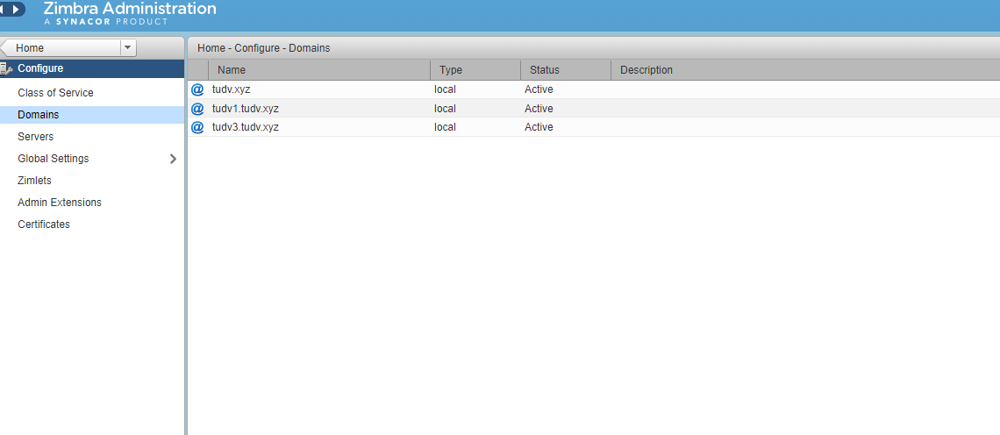

- Cập nhật múi giờ cho zimbra

```
sudo ln -s /usr/share/zoneinfo/Asia/Ho_Chi_Minh /etc/localtime

```

- Đổi hostname zimbra

```
su - zimbra
/opt/zimbra/libexec/zmsetservername -n mail.tudv.xyz

```

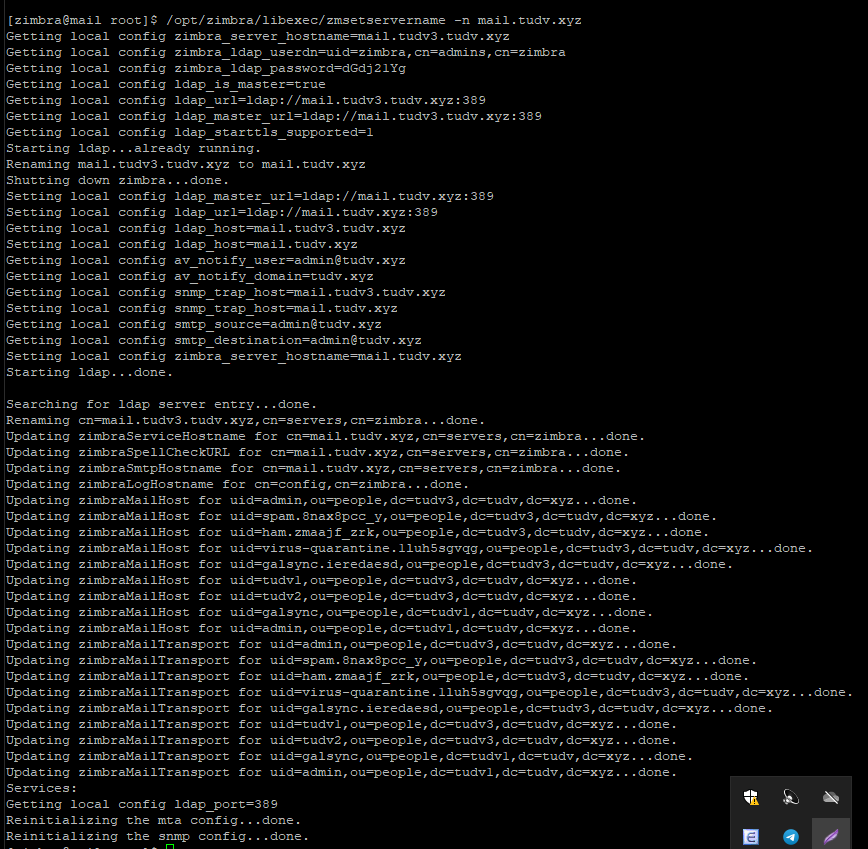


- Login to the Zimbra server, change to zimbra user and run the following commands:
```
# su – zimbra # zmprov -l rd [olddomain.com] [newdomain.com]

zmprov -l rd tudv3.tudv.xyz tudv.xyz

```

- Nếu báo lỗi DKIM

   - Active dkim cho domain


```

su - zimbra
/opt/zimbra/libexec/zmdkimkeyutil -a -d tudv.xyz


```
[zimbra@mail /]$ /opt/zimbra/libexec/zmdkimkeyutil -a -d tudv.xyz
DKIM Data added to LDAP for domain tudv.xyz with selector EA8E6160-CC46-11EC-B796-9F9092D8C1A0
Public signature to enter into DNS:
EA8E6160-CC46-11EC-B796-9F9092D8C1A0._domainkey IN      TXT     ( "v=DKIM1; k=rsa; "
          "p=MIIBIjANBgkqhkiG9w0BAQEFAAOCAQ8AMIIBCgKCAQEA+0hkrWnllYUnVVcVDyKjdwUK6xCxjfW3VrTbVMBhUe3wHgeV6vAouOP0c2c0XhBPHBcI1GRnne9+Vt7qlU1XzG4pTKIgQnhIiN8Hf78424WrNGde6AtctdxtwR6psCZUiOLwtQO3qukHQ8cztCB6c4KuNSgof1AQIpr1Uq8etkbjqsvO2QjO9aqJRspoi6d/AhZqKkkSw+7Udz"
          "mKjinZ9+CnPaaPaFTur7JsBjh3DJQu0Iqqk4KhmUWCie9rXv4dZZSDkSVHjQrTvVz2y6VBtznhM6Zc1AwdqdaU0dwjrim3N9AHPuZVVT8KVlUwF9UjQocK/NQxjCuOEGjvxkiOqwIDAQAB" )  ; ----- DKIM key EA8E6160-CC46-11EC-B796-9F9092D8C1A0 for tudv.xyz


- Kiểm tra trạng thái:

```
zmcontrol status

```
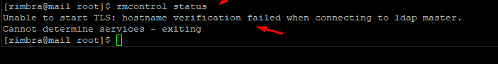


- Regenerate Self-Signed SSL Certificate - Single-Server
   - Tạo lại ssl self signed certificate zimbra

This step is optional and not required everytime you renew the self signed certificate.

```
/opt/zimbra/bin/zmcertmgr createca -new

/opt/zimbra/bin/zmcertmgr deployca
```

2. Then generate a certificate signed by the CA that expires in 365 days with either wildcard or subject altnames.

/opt/zimbra/bin/zmcertmgr createcrt -new -days 365
3. Next, deploy the certificate.

/opt/zimbra/bin/zmcertmgr deploycrt self 
4. To finish, verify the certificate was deployed.

/opt/zimbra/bin/zmcertmgr viewdeployedcrt
5. Restart zmcontrol to take the changes in effect.
su - zimbra zmcontrol restart


```

[zimbra@mail root]$ zmcontrol status
Unable to start TLS: hostname verification failed when connecting to ldap master.
Cannot determine services - exiting
[zimbra@mail root]$ /opt/zimbra/bin/zmcertmgr createca -new
** Creating directory '/opt/zimbra/ssl/zimbra'
zmcertmgr: ERROR createca() failed:
 mkdir /opt/zimbra/ssl/zimbra: Permission denied at /opt/zimbra/bin/zmcertmgr line 2110.
[zimbra@mail root]$ /opt/zimbra/bin/zmcertmgr createca -new
** Creating directory '/opt/zimbra/ssl/zimbra'
zmcertmgr: ERROR createca() failed:
 mkdir /opt/zimbra/ssl/zimbra: Permission denied at /opt/zimbra/bin/zmcertmgr line 2110.
[zimbra@mail root]$ su
Password:
[root@mail ~]# /opt/zimbra/bin/zmcertmgr createca -new
zmcertmgr: ERROR: no longer runs as root!
[root@mail ~]# chmod 755 /opt/zimbra/bin/zmcertmgr
[root@mail ~]# su zimbra
[zimbra@mail root]$ /opt/zimbra/bin/zmcertmgr createca -new
** Creating directory '/opt/zimbra/ssl/zimbra'
zmcertmgr: ERROR createca() failed:
 mkdir /opt/zimbra/ssl/zimbra: Permission denied at /opt/zimbra/bin/zmcertmgr line 2110.
[zimbra@mail root]$ cd /
[zimbra@mail /]$ /opt/zimbra/bin/zmcertmgr createca -new
** Creating directory '/opt/zimbra/ssl/zimbra'
zmcertmgr: ERROR createca() failed:
 mkdir /opt/zimbra/ssl/zimbra: Permission denied at /opt/zimbra/bin/zmcertmgr line 2110.
[zimbra@mail /]$ cd /opt
[zimbra@mail opt]$ ls -lah
total 28K
drwxr-xr-x  7 root root 4.0K May  5 12:01 .
drwxr-xr-x 23 root root 4.0K May  5 14:06 ..
drwxr-xr-x  2 root root 4.0K May  5 08:56 data
drwxr-xr-x  3 root root 4.0K May  5 12:01 eff.org
drwxr-xr-x 31 root root 4.0K May  4 19:19 letsencrypt
-rw-r--r--  1 root root    0 May  5 08:40 su
drwxr-xr-x 27 root root 4.0K May  5 12:10 zimbra
drwxr-xr-x 27 root root 4.0K May  5 02:00 zimbra_broken
[zimbra@mail opt]
[zimbra@mail opt]$
[zimbra@mail opt]$ exit
exit
[root@mail ~]# chown -p zimbra:zimbra /opt/zimbra
chown: invalid option -- 'p'
Try 'chown --help' for more information.
[root@mail ~]# chown -R zimbra:zimbra /opt/zimbra
[root@mail ~]# su zimbra
[zimbra@mail root]$ /opt/zimbra/bin/zmcertmgr createca -new
** Creating directory '/opt/zimbra/ssl/zimbra'
** Creating directory '/opt/zimbra/ssl/zimbra/ca'
** Creating directory '/opt/zimbra/ssl/zimbra/commercial'
** Creating directory '/opt/zimbra/ssl/zimbra/server'
** Creating directory '/opt/zimbra/ssl/zimbra/ca/newcerts'
** Touching file '/opt/zimbra/ssl/.rnd'
** Touching file '/opt/zimbra/ssl/zimbra/ca/index.txt'
** Creating /opt/zimbra/ssl/zimbra/ca/zmssl.cnf
** Retrieving CA private key from LDAP... ok
** Creating '/opt/zimbra/ssl/zimbra/ca/ca.key'
** Creating CA with existing private key /opt/zimbra/ssl/zimbra/ca/ca.key
[zimbra@mail root]$  /opt/zimbra/bin/zmcertmgr deployca
** Saving config key 'zimbraCertAuthorityCertSelfSigned' via zmprov modifyConfig...ok
** Saving config key 'zimbraCertAuthorityKeySelfSigned' via zmprov modifyConfig...ok
** Importing cert '/opt/zimbra/ssl/zimbra/ca/ca.pem' as 'my_ca' into cacerts '/opt/zimbra/common/lib/jvm/java/lib/security/cacerts'
** NOTE: restart mailboxd to use the imported certificate.
** Cleaning up 3 files from '/opt/zimbra/conf/ca'
** Removing /opt/zimbra/conf/ca/ca.key
** Removing /opt/zimbra/conf/ca/ca.pem
** Removing /opt/zimbra/conf/ca/7bdfffc5.0
** Copying CA to /opt/zimbra/conf/ca
** Copying '/opt/zimbra/ssl/zimbra/ca/ca.key' to '/opt/zimbra/conf/ca/ca.key'
** Copying '/opt/zimbra/ssl/zimbra/ca/ca.pem' to '/opt/zimbra/conf/ca/ca.pem'
** Creating CA hash symlink 'd2fd40e3.0' -> 'ca.pem'
zmcertmgr: ERROR deployca() failed:
 chdir(/root) failed: Permission denied
[zimbra@mail root]$ cd /
[zimbra@mail /]$  /opt/zimbra/bin/zmcertmgr deployca
** Saving config key 'zimbraCertAuthorityCertSelfSigned' via zmprov modifyConfig...ok
** Saving config key 'zimbraCertAuthorityKeySelfSigned' via zmprov modifyConfig...ok
** Importing cert '/opt/zimbra/ssl/zimbra/ca/ca.pem' as 'my_ca' into cacerts '/opt/zimbra/common/lib/jvm/java/lib/security/cacerts'
** NOTE: restart mailboxd to use the imported certificate.
** Cleaning up 3 files from '/opt/zimbra/conf/ca'
** Removing /opt/zimbra/conf/ca/ca.key
** Removing /opt/zimbra/conf/ca/d2fd40e3.0
** Removing /opt/zimbra/conf/ca/ca.pem
** Copying CA to /opt/zimbra/conf/ca
** Copying '/opt/zimbra/ssl/zimbra/ca/ca.key' to '/opt/zimbra/conf/ca/ca.key'
** Copying '/opt/zimbra/ssl/zimbra/ca/ca.pem' to '/opt/zimbra/conf/ca/ca.pem'
** Creating CA hash symlink 'd2fd40e3.0' -> 'ca.pem'
[zimbra@mail /]$  /opt/zimbra/bin/zmcertmgr createcrt -new -days 365
** Backup /opt/zimbra/ssl/zimbra to /opt/zimbra/ssl/zimbra.20220505143500
** Recreating /opt/zimbra/conf/zmssl.cnf
** Generating a server CSR of type 'self' for download
** Using CA cert in '/opt/zimbra/ssl/zimbra/ca/ca.pem'
** Using CA private key in '/opt/zimbra/ssl/zimbra/ca/ca.key'
** Retrieving Commercial CA cert from LDAP... ok
** Creating server cert request /opt/zimbra/ssl/zimbra/server/server.csr with keysize=2048 digest=sha256
** Saving config key 'zimbraSSLPrivateKey' via zmprov modifyServer mail.tudv.xyz...ok
** Signing cert request /opt/zimbra/ssl/zimbra/server/server.csr
[zimbra@mail /]$ /opt/zimbra/bin/zmcertmgr deploycrt self
** Saving config key 'zimbraSSLCertificate' via zmprov modifyServer mail.tudv.xyz...ok
** Saving config key 'zimbraSSLPrivateKey' via zmprov modifyServer mail.tudv.xyz...ok
** Installing imapd certificate '/opt/zimbra/conf/imapd.crt' and key '/opt/zimbra/conf/imapd.key'
** Copying '/opt/zimbra/ssl/zimbra/server/server.crt' to '/opt/zimbra/conf/imapd.crt'
** Copying '/opt/zimbra/ssl/zimbra/server/server.key' to '/opt/zimbra/conf/imapd.key'
** Creating file '/opt/zimbra/ssl/zimbra/jetty.pkcs12'
** Creating keystore '/opt/zimbra/conf/imapd.keystore'
** Installing ldap certificate '/opt/zimbra/conf/slapd.crt' and key '/opt/zimbra/conf/slapd.key'
** Copying '/opt/zimbra/ssl/zimbra/server/server.crt' to '/opt/zimbra/conf/slapd.crt'
** Copying '/opt/zimbra/ssl/zimbra/server/server.key' to '/opt/zimbra/conf/slapd.key'
** Creating file '/opt/zimbra/ssl/zimbra/jetty.pkcs12'
** Creating keystore '/opt/zimbra/mailboxd/etc/keystore'
** Installing mta certificate '/opt/zimbra/conf/smtpd.crt' and key '/opt/zimbra/conf/smtpd.key'
** Copying '/opt/zimbra/ssl/zimbra/server/server.crt' to '/opt/zimbra/conf/smtpd.crt'
** Copying '/opt/zimbra/ssl/zimbra/server/server.key' to '/opt/zimbra/conf/smtpd.key'
** Installing proxy certificate '/opt/zimbra/conf/nginx.crt' and key '/opt/zimbra/conf/nginx.key'
** Copying '/opt/zimbra/ssl/zimbra/server/server.crt' to '/opt/zimbra/conf/nginx.crt'
** Copying '/opt/zimbra/ssl/zimbra/server/server.key' to '/opt/zimbra/conf/nginx.key'
** NOTE: restart services to use the new certificates.
** Cleaning up 3 files from '/opt/zimbra/conf/ca'
** Removing /opt/zimbra/conf/ca/ca.key
** Removing /opt/zimbra/conf/ca/d2fd40e3.0
** Removing /opt/zimbra/conf/ca/ca.pem
** Copying CA to /opt/zimbra/conf/ca
** Copying '/opt/zimbra/ssl/zimbra/ca/ca.key' to '/opt/zimbra/conf/ca/ca.key'
** Copying '/opt/zimbra/ssl/zimbra/ca/ca.pem' to '/opt/zimbra/conf/ca/ca.pem'
** Creating CA hash symlink 'd2fd40e3.0' -> 'ca.pem'
[zimbra@mail /]$  /opt/zimbra/bin/zmcertmgr viewdeployedcrt
- imapd: /opt/zimbra/conf/imapd.crt
notBefore=May  5 07:35:06 2022 GMT
notAfter=May  5 07:35:06 2023 GMT
subject=OU = Zimbra Collaboration Server, CN = mail.tudv.xyz
issuer=O = CA, OU = Zimbra Collaboration Server, CN = mail.tudv.xyz
SubjectAltName=mail.tudv.xyz
- ldap: /opt/zimbra/conf/slapd.crt
notBefore=May  5 07:35:06 2022 GMT
notAfter=May  5 07:35:06 2023 GMT
subject=OU = Zimbra Collaboration Server, CN = mail.tudv.xyz
issuer=O = CA, OU = Zimbra Collaboration Server, CN = mail.tudv.xyz
SubjectAltName=mail.tudv.xyz
- mailboxd: /opt/zimbra/mailboxd/etc/mailboxd.pem
notBefore=May  5 07:35:06 2022 GMT
notAfter=May  5 07:35:06 2023 GMT
subject=OU = Zimbra Collaboration Server, CN = mail.tudv.xyz
issuer=O = CA, OU = Zimbra Collaboration Server, CN = mail.tudv.xyz
SubjectAltName=mail.tudv.xyz
- mta: /opt/zimbra/conf/smtpd.crt
notBefore=May  5 07:35:06 2022 GMT
notAfter=May  5 07:35:06 2023 GMT
subject=OU = Zimbra Collaboration Server, CN = mail.tudv.xyz
issuer=O = CA, OU = Zimbra Collaboration Server, CN = mail.tudv.xyz
SubjectAltName=mail.tudv.xyz
- proxy: /opt/zimbra/conf/nginx.crt
notBefore=May  5 07:35:06 2022 GMT
notAfter=May  5 07:35:06 2023 GMT
subject=OU = Zimbra Collaboration Server, CN = mail.tudv.xyz
issuer=O = CA, OU = Zimbra Collaboration Server, CN = mail.tudv.xyz
SubjectAltName=mail.tudv.xyz
[zimbra@mail /]$

```


```
zmcontrol restart

```


