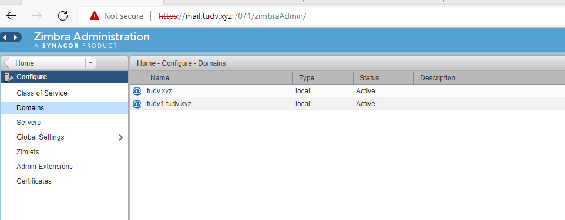

# Thêm 1 domain mới


- Điền domain mới và dịch vụ


- Next và Finish

- Click vào domain mới để lập account

- Tạo bản ghi DNS bao gồm 1 bản ghi A và MX cho tên miền mới




# Đổi domain:

- Backup dữ liệu zimbra: /opt/zimbra với ổ cắm thêm :

```
rsync -axvzKHS /opt/zimbra /mnt/zimbra_backup

```

- Setup the domain DNS records and map the webmail, mail, zimbra and MX records to point to the existing IP. This should be done a couple of days in advance to ensure that the DNS resolution is propagated worldwide.

- Take a backup of your Zimbra Server (dedicated or VM).

- Login to the Zimbra server, change to zimbra user and run the following commands:
```
# su – zimbra # zmprov -l rd [olddomain.com] [newdomain.com]

```

- After the domain is renamed, you need to check whether you can login to any of the email id with the new username but with the earlier password and check if you can send/receive emails through Zimbra webmail and also through your local email client.

- If the new id is working, the add another domain in Zimbra with the earlier domain name through the web admin console under

```
Home > Configure > Domains.

```

- Once the domain is added, you can map the earlier emails for the old domain as aliases to the new domain from the web admin interface by editing the email id and adding the id from the Aliases option. 
alternatively, this can be done from the CLI with the following command:

```
zmprov aaa email@newdomain.com email@olddomain.com

```

Once again, test that the emails are getting delivered by sending an email to the alias id from an external and internal id.

Finally, check that the webmail and zimbra admin URLs are working on the new domain as well.


