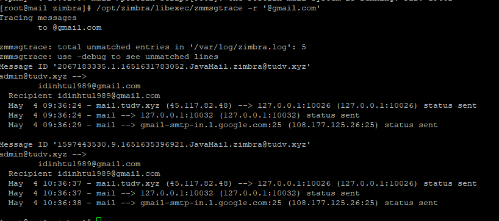

1./ Check logs user zimbra

```
/opt/zimbra/libexec/zmmsgtrace -r '@gmail.com'

/opt/zimbra/libexec/zmmsgtrace -r​​ abc@gmail.com

```



Lưu ý logs này là logs của người nhận ví dụ​​ người nhận là có đuôi email là gmail thì sẽ​​ có logs gửi từ​​ 1 account nào đó trong zimbra ra gmail.

2./ Check service antivirus

```
su zimbra

zmantivirusctl status

zmantivirusctl start
```

3./ Start service amavisd

```
zmamavisdctl start

```
4./ Check Logs zimbra

```
tail -100f /var/log/zimbra.log

```

5./ Check Logs cbpolicyd

```
tail -100f /opt/zimbra/log/cbpolicyd.log
```

6./ Check status service bất kỳ, ví dụ​​ antivirus

```
zmantivirusctl stop

zmantivirusctl start

zmantivirusctl status

```

7./ Kiểm tra clamd có đang hoạt động hay không, điều chỉnh thời gian update signature clamd

```
zmclamdctl status
```

Tư động update clamd sau mỗi 2h

```
zmprov mcf zimbraVirusDefinitionsUpdateFrequency 2h

check logs fresh clam

/opt/zimbra/log/freshclam.log

https://wiki.zimbra.com/wiki/Antivirus

```

8./ Kiểm tra Logs virus

```
tail -100f /opt/zimbra/log/clamd.log
```

Kết quả:​​ 
```

Wed Jun ​​ 3 13:30:06 2020 -> SelfCheck: Database status OK.

Wed Jun ​​ 3 13:38:51 2020 -> /opt/zimbra/data/amavisd/tmp/amavis-20200603T133848-08980-BGyhxkrX/parts/p006: Win.Trojan.Hacktool-1505 FOUND

Wed Jun ​​ 3 13:38:52 2020 -> /opt/zimbra/data/amavisd/tmp/amavis-20200603T133848-08980-BGyhxkrX/parts/p003: Win.Trojan.Hacktool-1505 FOUND
```

9./ Cấu hình giới hạn dung lượng tối đa email được phép gửi và nhận zimbraMtaMaxMessageSize and message_size_limit
```

# su - zimbra
$ postconf message_size_limit

$ zmprov modifyConfig zimbraMtaMaxMessageSize 2048000

$ postfix reload
```

Xác nhận lại cấu hình đã sửa

```

$ postconf message_size_limit
```

https://wiki.zimbra.com/wiki/Configuring_maxmessagesize#:~:text=The%20default%20Zimbra%20MTA%20configuration,i.e.%20'10240000'%20bytes).

10./ Bypasss amavis trong mạng Local

Mặc định mạng local amavis vẫn scan và hoạt động bình thường, nếu setup bypass amavis trong mạng local thì amavis sẽ​​ Bypass SpamAssassin.
```

su - zimbra

zmprov mcf zimbraAmavisOriginatingBypassSA TRUE​​ 

zmantispamctl restart​​ 

zmantivirusctl restart​​ 

zmamavisdctl restart​​ 

https://wiki.zimbra.com/wiki/How_to_bypass_local_network_with_amavis

```

11./ Chặn block users hoặc domain blacklist


tạo 1 file như dưới và list các domain, users blacklist vào

```
/opt/zimbra/common/conf/postfix_reject_sender​​ 

 

nano /opt/zimbra/common/conf/postfix_reject_sender

 

zimbra@mail ~# zmprov ms mail.yourdomain.com​​ +zimbraMtaSmtpdSenderRestrictions "check_sender_access lmdb:/opt/zimbra/common/conf/postfix_reject_sender"

zimbra@mail ~# /opt/zimbra/common/sbin/postmap /opt/zimbra/common/conf/postfix_reject_sender

zimbra@mail ~# zmmtactl restart

 

 

https://wiki.zimbra.com/wiki/Block_user_to_send_email_locally_or_externally

 

zimbra@mail ~# zmprov ms mail.yourdomain.com zimbraMtaSmtpdSenderRestrictions "actual_value, check_sender_access lmdb:/opt/zimbra/common/conf/postfix_reject_sender"

zimbra@mail ~# postmap /opt/zimbra/common/conf/restricted_senders

zimbra@mail ~# postmap /opt/zimbra/common/conf/local_domains

 

 

zmmtactl stop

zmmtactl start

 

zmamavisdctl restart

zmmtactl restart

Nếu Zimbra email server đã cài PolicyD thì có thể​​ sử dụng PolicyD​​ để chặn Email Blacklist

https://fixloinhanh.com/huong-dan-block-email-blacklist-tren-zimbra-email-server-voi-policyd/

 

12./​​ Đổi tên Domain​​ Email Zimbra

zmprov -l rd [olddomain.com] [newdomain.com]

Sau đó khởi động lại server.

 

13./​​ Kiểm tra show tất cả​​ cài đặt trong zimbra

zmlocalconfig

 


14./ File config của Zimbra​​ 

/opt/zimbra/common/conf/main.cf

 

15./​​ Check hostname zimbra

zmhostname 

 

16./Kiểm tra version của zimbra

zmcontrol -v

Kết quả​​ 

Release 8.8.15.GA.3869.UBUNTU18.64 UBUNTU18_64 FOSS edition, Patch 8.8.15_P9.

 

17./​​ Kiểm tra queue zimbra

postqueue -p

 

18./​​ Kiểm tra postfix queue domain​​ 

/opt/zimbra/bin/qshape

View 1 Message trong Queue

/opt/zimbra/postfix/sbin/postcat -q EC753D0D00

View nhiều thông tin 1 Message

/opt/zimbra/postfix/sbin/postcat -qv EC753D0D00

 

19./​​ Flush Postfix Queue

/opt/zimbra/postfix/sbin/postqueue -f

https://wiki.zimbra.com/wiki/Managing-The-Postfix-Queues

20./​​ Show tất cả​​ các loại DB​​ 

postconf -m