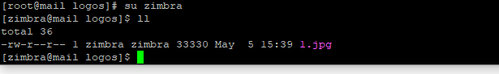
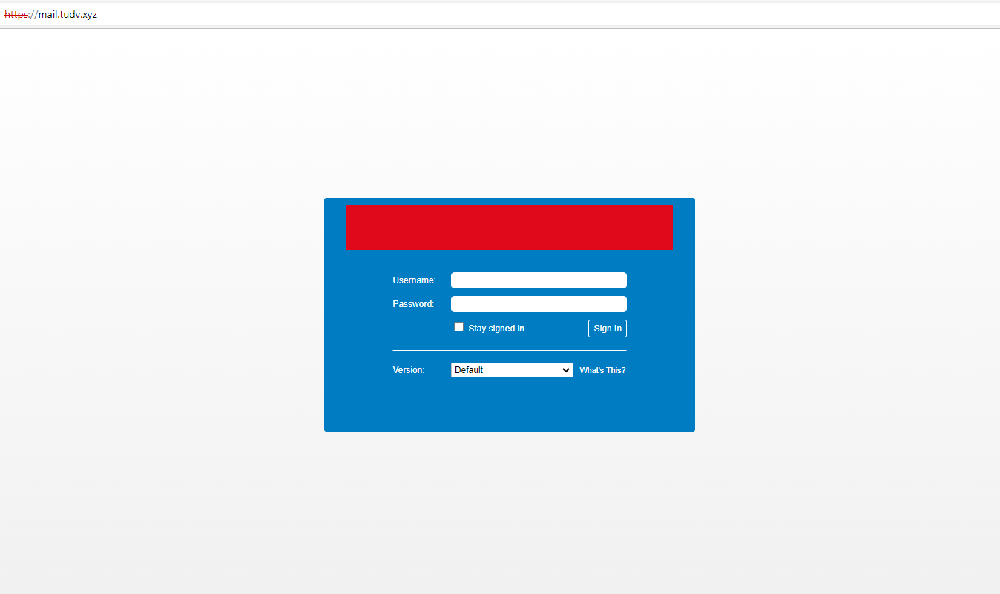

# Đổi Logo zimbra

Tạo thư mục chứa ảnh logos:

```
mkdir /opt/zimbra/jetty/webapps/zimbra/logos

```

- Dùng winscp tải lên 1 ảnh làm  logo tại thư mục

```
/opt/zimbra/jetty/webapps/zimbra/logos

```

Up file ảnh lên rồi phân quyền ảnh đó cho zimbra

```
chown -R zimbra:zimbra /opt/zimbra/jetty/webapps/zimbra/logos/

```




- Thay đổi logo

```
zmprov md tudv.xyz zimbraSkinLogoURL /logos/1.jpg

zmprov md tudv.xyz zimbraSkinLogoLoginBanner /logos/1.jpg

zmprov md tudv.xyz zimbraSkinLogoAppBanner /logos/1.jpg

```


Lệnh zimbraSkinLogoLoginBanner là thay đổi thông tin ngoài ô login, lệnh zimbraSkinLogoAppBanner là thay đổi logo sau khi login vào trong

```
zmmailboxdctl restart

```


