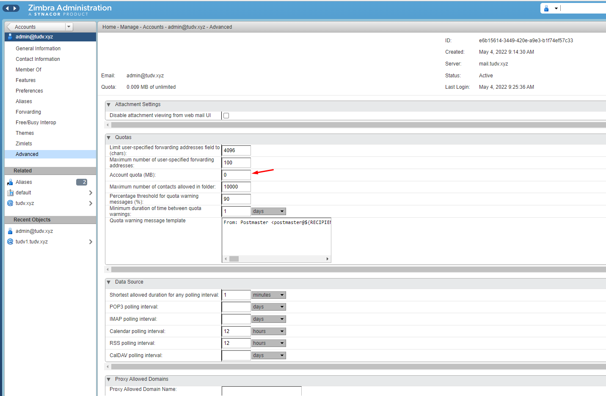
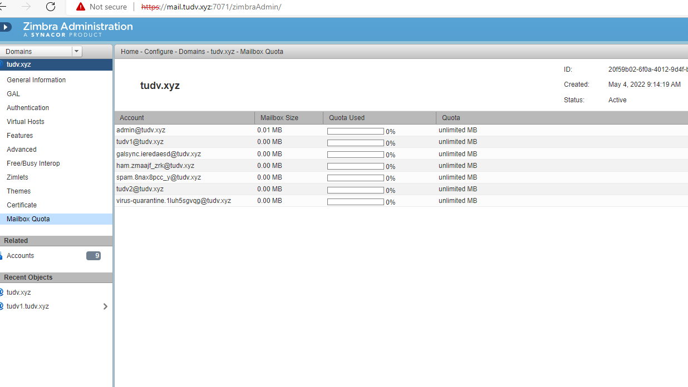
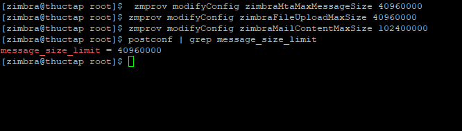

# Xem quota  của  1 mail bất kỳ





# Tăng dung lượng file đính kèm

- Show dung lượng đang áp dụng :

```
su zimbra
postconf | grep message_size_limit

```


- Kiểm tra các thông số toàn cục:

  - zimbraMtaMaxMessageSize, 

  ```

  [zimbra@thuctap root]$ zmprov gcf zimbraMtaMaxMessageSize

  zimbraMtaMaxMessageSize: 10240000

  ```

  
  - zimbraFileUploadMaxSize 

  ```
  [zimbra@thuctap root]$ zmprov gcf zimbraFileUploadMaxSize

  zimbraFileUploadMaxSize: 10485760

  ```

  - zimbraMailContentMaxSize :

  ``` 
   [zimbra@thuctap root]$ zmprov gcf zimbraMailContentMaxSize
   zimbraMailContentMaxSize: 10240000

  ```

- Nâng cấp đính kèm lên 40Mb thì 2 thông số 

```
 zmprov modifyConfig zimbraMtaMaxMessageSize 40960000 

 zmprov modifyConfig zimbraFileUploadMaxSize 40960000 : up =40MB

 zmprov modifyConfig zimbraMailContentMaxSize 102400000 : nội dung = 100MB

``` 



- Nếu hệ thống có nhiều máy chủ ta cần set các tham số cho từng máy theo hostname:

```

zmprov ms `zmhostname` zimbraFileUploadMaxSize 40960000

zmprov ms `zmhostname` zimbraMtaMaxMessageSize 40960000

zmprov ms `zmhostname` zimbraMailContentMaxSize 102400000

```

Hoặc theo domain:

```

zmprov modifyServer mail1.com zimbraFileUploadMaxSize 40960000
zmprov modifyServer mail1.com  zimbraMtaMaxMessageSize 40960000
zmprov modifyServer mail1.com zimbraMailContentMaxSize 102400000

```

- Cuối cùng là reload:

```
postfix reload
zmcontrol restart

```