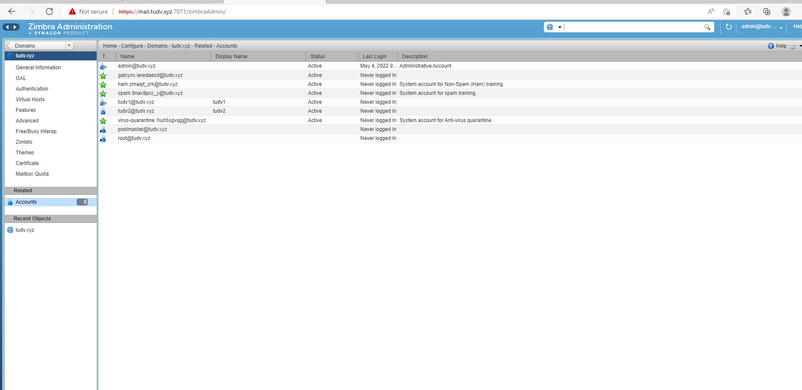

# Restore 1 máy chủ zimbra

Thư mục /opt/zimbra bị hỏng và xóa /opt/zimbra

Hiện tại máy chủ cũ đang chạy zcs-8.8.15_GA_3869.RHEL7_64.20190918004220


- Có sẵn các bản ghi A và MX


- Đã có 1 bản backup gần nhất tại /backupzimbra, nên ta tiến hành copy zimbra vào /opt


- Khi tiến hành cài đặt lại filesetup gặp lỗi 

```
Error: Unable to create a successful TLS connection to the ldap masters. Fix cert configuration prior to upgrading. zimbra

```


- Khắc phục 

```
./install.sh --skip-upgrade-check

```


```
su zimbra

zmcontrol restart

```


# Add domain mail.tudv10.tudv.xyz


- **Tạo xong xóa tudv10.tudv.xyz để tí dùng domain này làm test chuyển**

- Đổi logo 2 cty
```

zmprov md tudv.xyz zimbraSkinLogoURL /logos/adidas.jpg

zmprov md tudv.xyz zimbraSkinLogoLoginBanner /logos/adidas.jpg

zmprov md tudv.xyz zimbraSkinLogoAppBanner /logos/adidas.jpg
```


- Đổi logo2

```
zmprov md tudv10.tudv.xyz zimbraSkinLogoURL /logos/mercedes.jpg

zmprov md tudv10.tudv.xyz zimbraSkinLogoLoginBanner /logos/mercedes.jpg

zmprov md tudv10.tudv.xyz zimbraSkinLogoAppBanner /logos/mercedes.jpg


zmmailboxdctl restart


```

# Đổi domain mail.tudv.xyz sang mail.tudv10.tudv.xyz


- Dữ liệu của domain tudv.xyz



- Dữ liệu của domain tudv10.tudv.xyz


- Kiểm tra múi giờ


- Đổi hostname mới

```
su - zimbra
/opt/zimbra/libexec/zmsetservername -n mail.tudv10.tudv.xyz

```
- n: tham số chỉ new


- Đổi domain 

```
zmprov -l rd [olddomain.com] [newdomain.com]

zmprov -l rd tudv.xyz tudv10.tudv.xyz

```


- Active DKIM


```

/opt/zimbra/libexec/zmdkimkeyutil -a -d tudv10.tudv.xyz

```

```
[zimbra@mail zimbra]$ zmprov -l rd tudv.xyz tudv10.tudv.xyz
[] WARN: checkValue: no attribute info for: DKIMIdentity
[] WARN: checkValue: no attribute info for: DKIMDomain
[] WARN: checkValue: no attribute info for: DKIMKey
[] WARN: checkValue: no attribute info for: DKIMPublicKey
[] WARN: checkValue: no attribute info for: DKIMSelector
domain tudv.xyz renamed to tudv10.tudv.xyz
Note: use zmlocalconfig to check and update any localconfig settings referencing domain 'tudv.xyz' on all servers.
Use /opt/zimbra/libexec/zmdkimkeyutil to recreate the DKIM entries for new domain name if required.
[zimbra@mail zimbra]$ /opt/zimbra/libexec/zmdkimkeyutil -a -d tudv10.tudv.xyz
DKIM Data added to LDAP for domain tudv10.tudv.xyz with selector 1BB70B10-CCF2-1                                                                                                                                                             1EC-A93F-6EB792D8C1A0
Public signature to enter into DNS:
1BB70B10-CCF2-11EC-A93F-6EB792D8C1A0._domainkey IN      TXT     ( "v=DKIM1; k=rs                                                                                                                                                             a; "
          "p=MIIBIjANBgkqhkiG9w0BAQEFAAOCAQ8AMIIBCgKCAQEAyh3KbblbgkEeZRSa2avJdYX                                                                                                                                                             cNxqih1kCyh0XYtRZxhrHC2WFrUs6R8zQ48t3F7CueaBWBUVEO7svukfAtTZ3Vo22KxhzkWGNvlMeHsT                                                                                                                                                             Hei+Ai8lGMZg2lA1ZulYkNYMhUJp63A3DRTBrmVIVYpeW6zCYTVAuOM5IlmhFjbKmiYC5jBcovPyN04m                                                                                                                                                             vu2NmRi16kltkc24o6U+RWM"
          "xwvmPQ6ZfUj0EFscXeD4EIYaxzhKdSp7u60ovmm5OutM9JK2oRfF9Oy2hn5vjP1uQpU2B                                                                                                                                                             T1LUcBtFLF5GVuc7f5upVyUCenizqD7tUaeprgAhfGgq0rsjpI1Rnaj6RmLU+Up8b1wIDAQAB" )  ;                                                                                                                                                              ----- DKIM key 1BB70B10-CCF2-11EC-A93F-6EB792D8C1A0 for tudv10.tudv.xyz
[zimbra@mail zimbra]$ zmprov -l rd tudv.xyz tudv10.tudv.xyz
ERROR: account.NO_SUCH_DOMAIN (no such domain: tudv.xyz)
[zimbra@mail zimbra]$ zmcontrol status
Host mail.tudv10.tudv.xyz
        amavis                  Running
        antispam                Running
        antivirus               Running
        dnscache                Running
        imapd                   Running
        ldap                    Running
        logger                  Running
        mailbox                 Running
        memcached               Running
        mta                     Running
        opendkim                Running
        proxy                   Running
        service webapp          Running
        snmp                    Running
        spell                   Running
        stats                   Running
        zimbra webapp           Running
        zimbraAdmin webapp      Running
        zimlet webapp           Running
        zmconfigd               Running
[zimbra@mail zimbra]$


```


