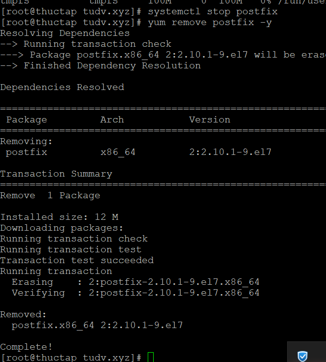
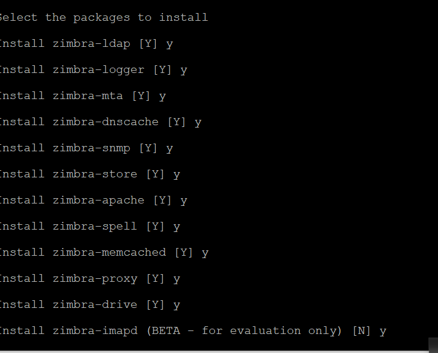
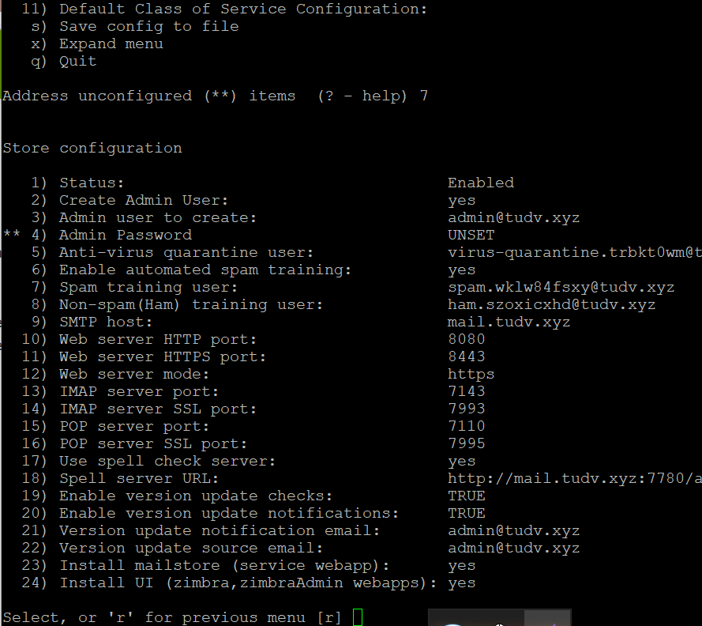
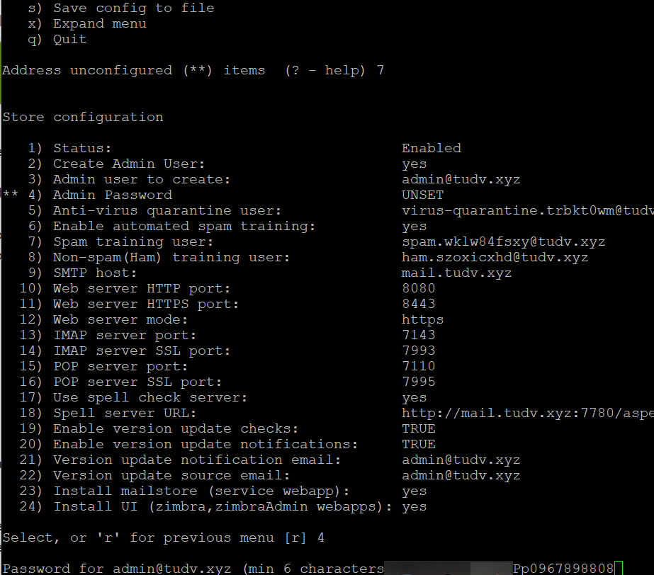
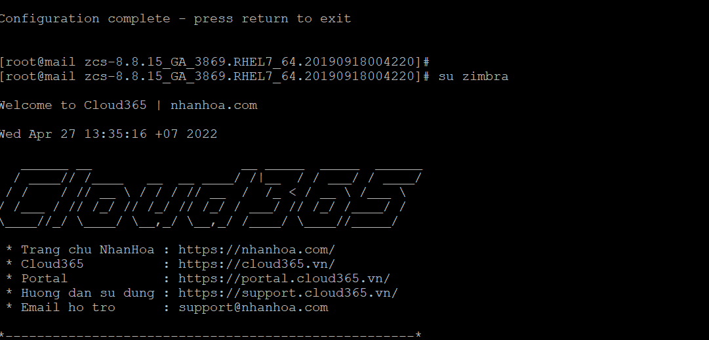

# Cài đặt mail zimbra

- Tắt selinux

- Xóa posfix là dịch vụ mail được cài sẵn trên máy centos 

```
systemctl stop postfix
yum remove postfix -y

```



- Sau đó bạn cập nhật hệ thống  và reboot lại máy chủ để áp dụng
```
 yum update -y 
 reboot

```

- Đổi tên máy :


```
hostnamectl set-hostname mail.tudv.xyz
exec bash

```

- Sau khi set hostname xong  thêm dòng sau vào file hosts .

```
vi /etc/host

```


- Chạy lệnh sau để install Zimbra & ZCS dependencies


- Sau khi download về ta giải nén file ra

```

tar zxpvf zcs*.tgz

```
- Truy cập vào thư mục vừa giải nén và chạy lệnh ./install

```
cd zcs* && ./install.sh

```


- Chon y toàn bộ , đó là những gói dịch vụ kèm theo









