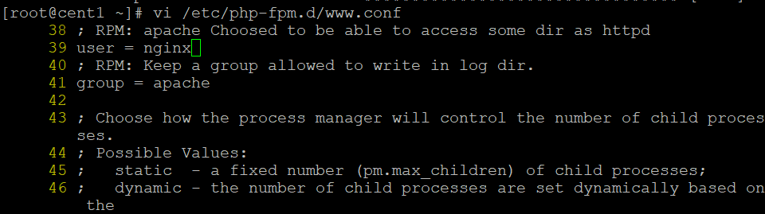

yum install php-cli php-fpm php-mysql php-json php-opcache php-mbstring php-xml php-gd php-curl -y

rpm -Uvh https://dl.fedoraproject.org/pub/epel/epel-release-latest-7.noarch.rpm

rpm -Uvh http://li.nux.ro/download/nux/dextop/el7/x86_64/nux-dextop-release-0-1.el7.nux.noarch.rpm

yum --enablerepo=epel -y install php php-mbstring php-pear php-fpm 

vi /etc/php-fpm.d/www.conf 

39 user = nginx

41 group = nginx

