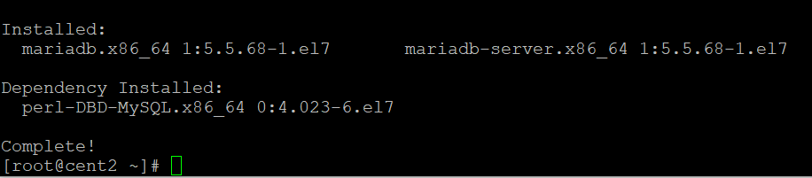
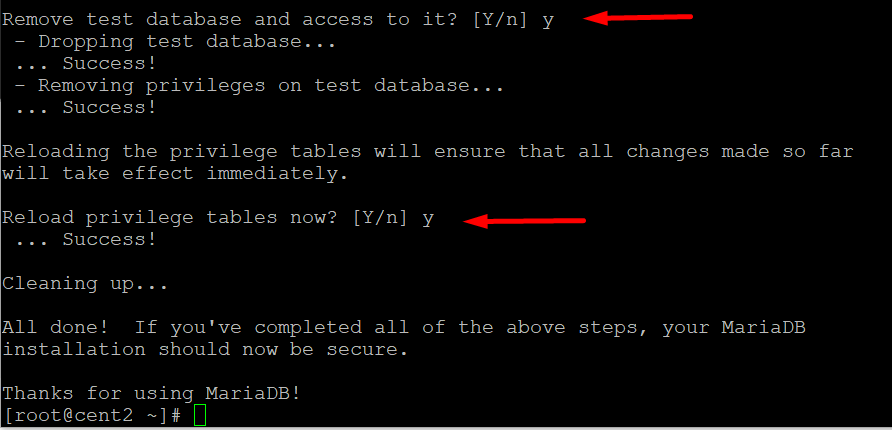
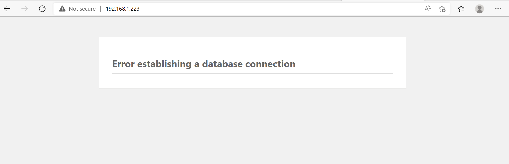

# Thực hành NGINX MYSQL PHP WORDPRESS

- Máy chủ chạy nginx 192.168.1.223

- Trước tiên tắt selinux

```
vi /etc/sysconfig/selinux  :  selilux=disabled

```

## 1 - Cài NGINX

- Update yum và mở rộng thư viện :

```yum update -y

yum install epel-release -y

```

- Cài đặt nginx


```
yum install nginx -y

```

- Khởi động dịch vụ

```
systemctl start nginx
systemctl enable nginx

```
- Cài đặt Mariadb

```
yum install mariadb-server mariadb -y

```



- Chạy maria

```
systemctl start mariadb

systemctl enable mariadb

service mariadb restart

```
- Khai báo maria

```
mysql_secure_installation

```

 Enter current password for root (enter for none): ``Enter``

...khai báo 1 vài thông số...



- Download và cài đặt remi 7 

```
mkdir /data && cd /data

wget http://rpms.remirepo.net/enterprise/remi-release-7.rpm

rpm -Uvh remi-release-7.rpm

```


- Cài yum utils

```
yum install yum-utils

```


- Tải php 5.4.16

```
yum install php php-mysql php-xml php-imap php-fpm php-cli php-curl php-xmlrpc php-common php-gd php-devel php-intl php-process php-zts -y

```


- Cài phpMyAdmin

```
yum -y install phpmyadmin

```


- Cài đặt nginx :File cấu hình tên default.conf( mặc định chưa có) của nginx sẽ là :``/etc/nginx/conf.d/default.conf``

ta sẽ tạo file default.conf và chỉnh thông số.

```
vi /etc/nginx/conf.d/default.conf

```
- Dán vào

```
server {
    listen   80;
    server_name  your_server_ip;

    # note that these lines are originally from the "location /" block
    root   /usr/share/nginx/html;
    index index.php index.html index.htm;

    location / {
        index index.php index.html index.htm; 
        try_files $uri $uri/ =404;
    }    

    location /fileweb {
         index index.php index.html index.htm;          
      } 

    error_page 404 /404.html;
    error_page 500 502 503 504 /50x.html;
    location = /50x.html {
        root /usr/share/nginx/html;
    }

    location ~ .php$ {
        try_files $uri =404;
        fastcgi_pass unix:/var/run/php-fpm/php-fpm.sock;
        fastcgi_index index.php;
        fastcgi_param SCRIPT_FILENAME $document_root$fastcgi_script_name;
        include fastcgi_params;
    }
}

```

- Khởi động lại nginx

``` 
systemctl restart nginx

```

- Tạo shortlink phpMyAdmin vào trong ``/usr/share/nginx/html``
```
 ln -s /usr/share/phpMyAdmin /usr/share/nginx/html

 ```


- Config  ``/etc/php-fpm.d/www.conf ``

```
vi /etc/php-fpm.d/www.conf 

```

```
user = apache to user = nginx
group = apache to group = nginx
listen.owner = nobody to listen.owner = nginx
listen.group = nobody to listen.group = nginx
listen = 127.0.0.1:9000 to listen = /var/run/php-fpm/php-fpm.sock

```


```
systemctl start php-fpm.service

systemctl enable php-fpm.service

systemctl restart nginx

```

- Kiểm tra firewalld

``` 
firewall-cmd --get-active-zones

systemctl status firewalld.service

firewall-cmd --zone=public --add-service=http  --permanent

firewall-cmd --reload
```


- Truy cập phpMyAdmin

- Nếu có cảnh báo

```
chown -R nginx:nginx /var/lib/php/session/

```


- Đăng nhập root maria tạo ban nãy


- Tạo database tên website 


- Tạo tài khoản admin databese:


- Check all ,tích hết là full quyền = root ,và roll xuống click Go


- Giờ đi kiếm wordpress

- Do cài php thấp nên em cũng tìm wpress thấp, và sẽ nâng cấp sau, em có sẵn 1 wp , giờ đẩy đến = stfp


- Cài thêm php7.1

```
yum-config-manager --enable remi-php71 [Default]

yum install php php-common php-fpm 

yum install php-mysql php-pecl-memcache php-pecl-memcached php-gd php-mbstring php-mcrypt php-xml php-pecl-apc php-cli php-pear php-pdo

```


- Sau khi cài xong ta cần phải khai báo  trong file ``wp-config.php`` để kết nối database


và 

```
chown -R nginx:nginx /var/lib/php/session/

```




- Khai báo vào database tên website ban nãy tạo

```
vi /usr/share/nginx/html/wp-config.php

```


- Truy cập lại 192.168.1.223 tạo web wordpress ,admin wpress và mail nhận đăng ký thông tin wpress


- Bước cuối cùng là viết bài

- Trang trí

- Chọn theme phù hợp

