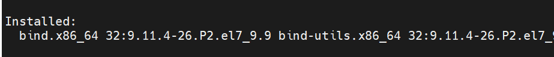
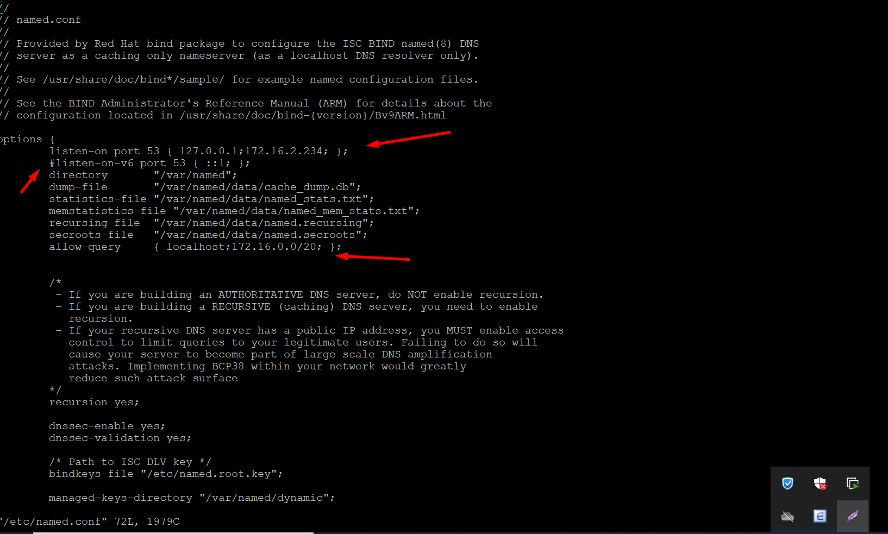
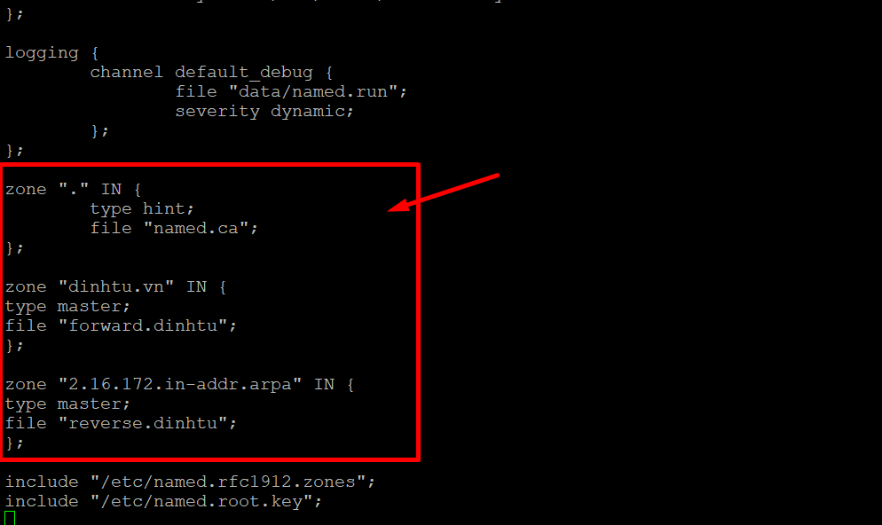
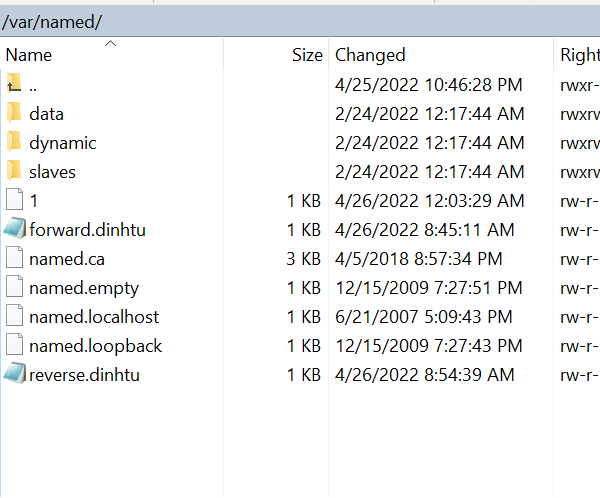
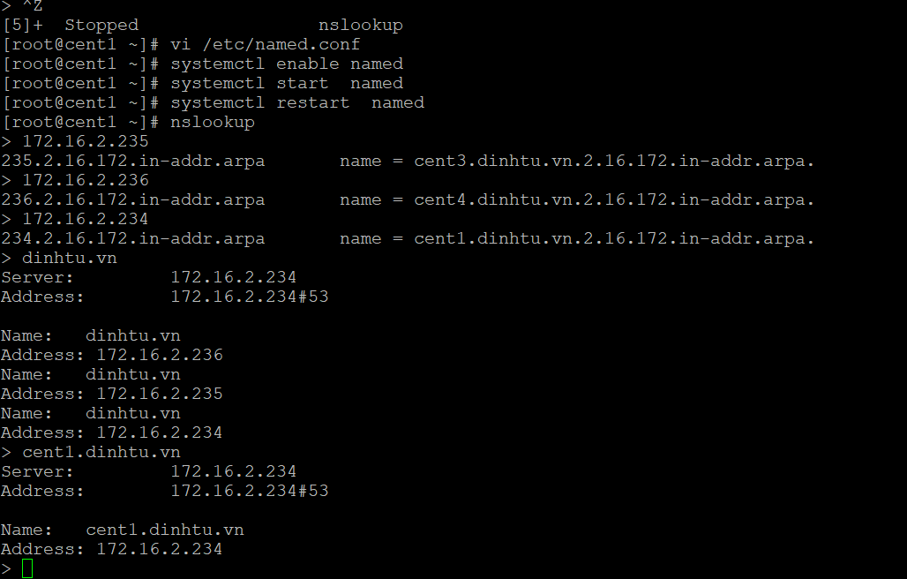

# DNS

```
Domain dinhtu.vn IP 192.168.1.234

Cent3: cent3.dinhtu.vn IP 192.168.1.235 DNS 192.168.1.234

Cent4: cent4.dinhtu.vn IP 192.168.1.236 DNS 192.168.1.234

```

- Cài DNS

 ```
yum install bind bind-utils -y

```


- Cấu hình Dns server 

Thêm các tham số như hình trong

```
vi /etc/named.conf
```





```
vi /var/named/forward.dinhtu

```



- Thêm vào

```

$TTL 86400
@    IN SOA     cent1.dinhtu.vn. root.dinhtu.vn. (
2011071001   ;Serial
3600       ;Refresh
1800       ;Retry
604800     ;Expire
86400      ;Minimum TTL
)
@        IN      NS      cent1.dinhtu.vn.
@        IN      A       172.16.2.235
@        IN      A       172.16.2.236
@        IN      A       172.16.2.234
cent1    IN      A       172.16.2.234
cent3    IN      A       172.16.2.235
cent4    IN      A       172.16.2.236

```

```

vi /var/named.conf/reverse.dinhtu

```
- Thêm vào

```
$TTL 86400
@   IN SOA     cent1.dinhtu.vn. root.dinhtu.vn. (
2022071001   ;Serial
3600         ;Refresh
1800         ;Retry
604800       ;Expire
86400        ;Minimum TTL
)
@          	     NS	   cent1.dinhtu.vn.

@                IN	 PTR	dinhtu.vn.
cent1            IN  A      172.16.2.234
cent3            IN  A      172.16.2.235
cent4            IN  A      172.16.2.236
234              IN  PTR    cent1.dinhtu.vn
235              IN  PTR    cent3.dinhtu.vn
236              IN  PTR    cent4.dinhtu.vn    

```

- Kiểm tra phân giải ngược và thuận:

